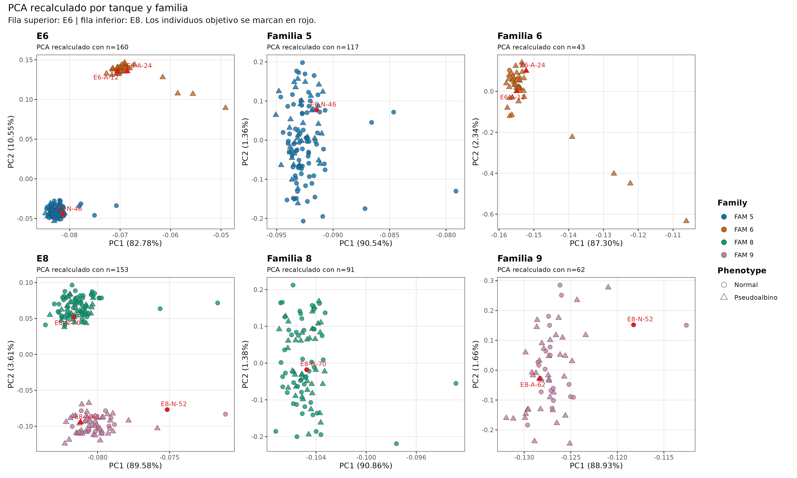

# Materiales y métodos

## Animales de experimentación

Se emplearon un total de 6 individuos juveniles de rodaballo (Scophthalmus maxiums; 5 meses de edad, 25 +- 6 g) pertenecientes a dos los tanques E6 y E8 del Pescanova Biomarine Center (O Grove, España). Los peces fueron criados en siete tanques cuadrados negros de 4 m2 cada uno, conectados a un sistema de circulación abierto abastecido con agua de mar filtrada (1 um) y tratada con luz UV, bajo condiciones controlada 18 +- 1 ºC, salinidad de 32 +- 2 ppt, fotoperiodo de 14 h de luz y 10 h de oscuridad, y una densidad de cultivo de 6 kg/m2.

Estas familias se procedían de un stock de reproductores compuesto por ... del programa de selección genética para crecimiento de la empresa

Figura X .....

El diseño parte de individuos de rodaballo con fenotipo **normal** y **malpigmentado**, seleccionados en los tanques **E6** (FAM 5 y FAM6) y **E8 (FAM8 y FAM9)**, donde las diferencias de pigmentación eran evidentes. FAM5 y FAM6 tienen padres y madres distintos. Fam 8 y FAM9 comparten madre. El tanque E6 se incluyeron descendientes de dos parejas parentales distintas; en el tanque E8 se trabajó con una familia de medios hermanos, con una madre compartida y dos padres distintos.

E8-A-142 es E8-A-62

Esta estructura permite interpretar los resultados teniendo en cuenta tanto el fenotipo de pigmentación como el posible componente familiar.

|       |          |     |      |     |        |     |           |     |              |     |
|-------|----------|-----|------|-----|--------|-----|-----------|-----|--------------|-----|
|       |          |     |      |     |        |     |           |     |              |     |
|       | ID       |     | Tank |     | Family |     | Turbot_ID |     | Phenotype    |     |
|       |          |     |      |     |        |     |           |     |              |     |
|       | E6-N-46  |     | E6   |     | FAM 5  |     | 46        |     | Normal       |     |
|       |          |     |      |     |        |     |           |     |              |     |
|       | E8-N-52  |     | E8   |     | FAM 5  |     | 52        |     | Normal       |     |
|       |          |     |      |     |        |     |           |     |              |     |
|       | E8-N-70  |     | E8   |     | FAM 8  |     | 70        |     | Normal       |     |
|       |          |     |      |     |        |     |           |     |              |     |
|       | E8-A-142 |     | E8   |     |        |     | 142       |     | Pseudoalbino |     |
|       |          |     |      |     |        |     |           |     |              |     |
|       | E6-A-24  |     | E6   |     |        |     | 24        |     | Pseudoalbino |     |
|       |          |     |      |     |        |     |           |     |              |     |
|       | E6-A-12  |     | E6   |     |        |     | 12        |     | Pseudoalbino |     |
|       |          |     |      |     |        |     |           |     |              |     |
|       | X-N-G    |     | X    |     |        |     | G         |     | Normal       |     |
|       |          |     |      |     |        |     |           |     |              |     |
|       | X-Am-PNK |     | X    |     |        |     | PNK       |     | Ambicolor    |     |
|       |          |     |      |     |        |     |           |     |              |     |

## Toma de muestras

Se tomaron fragmentos de piel de aproximadamente 20 mg con material de disección estéril (@fig-sampling). Los fragmentos se rasparon cuidadosamente con la cuchilla del bisturí para eliminar la parte de músculo y evitar posibles interferencias de este tejido en el posterior análisis de RNA-seq.

Se tomaron muestras de peces con fenotipo pigmentario normal (control) y peces pseudoalbinos o malpigmentados. En los rodaballos control se recogieron dos tipos de muestras de piel: pigmentada, de color oscuro, en el lado ocular; y no pigmentada, de color claro, en el lado ciego. En los rodaballos pseudoalbinos se recogieron cuatro tipos de muestras:

-   Lado ocular
    -   Pigmentada, correspondiente a pigmentación normal.
    -   No pigmentada, correspondiente a pigmentación anormal.
-   Lado ciego
    -   Pigmentada, correspondiente a pigmentación anormal.
    -   No pigmentada, correspondiente a pigmentación anormal.

{#fig-sampling}

La unidad biológica principal de esta fase es la **piel**, muestreada en regiones pigmentadas y no pigmentadas. La @tbl-sample-groups resume la lógica experimental de las muestras procesadas en el flujo nf-core/rnaseq documentado en este libro.

::: {#tbl-sample-groups}
| Grupo | Fenotipo del individuo | Región muestreada | Interpretación esperada |
|:---------------|:---------------|:---------------|:-----------------------|
| Piel ocular pigmentada normal | Normal | Cara ocular, piel oscura | Referencia de pigmentación esperada en rodaballo. |
| Piel ciega clara normal | Normal | Cara ciega, piel clara | Referencia de ausencia fisiológica de pigmentación. |
| Piel oscura en malpigmentados | Malpigmentado | Cara ocular o ciega, piel pigmentada | Permite estudiar pigmentación mantenida o ectópica. |
| Piel clara en malpigmentados | Malpigmentado | Cara ocular o ciega, piel no pigmentada | Permite estudiar pérdida local o ausencia anómala de pigmentación. |
| Muestras complementarias | Normal, ambicolor o intestinal | Piel adicional o intestino | Material de apoyo para control, exploración o análisis integrativos posteriores. |

: Estructura conceptual de los grupos de muestras incluidos en el análisis.
:::

## Muestras documentadas en este libro

La @tbl-samples-intro recoge las muestras incluidas en la documentación bioinformática actual. La nomenclatura distingue muestras de piel (`P`) y muestras intestinales (`IT`). En capítulos posteriores, el control de calidad y el alineamiento se revisan a partir de los resultados generados por **nf-core/rnaseq** y **MultiQC** para este conjunto de bibliotecas.

::: {#tbl-samples-intro}
| Muestra | Tejido    | Tanque | Individuo | Fenotipo      | Cara   | Pigmentación |
|:--------|:----------|:-------|:----------|:--------------|:-------|:-------------|
| P31     | Piel      | E6     | 46        | Normal        | Ocular | Oscura       |
| P32     | Piel      | E6     | 46        | Normal        | Ciega  | Clara        |
| P33     | Piel      | E8     | 52        | Normal        | Ocular | Oscura       |
| P34     | Piel      | E8     | 52        | Normal        | Ciega  | Clara        |
| P35     | Piel      | E8     | 70        | Normal        | Ocular | Oscura       |
| P36     | Piel      | E8     | 70        | Normal        | Ciega  | Clara        |
| P41     | Piel      | E8     | 142       | Malpigmentado | Ocular | Oscura       |
| P42     | Piel      | E8     | 142       | Malpigmentado | Ocular | Clara        |
| P43     | Piel      | E8     | 142       | Malpigmentado | Ciega  | Oscura       |
| P44     | Piel      | E8     | 131       | Malpigmentado | Ciega  | Clara        |
| P45     | Piel      | E6     | 130       | Malpigmentado | Ocular | Oscura       |
| P46     | Piel      | E6     | 130       | Malpigmentado | Ocular | Clara        |
| P47     | Piel      | E6     | 130       | Malpigmentado | Ciega  | Oscura       |
| P48     | Piel      | E6     | 130       | Malpigmentado | Ciega  | Clara        |
| P49     | Piel      | E6     | 26        | Malpigmentado | Ocular | Oscura       |
| P50     | Piel      | E6     | 26        | Malpigmentado | Ocular | Clara        |
| P51     | Piel      | E6     | 26        | Malpigmentado | Ciega  | Oscura       |
| P52     | Piel      | E6     | 26        | Malpigmentado | Ciega  | Clara        |
| P1G     | Piel      | ND     | 56        | Normal        | ND     | ND           |
| P2G     | Piel      | ND     | 34        | Normal        | ND     | ND           |
| PNKD    | Piel      | ND     | ND        | Ambicolor     | ND     | ND           |
| PNKV    | Piel      | ND     | ND        | Ambicolor     | ND     | ND           |
| IT12    | Intestino | ND     | ND        | ND            | ND     | ND           |
| IT16    | Intestino | ND     | ND        | ND            | ND     | ND           |
| IT1G    | Intestino | ND     | ND        | ND            | ND     | ND           |
| ITPNK   | Intestino | ND     | ND        | ND            | ND     | ND           |

: Muestras incluidas en la fase documentada del análisis RNA-seq.
:::

## Extracción de ARN 

El ARN total se aisló a partir de las muestras de piel y de las muestras intestinales complementarias siguiendo un protocolo basado en extracción con TRIzol^TM^ y columnas Phasemaker^TM^ Tubes (Thermo Fisher), seguido de purificación en columna. La concentración, la cantidad total disponible y la integridad del ARN se evaluaron antes de la preparación de bibliotecas RNA-seq.

::: {.callout-tip title="Protocolo experimental completo"}
El protocolo detallado de extracción, homogeneización, separación de fases, digestión con DNasa y purificación en columna se incluye como anexo: [Protocolo de extracción de ARN con TRIzol y columnas Phase Lock Gel Heavy](../appendices/rna_extraction_protocol.md).
:::

### Control de calidad: cuantificación e integridad del ARN 

Antes del envío de muestras para preparación de bibliotecas, se realizó un control preliminar de las extracciones mediante cuantificaciñon con **NanoDrop** y visualización de integridad en **gel de agarosa al 1.5%**. Este paso permitió revisar la concentración de ARN total, la pureza estimada por las ratios **A260/A280** y **A260/A230**, y la presencia de bandas compatibles con ARN ribosomal íntegro.

::: {.callout-note title="Relación con el QC de Novogene"}
La @tbl-rna-extraction-nanodrop corresponde al control de extracción inicial y contiene muestras candidatas, incluidas algunas que no llegaron a formar parte del conjunto final de bibliotecas RNA-seq. La selección final para secuenciación se basó en el control posterior de Novogene/Bioanalyzer, resumido en la @tbl-rna-qc.
:::

::: {#tbl-rna-extraction-nanodrop .rna-gel-table}
| Muestra | NanoDrop (ng/µl) | A260/A280 | A260/A230 | Integridad en gel de agarosa 1.5%, 100 mV, 30 min |
|----------|----------|----------|----------|----------------------------------|
| P31 | 1142.7 | 2.14 | 2.10 | [{alt="Gel de agarosa para P31, P32 e IT11"}](../figures/02_exp_design/rna_extraction_gels/gel_block_01_P31_P32_IT11.png "Gel de agarosa: P31, P32 e IT11") |
| P32 | 813.4 | 2.14 | 2.18 |  |
| IT11 | 534.3 | 2.13 | 2.00 |  |
| P33 | 338.9 | 2.12 | 2.24 | [{alt="Gel de agarosa para P33, P34 e IT12"}](../figures/02_exp_design/rna_extraction_gels/gel_block_02_P33_P34_IT12.png "Gel de agarosa: P33, P34 e IT12") |
| P34 | 440.5 | 2.10 | 2.27 |  |
| IT12 | 974.0 | 2.13 | 2.36 |  |
| P35 | 299.3 | 2.12 | 1.08 | [{alt="Gel de agarosa para P35, P36 e IT13"}](../figures/02_exp_design/rna_extraction_gels/gel_block_03_P35_P36_IT13.png "Gel de agarosa: P35, P36 e IT13") |
| P36 | 308.8 | 2.13 | 2.18 |  |
| IT13 | 367.6 | 2.13 | 1.99 |  |
| P37 | 191.5 | 2.10 | 2.20 | [{alt="Gel de agarosa para P37, P38, P39, P40 e IT14"}](../figures/02_exp_design/rna_extraction_gels/gel_block_04_P37_P40_IT14.png "Gel de agarosa: P37, P38, P39, P40 e IT14") |
| P38 | 209.5 | 2.14 | 2.05 |  |
| P39 | 827.3 | 2.15 | 2.31 |  |
| P40 | 359.5 | 2.14 | 2.17 |  |
| IT14 | 822.9 | 2.14 | 2.31 |  |
| P41 | 583.6 | 2.10 | 2.29 | [{alt="Gel de agarosa para P41, P42, P43, P44 e IT15"}](../figures/02_exp_design/rna_extraction_gels/gel_block_05_P41_P44_IT15.png "Gel de agarosa: P41, P42, P43, P44 e IT15") |
| P42 | 506.5 | 2.10 | 2.15 |  |
| P43 | 588.0 | 2.10 | 2.33 |  |
| P44 | 1028.3 | 2.13 | 2.14 |  |
| IT15 | 727.2 | 2.10 | 2.29 |  |
| P45 | 529.7 | 2.05 | 2.33 | [{alt="Gel de agarosa para P45, P46, P47, P48 e IT16"}](../figures/02_exp_design/rna_extraction_gels/gel_block_06_P45_P48_IT16.png "Gel de agarosa: P45, P46, P47, P48 e IT16") |
| P46 | 383.0 | 2.09 | 2.11 |  |
| P47 | 218.3 | 2.07 | 2.14 |  |
| P48 | 291.2 | 2.09 | 1.77 |  |
| IT16 | 963.5 | 2.07 | 2.31 |  |
| P49 | 444.2 | 2.09 | 2.21 | [{alt="Gel de agarosa para P49, P50, P51, P52 e IT17"}](../figures/02_exp_design/rna_extraction_gels/gel_block_07_P49_P52_IT17.png "Gel de agarosa: P49, P50, P51, P52 e IT17") |
| P50 | 236.5 | 2.11 | 2.13 |  |
| P51 | 927.5 | 2.11 | 2.26 |  |
| P52 | 385.8 | 2.14 | 1.08 |  |
| IT17 | 1327.1 | 2.10 | 2.24 |  |
| P1G | 117.6 | 2.13 | 1.73 | [{alt="Gel de agarosa para P1G, P2G e IT1G"}](../figures/02_exp_design/rna_extraction_gels/gel_block_08_P1G_P2G_IT1G.png "Gel de agarosa: P1G, P2G e IT1G") |
| P2G | 121.6 | 2.12 | 2.07 |  |
| IT1G | 1117.5 | 2.11 | 2.31 |  |

Control preliminar de extracción de ARN mediante NanoDrop y gel de agarosa. Las imágenes del gel proceden del documento original `Resumen_extracciones.docx`; cada imagen abarca el bloque de muestras cargadas conjuntamente en el mismo gel.
:::

### Control de calidad para preparación de bibliotecas: Bioanalyzer y RIN

La evaluación de calidad final del ARN fue realizada por Novogene mediante **Agilent 5400 Bioanalyzer**, como paso previo a la preparación de bibliotecas RNA-seq. Este control permitió evaluar de forma conjunta la concentración, la integridad y la pureza del ARN. Los resultados completos se resumen en la @tbl-rna-qc, mientras que los electroferogramas individuales se muestran en la @fig-rna-electropherograms mediante un panel de selección por muestra.

::: {.callout-note title="Interpretación técnica del RIN"}
El **RNA Integrity Number (RIN)** es un parámetro numérico que oscila entre **1** y **10** y que se emplea para evaluar la calidad del ARN total extraído de una muestra. Se calcula a partir de un análisis electroforético automatizado que separa los fragmentos de ARN según su tamaño molecular y genera un **electroferograma**, es decir, una representación de la intensidad de señal en función del tamaño de los fragmentos.

El algoritmo de RIN analiza varias propiedades del perfil electroforético:

-   **Altura y nitidez de los picos ribosomales**. En ARN eucariota íntegro se esperan picos bien definidos de **18S** y **28S**, con una proporción aproximada de **2:1**.
-   **Nivel de fondo y fragmentación**. El ARN degradado muestra una señal más difusa, acumulación de fragmentos pequeños y pérdida progresiva de picos definidos.
-   **Distribución global de la señal**. A medida que aumenta la degradación, crece la señal en regiones de bajo peso molecular y se reduce la resolución del perfil.

{#fig-rin-profiles width="80%"}

En una muestra de alta calidad, el electroferograma presenta picos de **18S** y **28S** altos y definidos, bajo nivel de fondo y poca señal asociada a fragmentos cortos. Cuando la muestra está degradada, los picos ribosomales se atenúan o desaparecen y aumenta la señal correspondiente a fragmentos de menor tamaño molecular, como se resume en la @fig-rin-profiles.
:::

En el **QC Report de Novogene**, la mayoría de las muestras mostraron concentraciones adecuadas para la construcción de bibliotecas, aunque con una variabilidad esperable entre tejidos y extracciones. La concentración más alta correspondió a **ITPNK** (**4493.36 ng/µl**), mientras que **P1G** presentó una de las concentraciones más bajas (**150.06 ng/µl**). En ambos casos, la concentración fue evaluada junto con la integridad y el resultado global de QC.

Respecto a la integridad, la mayoría de las muestras presentaron **RIN entre 7.0 y 9.8**, un rango compatible con preparación de bibliotecas RNA-seq y análisis posteriores de expresión diferencial. Dos muestras requirieron atención especial: **IT12** mostró un **RIN de 3.8**, indicativo de degradación marcada, y fue clasificada como *Fail*; **IT16** presentó un valor intermedio (**RIN = 6.0**), compatible con degradación parcial y con potencial impacto sobre la calidad de la librería y la interpretación de los datos. Además, **ITPNK** fue aceptada aunque el informe técnico indicó una **ligera contaminación genómica**.

En conjunto, el control de calidad indicó que la mayoría de las muestras cumplían los estándares requeridos para el análisis transcriptómico. Dado que el presupuesto de Novogene contemplaba **24 bibliotecas RNA-seq** y se habían enviado **26 muestras**, se decidió excluir **IT12** e **IT16** de la secuenciación. Las muestras restantes fueron retenidas para la preparación de bibliotecas.

:::::: panel-tabset
## Resumen QC

::: {#tbl-rna-qc}
| No. | Muestra | Nucleic Acid ID | Concentración (ng/µl) | Volumen (µl) | Cantidad total (µg) | RIN | QC | Observación |
|:------:|:-------|:-------|-------:|-------:|-------:|-------:|:------:|:-------|
| 1 | P31 | EKRN240028385-1A | 1851.34 | 16 | 29.62 | 7.7 | Pass | N/A |
| 2 | P32 | EKRN240028386-1A | 2022.42 | 16 | 32.36 | 8.3 | Pass | N/A |
| 3 | P33 | EKRN240028387-1A | 483.84 | 13 | 6.29 | 8.8 | Pass | N/A |
| 4 | P34 | EKRN240028388-1A | 826.81 | 17 | 14.06 | 8.8 | Pass | N/A |
| 5 | P35 | EKRN240028389-1A | 430.00 | 16 | 6.88 | 8.2 | Pass | N/A |
| 6 | P36 | EKRN240028390-1A | 447.89 | 16 | 7.17 | 7.2 | Pass | N/A |
| 7 | P41 | EKRN240028391-1A | 1270.12 | 16 | 20.32 | 9.3 | Pass | N/A |
| 8 | P42 | EKRN240028392-1A | 888.98 | 19 | 16.89 | 8.8 | Pass | N/A |
| 9 | P43 | EKRN240028393-1A | 1343.73 | 19 | 25.53 | 8.0 | Pass | N/A |
| 10 | P44 | EKRN240028394-1A | 1961.08 | 18 | 35.30 | 7.8 | Pass | N/A |
| 11 | P45 | EKRN240028395-1A | 709.86 | 18 | 12.78 | 8.1 | Pass | N/A |
| 12 | P46 | EKRN240028396-1A | 768.56 | 18 | 13.83 | 8.9 | Pass | N/A |
| 13 | P47 | EKRN240028397-1A | 342.27 | 19 | 6.50 | 8.5 | Pass | N/A |
| 14 | P48 | EKRN240028398-1A | 404.26 | 17 | 6.87 | 7.8 | Pass | N/A |
| 15 | P49 | EKRN240028399-1A | 954.50 | 16 | 15.27 | 8.8 | Pass | N/A |
| 16 | P50 | EKRN240028400-1A | 295.43 | 16 | 4.73 | 9.6 | Pass | N/A |
| 17 | P51 | EKRN240028401-1A | 2511.00 | 13 | 32.64 | 9.5 | Pass | N/A |
| 18 | P52 | EKRN240028402-1A | 578.87 | 15 | 8.68 | 9.8 | Pass | N/A |
| 19 | P1G | EKRN240028403-1A | 150.06 | 16 | 2.40 | 8.9 | Pass | N/A |
| 20 | P2G | EKRN240028404-1A | 192.33 | 16 | 3.08 | 9.0 | Pass | N/A |
| 21 | PNKD | EKRN240028405-1A | 417.18 | 18 | 7.51 | 8.7 | Pass | N/A |
| 22 | PNKV | EKRN240028406-1A | 221.19 | 17 | 3.76 | 8.4 | Pass | N/A |
| 23 | IT12 | EKRN240028407-1A | 2422.80 | 17 | 41.19 | 3.8 | Fail | RIN no cualificado |
| 24 | IT16 | EKRN240028408-1A | 2988.15 | 18 | 53.79 | 6.0 | Pass | N/A |
| 25 | IT1G | EKRN240028409-1A | 2842.68 | 16 | 45.48 | 7.8 | Pass | N/A |
| 26 | ITPNK | EKRN240028410-1A | 4493.36 | 18 | 80.88 | 7.1 | Pass | Ligera contaminación genómica |

: Resumen de concentración, cantidad total, integridad de ARN y resultado QC de las muestras evaluadas antes de la preparación de bibliotecas RNA-seq.
:::

## Electroferogramas Bioanalyzer

:::: {#fig-rna-electropherograms}
::: panel-tabset
### P31

### P32

### P33

### P34

### P35

### P36

### P41

### P42

### P43

### P44

### P45

### P46

### P47

### P48

### P49

### P50

### P51

### P52

### P1G

### P2G

### PNKD

### PNKV

### IT12

### IT16

### IT1G

### ITPNK

:::

Electroferogramas de control de calidad de ARN generados con Agilent 5400 Bioanalyzer. Cada pestaña corresponde a una muestra y permite revisar la distribución de fragmentos y los picos ribosomales utilizados para estimar la integridad del ARN.
::::
::::::

## Secuenciación y marco técnico

Las bibliotecas RNA-seq se generaron a partir de mRNA enriquecido por selección de poli(A), con protocolo específico de hebra y secuenciación paired-end de 150 pb. La @tbl-rnaseq-specs sintetiza las especificaciones técnicas de la fase de secuenciación. Esta información se desarrolla con más detalle en los capítulos metodológicos, donde se documentan el preprocesamiento, el control de calidad, el alineamiento contra el genoma de referencia y la cuantificación de expresión.

::: {#tbl-rnaseq-specs}
| Parámetro | Descripción |
|:---------------------------|:-------------------------------------------|
| Plataforma | Illumina NovaSeq X Plus |
| Configuración de lectura | Paired-end, 2 x 150 pb |
| Preparación de librerías | mRNA específico de hebra, enriquecido por poli(A) |
| Criterio de calidad contratado | Al menos 85% de bases con Q30 o superior |
| Salida mínima esperada | Al menos 6 Gb por muestra |
| Servicio | Novogene, WOBI Plant and Animal Whole Genome Sequencing |

: Especificaciones generales de las bibliotecas RNA-seq.
:::