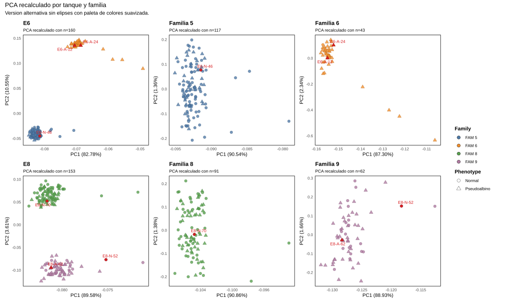
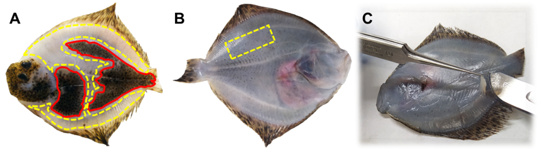

# Diseño experimental, muestreo y definición de grupos

## Resumen

Este capítulo documenta el diseño experimental del estudio, que incluye los animales de experimentación, la lógica empleada para llevar a cabo el muestreo y la definición de grupos usada en el análisis transcriptómico posterior.

## Animales de experimentación

Se estudiaron juveniles de rodaballo (*Scophthalmus maximus*) procedentes de los tanques **E6** y **E8** del Pescanova Biomarine Center, en el municipio de O Grove, Pontevedra, España (aprox. **42.47°N, 8.90°W**). Los peces pertenecían a familias del programa de selección genética para crecimiento y se mantuvieron en tanques cuadrados negros conectados a un sistema de circulación abierto con agua de mar filtrada y tratada con luz UV (sistema RAS abierto). Las condiciones generales de cultivo fueron: temperatura controlada en torno a **18 ± 1 ºC**, salinidad aproximada de **32 ± 2 ppt**, fotoperiodo de **14 h de luz y 10 h de oscuridad**, y densidad de cultivo cercana a **6 kg/m²**.

El diseño incluyó individuos con fenotipo pigmentario normal y peces con fenotipo malpigmentado. En el tanque E6 se incluyeron descendientes de dos parejas parentales distintas, mientras que en el tanque E8 se trabajó con una estructura de medios hermanos, con una madre compartida y padres distintos. Esta estructura familiar no se usa como eje principal de inferencia en los modelos actuales, pero sí forma parte del contexto necesario para interpretar el diseño.

::: {#tbl-fish-design}
| ID experimental | Tanque | Individuo | Fenotipo | Uso en el informe |
|:--------------|:--------------|:--------------|:--------------|:--------------|
| E6-N-46 | E6 | 46 | Normal | Piel ocular oscura y piel ciega clara normales |
| E8-N-52 | E8 | 52 | Normal | Piel ocular oscura y piel ciega clara normales |
| E8-N-70 | E8 | 70 | Normal | Piel ocular oscura y piel ciega clara normales |
| E8-A-142 | E8 | 142 | Pseudoalbino | Cuatro regiones de piel pseudoalbina |
| E6-A-24 | E6 | 24 | Pseudoalbino | Cuatro regiones de piel pseudoalbina |
| E6-A-12 | E6 | 12 | Pseudoalbino | Cuatro regiones de piel pseudoalbina |
| X-N-G | X | G | Normal | Muestras complementarias de piel/intestino |
| X-Am-PNK | X | PNK | Ambicolor | Muestras exploratorias excluidas del DE principal |

: Individuos y bloques biológicos representados en la documentación RNA-seq.
:::

## Contexto familiar de las muestras 

La selección de individuos para el análisis transcriptómico se realizó dentro de dos tanques con estructura familiar conocida. El tanque **E6** contiene las **familias 5** y **6**, mientras que el tanque **E8** contiene las **familias 8** y **9**. Esta información se obtuvo en un trabajo previo donde se estudió la arquitectura genética de la malpigmentación en diferentes familias de rodaballos y es importante para interpretar el origen biológico de las muestras y detectar posibles confusiones entre fenotipo, tanque y parentesco.

Para documentar esta estructura, se utilizaron los ficheros PLINK binarios del genotipado con chip de 5K SNPs (`.bed`, `.bim` y `.fam`) como matriz genómica de partida. A partir de ese conjunto se generaron subconjuntos por tanque y familia: E6 completo, E6-FAM5, E6-FAM6, E8 completo, E8-FAM8 y E8-FAM9. Para cada subconjunto se recalculó un PCA genómico independiente con PLINK; las coordenadas de los individuos proceden de los ficheros `.eigenvec`, y los porcentajes de varianza explicada por PC1 y PC2 se calcularon a partir de los autovalores de los ficheros `.eigenval`. Finalmente, los individuos seleccionados para RNA-seq se proyectaron y etiquetaron sobre estos PCA para comprobar su posición dentro de la estructura familiar.

::: {.callout-note title="Nota sobre identificadores"}
En los ficheros genómicos se usa una numeración actualizada en la que los individuos normales van de `N-01` a `N-80` y los pseudoalbinos de `A-01` a `A-80`; por tanto, el individuo transcriptómico histórico **E8-A-142** corresponde al identificador genómico actual **E8-A-62**.
:::

La @fig-family-pca-rnaseq muestra que las muestras transcriptómicas quedan distribuidas de forma coherente con la asignación familiar: **E6-N-46** se sitúa en **FAM 5**, **E6-A-24** y **E6-A-12** en **FAM 6**, **E8-N-70** en **FAM 8**, y **E8-N-52** junto con **E8-A-62** en **FAM 9**. Esta comprobación refuerza que el diseño transcriptómico incluye individuos de ambos tanques y de las familias esperadas, y proporciona una capa adicional de trazabilidad para las comparaciones downstream.

{#fig-family-pca-rnaseq fig-align="center" width="100%"}

## Muestreo de piel

Se tomaron fragmentos de piel de aproximadamente **20 mg** con material de disección estéril. Los fragmentos se rasparon cuidadosamente con la cuchilla del bisturí para retirar músculo adherido y reducir interferencias de tejido subyacente en la señal transcriptómica.

En peces normales se recogieron dos tipos de piel:

-   piel ocular pigmentada, correspondiente al estado oscuro esperado;
-   piel ciega clara, correspondiente al estado fisiológicamente no pigmentado.

En peces pseudoalbinos se recogieron cuatro tipos de piel:

-   piel ocular oscura, correspondiente a pigmentación mantenida;
-   piel ocular clara, correspondiente a pérdida local de pigmentación;
-   piel ciega oscura, correspondiente a pigmentación ectópica;
-   piel ciega clara, correspondiente al estado claro de la superficie ciega en el contexto pseudoalbino.

{#fig-sampling-sites fig-align="center"}

## Grupos conceptuales

La unidad biológica principal de este informe es la muestra de piel. Cada muestra se interpreta mediante la combinación de fenotipo del individuo, superficie corporal y pigmentación local. La @tbl-sample-groups resume los grupos que estructuran el análisis.

::: {#tbl-sample-groups}
| Grupo | Fenotipo del individuo | Región muestreada | Interpretación esperada |
|:-----------------|:-----------------|:-----------------|:-----------------|
| Piel ocular oscura normal | Normal | Cara ocular, piel oscura | Referencia fisiológica de pigmentación esperada |
| Piel ciega clara normal | Normal | Cara ciega, piel clara | Referencia fisiológica de ausencia de pigmentación |
| Piel ocular oscura pseudoalbina | Pseudoalbino | Cara ocular, piel oscura | Pigmentación mantenida dentro de un fenotipo alterado |
| Piel ocular clara pseudoalbina | Pseudoalbino | Cara ocular, piel clara | Pérdida local de pigmentación en superficie ocular |
| Piel ciega oscura pseudoalbina | Pseudoalbino | Cara ciega, piel oscura | Pigmentación ectópica en superficie normalmente clara |
| Piel ciega clara pseudoalbina | Pseudoalbino | Cara ciega, piel clara | Estado claro de la superficie ciega en pseudoalbinismo |
| Muestras complementarias | Normal o ambicolor | Piel o intestino | Control, exploración o análisis integrativos posteriores |

: Grupos biológicos usados para interpretar las muestras de piel.
:::

## Muestras incluidas

La @tbl-samples-design recoge las muestras procesadas en la documentación bioinformática actual. Las muestras de intestino y las muestras ambicolor se conservaron en el control de calidad global, pero no forman parte de los modelos de expresión diferencial principales.

::: {#tbl-samples-design}
| Muestra | Tejido | Tanque | Individuo | Fenotipo | Superficie | Pigmentación | Uso principal |
|:--------|:--------|:--------|:--------|:--------|:--------|:--------|:--------|
| P31 | Piel | E6 | 46 | Normal | Ocular | Oscura | DE principal |
| P32 | Piel | E6 | 46 | Normal | Ciega | Clara | DE principal |
| P33 | Piel | E8 | 52 | Normal | Ocular | Oscura | DE principal |
| P34 | Piel | E8 | 52 | Normal | Ciega | Clara | DE principal |
| P35 | Piel | E8 | 70 | Normal | Ocular | Oscura | DE principal |
| P36 | Piel | E8 | 70 | Normal | Ciega | Clara | DE principal |
| P41 | Piel | E8 | 142 | Pseudoalbino | Ocular | Oscura | DE principal |
| P42 | Piel | E8 | 142 | Pseudoalbino | Ocular | Clara | DE principal |
| P43 | Piel | E8 | 142 | Pseudoalbino | Ciega | Oscura | DE principal |
| P44 | Piel | E8 | 142 | Pseudoalbino | Ciega | Clara | DE principal |
| P45 | Piel | E6 | 24 | Pseudoalbino | Ocular | Oscura | DE principal |
| P46 | Piel | E6 | 24 | Pseudoalbino | Ocular | Clara | DE principal |
| P47 | Piel | E6 | 24 | Pseudoalbino | Ciega | Oscura | DE principal |
| P48 | Piel | E6 | 24 | Pseudoalbino | Ciega | Clara | DE principal |
| P49 | Piel | E6 | 12 | Pseudoalbino | Ocular | Oscura | DE principal |
| P50 | Piel | E6 | 12 | Pseudoalbino | Ocular | Clara | DE principal |
| P51 | Piel | E6 | 12 | Pseudoalbino | Ciega | Clara | DE principal |
| P52 | Piel | E6 | 12 | Pseudoalbino | Ciega | Oscura | DE principal |
| P1G | Piel | X | G | Normal | Ocular | Oscura | DE principal |
| P2G | Piel | X | G | Normal | Ciega | Clara | DE principal |
| IT1G | Intestino | X | G | Normal | No aplica | No aplica | QC global; excluida de DE |
| PNKD | Piel | X | PNK | Ambicolor | Ocular | Oscura | QC global; excluida de DE |
| PNKV | Piel | X | PNK | Ambicolor | Ciega | Oscura | QC global; excluida de DE |
| PNKIT | Intestino | X | PNK | Ambicolor | No aplica | No aplica | QC global; excluida de DE |

: Muestras documentadas en el libro Quarto. La columna de uso resume su papel en la inferencia principal.
:::

## Contrastes analíticos

Los contrastes se diseñaron para responder preguntas biológicas concretas, evitando mezclar muestras que no comparten tejido o diseño interpretable. La inferencia principal se restringió a piel.

::: {#tbl-contrast-logic}
| Contraste | Pregunta | Lectura esperada |
|:-----------------------|:-----------------------|:-----------------------|
| `N_OD_vs_N_BL` | ¿Cómo difiere la piel ocular oscura normal de la piel ciega clara normal? | Eje fisiológico de pigmentación y superficie |
| `P_OD_vs_P_OL` | ¿Qué cambia entre zonas oculares oscuras y claras pseudoalbinas? | Pérdida local de pigmentación en superficie ocular |
| `P_BD_vs_P_BL` | ¿Qué cambia entre zonas ciegas oscuras y claras pseudoalbinas? | Pigmentación ectópica en superficie ciega |
| `P_OL_vs_P_BL` | ¿Son equivalentes las regiones claras pseudoalbinas de ambas superficies? | Efecto de superficie manteniendo color claro |
| `P_BD_vs_P_OD` | ¿Son equivalentes las regiones oscuras pseudoalbinas de ambas superficies? | Efecto de superficie manteniendo color oscuro |
| `P_surface_x_pigmentation` | ¿El efecto de pigmentación depende de la superficie? | Interacción superficie por pigmentación |
| `P_OL_vs_N_OD` | ¿Cómo se diferencia una zona ocular clara anómala del estado ocular oscuro esperado? | Pérdida del programa ocular pigmentado |
| `P_BD_vs_N_BL` | ¿Cómo se diferencia una zona ciega oscura anómala del estado ciego claro esperado? | Divergencia de la pigmentación ectópica |

: Lógica biológica de los contrastes usados en expresión diferencial.
:::

## Consideraciones de diseño

El diseño contiene muestras pareadas por individuo en varios contrastes, lo que permite controlar el efecto de individuo (`turbot_id`) en comparaciones dentro de pseudoalbinos y normales. Al mismo tiempo, el tamaño muestral es limitado y algunas comparaciones integrativas no pueden controlar simultáneamente todos los posibles factores familiares o de tanque. Por ello, las conclusiones se formulan como hipótesis transcriptómicas robustas para guiar validación e integración posterior, no como demostración causal aislada.

::: {.callout-important title="Decisión analítica"}
Las muestras intestinales y el bloque ambicolor se mantienen en el control de calidad global porque aportan contexto técnico, pero se excluyen del análisis diferencial principal. Esta decisión evita que diferencias de tejido, estadio o fenotipo no balanceado dominen los contrastes de piel.
:::
