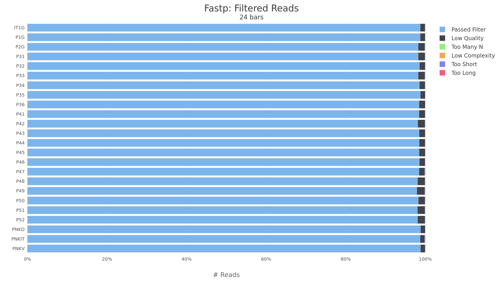
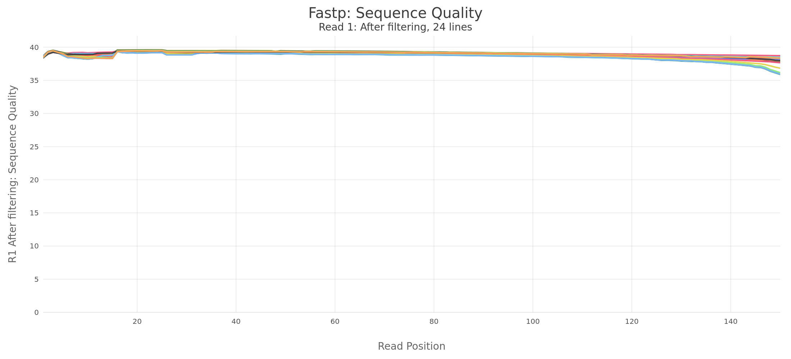
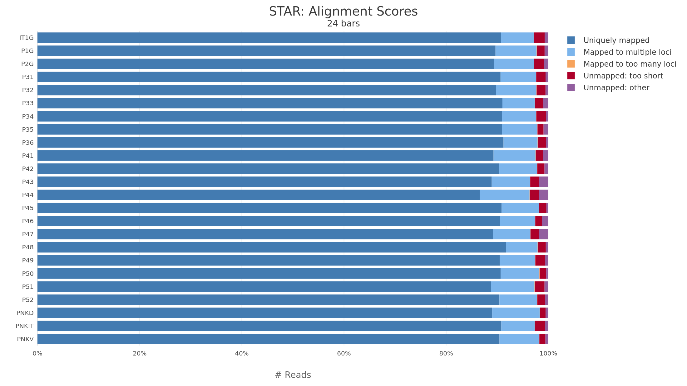
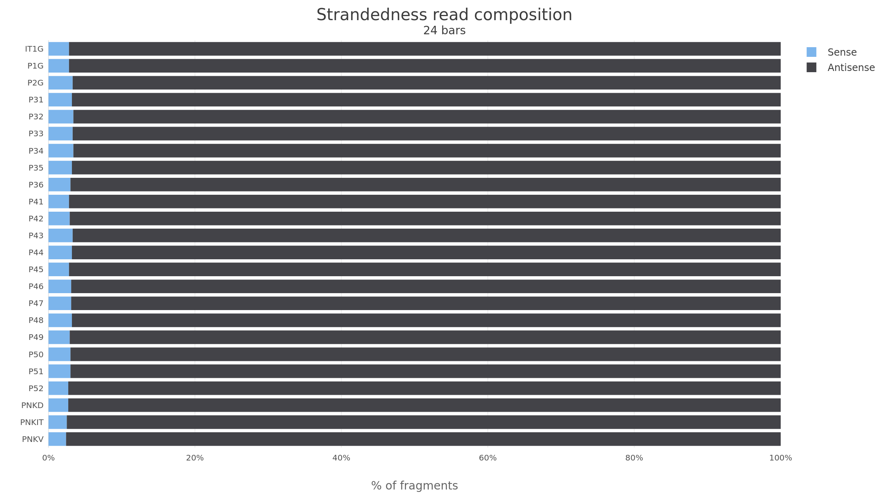

# Procesamiento bioinformatico con nf-core/rnaseq

Este capitulo documenta la primera capa computacional del proyecto: el procesamiento de lecturas RNA-seq crudas con `nf-core/rnaseq`. El objetivo de esta fase no es todavia contrastar hipotesis biologicas, sino transformar los ficheros FASTQ en una matriz de expresion trazable, reproducible y suficientemente controlada como para sostener el analisis estadistico posterior.

En este proyecto, `nf-core/rnaseq` se utilizo como flujo de trabajo principal para control de calidad, recorte de lecturas, alineamiento frente al genoma de referencia de rodaballo, cuantificacion con Salmon y agregacion de metricas con MultiQC. La salida de esta fase constituye la base sobre la que despues se construyen los modulos de exploracion, expresion diferencial y enriquecimiento funcional.

## Objetivo del procesamiento primario

El procesamiento primario persigue cuatro objetivos tecnicos:

1. Verificar la calidad de las lecturas y detectar problemas de secuenciacion, adaptadores o composicion anomala.
2. Alinear las lecturas contra una referencia genomica coherente con la anotacion utilizada.
3. Cuantificar la expresion a nivel de transcrito y gen de forma reproducible.
4. Producir informes integrados que permitan auditar cada muestra antes de pasar al analisis estadistico.

En terminos practicos, esta fase separa el problema bioinformatico en dos niveles. Primero se genera una representacion cuantitativa estandarizada de la expresion; despues, en el subproyecto `analysis/`, se filtran muestras, se definen contrastes biologicos y se ajustan modelos de expresion diferencial.

## Entradas del pipeline

El pipeline recibio como entrada una `samplesheet` con las muestras del experimento y ficheros FASTQ pareados. Los datos fueron procesados en CESGA y las salidas se guardaron bajo:

```text
results/nfcore_rnaseq/
```

La configuracion principal del ultimo run documentado en `pipeline_info` se resume en @tbl-nfcore-config.

::: {#tbl-nfcore-config}
| Parametro | Valor utilizado |
|---|---|
| Pipeline | `nf-core/rnaseq` |
| Version del workflow | `v3.25.0-g891468c` |
| Motor de ejecucion | Nextflow `25.10.3` |
| Estrategia de alineamiento/cuantificacion | `star_salmon` |
| Recorte de lecturas | `fastp` |
| Argumentos extra de fastp | `--detect_adapter_for_pe` |
| FASTA de referencia | `Scophthalmus_maximus.ASM1334776v1.dna.toplevel.fa.gz` |
| GTF de referencia | `Scophthalmus_maximus.ASM1334776v1.113.gtf.gz` |
| Carpeta de salida | `results/nfcore_rnaseq` |
| Titulo MultiQC | `Holofish turbot RNA-seq` |
| Recursos maximos configurados | 32 CPUs, 160 GB RAM, 24 h |

: Configuracion principal del run nf-core/rnaseq utilizado para generar las matrices primarias.
:::

## Referencia genomica y anotacion

Las lecturas se procesaron contra la referencia de *Scophthalmus maximus* ASM1334776v1 de Ensembl release 113. Se utilizo el FASTA `dna.toplevel`, que incluye cromosomas, contigs no colocados y scaffolds, junto con la anotacion completa en formato GTF.

Esta decision es importante para un experimento de RNA-seq en una especie no modelo: restringir el alineamiento solo a cromosomas principales podria perder lecturas procedentes de regiones anotadas en scaffolds o contigs no integrados. La combinacion `dna.toplevel` + GTF de Ensembl mantiene la coherencia entre coordenadas genomicas, anotacion de genes y cuantificacion.

::: {.callout-note title="Identificadores de genes"}
El identificador primario que se conserva a lo largo del analisis es el identificador Ensembl de rodaballo (`ENSSMAG...`). Los simbolos de genes, nombres funcionales u ortologos se tratan como anotaciones auxiliares, no como claves primarias. Esta regla evita ambiguedades durante la integracion con resultados de expresion diferencial y enriquecimiento funcional.
:::

### Resumen de la referencia

::: {#tbl-reference-summary}
| Caracteristica | Valor |
|---|---|
| Especie | *Scophthalmus maximus* |
| Ensamblado | ASM1334776v1 |
| Fuente | Ensembl release 113 |
| FASTA | `dna.toplevel.fa.gz` |
| Anotacion | `gtf.gz` |
| Uso principal | Alineamiento STAR y cuantificacion Salmon |

: Referencia genomica y anotacion utilizadas por el pipeline nf-core/rnaseq.
:::

## Arquitectura del flujo nf-core

El flujo `star_salmon` combina alineamiento splice-aware con STAR y cuantificacion transcriptomica con Salmon. A grandes rasgos, la ejecucion siguio la estructura de @tbl-nfcore-modules.

::: {#tbl-nfcore-modules}
| Etapa | Herramienta principal | Salida relevante |
|---|---|---|
| Validacion de FASTQ | `fq` / `fq-lint` | Informes de integridad de FASTQ |
| Control de calidad inicial | FastQC | Informes por muestra y lectura |
| Recorte y filtrado | fastp `1.0.1` | Lecturas filtradas, metricas de calidad y adaptadores |
| Preparacion de referencia | STAR / Salmon index | Indices reproducibles de genoma y transcriptoma |
| Alineamiento | STAR `2.7.11b` | BAM alineados y metricas de mapeo |
| Marcado de duplicados | Picard `3.4.0` | Porcentaje de duplicacion |
| Cuantificacion | Salmon `1.10.3` | Abundancias por transcrito |
| Agregacion de matrices | tximeta / SummarizedExperiment | Matrices gene-level y transcript-level |
| Informe integrado | MultiQC | Resumen HTML, tablas y figuras comparativas |

: Modulos principales de nf-core/rnaseq y salidas que se reutilizan en el proyecto.
:::

## Control de calidad de lecturas

El recorte de adaptadores y filtrado de lecturas se realizo con fastp. Las metricas agregadas de MultiQC indican una retencion alta de lecturas tras filtrado y una calidad global consistente entre muestras.

::: {#tbl-fastp-summary}
| Metrica MultiQC | Resumen del run |
|---|---|
| Numero de muestras procesadas | 24 |
| Lecturas que sobreviven al filtrado | Media 98.45%; rango 97.92-98.84% |
| Bases Q30 tras filtrado | Media 94.71%; rango 93.23-95.81% |
| Duplicacion estimada por fastp | Media 22.35%; rango 9.86-32.10% |
| Longitud media antes de filtrado | 150 bp por lectura |

: Resumen de calidad y filtrado de lecturas obtenido a partir de `multiqc_general_stats.txt`.
:::

La proporcion de lecturas que pasan los filtros de fastp fue elevada en todas las muestras, lo que sugiere que el proceso de limpieza no elimino una fraccion problematica del experimento. En RNA-seq, esta observacion es relevante porque perdidas muy desiguales entre muestras podrian introducir sesgos de profundidad o composicion antes del modelado estadistico.

{#fig-fastp-filtered fig-align="center"}

La calidad por ciclo despues del filtrado se mantuvo alta a lo largo de la lectura. Esta figura es util como comprobacion visual rapida: caidas abruptas al final de las lecturas, perfiles muy divergentes entre muestras o valores bajos de calidad podrian justificar un filtrado mas agresivo o una revision especifica de bibliotecas.

{#fig-fastp-quality fig-align="center"}

## Alineamiento con STAR

El alineamiento se realizo con STAR contra el genoma de referencia de rodaballo. La tasa media de alineamiento fue alta y estable, con una media del 97.52% de lecturas mapeadas y un rango de 96.31-98.31%. La proporcion de lecturas unicamente alineadas fue tambien consistente, con una media del 90.09% y un rango de 86.56-91.71%.

::: {#tbl-star-summary}
| Metrica STAR / samtools | Resumen del run |
|---|---|
| Lecturas STAR por muestra | Media 24.51 millones; rango 20.15-42.92 millones |
| Lecturas mapeadas | Media 97.52%; rango 96.31-98.31% |
| Lecturas unicamente mapeadas | Media 90.09%; rango 86.56-91.71% |
| Lecturas multimapeadas | Bajas en relacion con el total mapeado |
| Resultado general | Alineamiento robusto y comparable entre muestras |

: Resumen de alineamiento derivado de las tablas MultiQC de STAR y samtools.
:::

La figura de MultiQC permite comparar rapidamente la composicion del alineamiento entre muestras. En este run no se observa un patron extremo que sugiera fallo global de alineamiento en una muestra concreta.

{#fig-star-alignment fig-align="center"}

## Informacion de cadena de la biblioteca

La comprobacion de strandedness es una salvaguarda importante en RNA-seq. Una especificacion incorrecta de la orientacion de la biblioteca puede degradar la cuantificacion y afectar la interpretacion de genes solapantes o regiones antisense. nf-core/rnaseq agrega esta informacion en MultiQC para contrastar la composicion observada con el modelo de biblioteca esperado.

{#fig-strand-check fig-align="center"}

## Cuantificacion con Salmon y matrices resultantes

Tras el alineamiento, el flujo `star_salmon` produjo cuantificaciones transcriptomicas con Salmon y matrices agregadas a nivel de gen. Para el analisis downstream de este proyecto se conserva Salmon como fuente primaria de conteos y TPM, mientras que otras estrategias de conteo se tratan como recursos secundarios o de sensibilidad.

Las salidas principales reutilizadas en `analysis/` son:

```text
results/nfcore_rnaseq/star_salmon/salmon.merged.gene.SummarizedExperiment.rds
results/nfcore_rnaseq/star_salmon/salmon.merged.gene_counts.tsv
results/nfcore_rnaseq/star_salmon/salmon.merged.gene_tpm.tsv
```

Estas matrices son el puente entre la ejecucion nf-core y el analisis estadistico modular del proyecto. En particular, el objeto `SummarizedExperiment` y las tablas gene-level permiten importar conteos de forma consistente, mantener metadatos de muestra y construir los modelos de DESeq2 sin volver a procesar FASTQ o BAM.

::: {.callout-tip title="Decision de analisis downstream"}
Salmon gene-level se adopta como matriz principal para expresion diferencial. `featureCounts` y `HTSeq` pueden usarse como comprobaciones de sensibilidad, pero no sustituyen la matriz primaria salvo decision explicita.
:::

## Salidas auditables del run

La organizacion de salidas de nf-core permite auditar el procesamiento desde distintos niveles de detalle:

::: {#tbl-nfcore-outputs}
| Carpeta | Contenido | Uso en este proyecto |
|---|---|---|
| `fastp/` | Informes HTML/JSON y logs por muestra | Diagnostico de filtrado, adaptadores y calidad |
| `fastqc/` | QC antes y despues de trimming | Revision de calidad por lectura |
| `star_salmon/` | BAM, cuantificaciones Salmon y matrices combinadas | Entrada principal para analisis downstream |
| `multiqc/star_salmon/` | Informe integrado, tablas y figuras | Resumen comparativo y documentacion del run |
| `pipeline_info/` | Parametros, versiones y metadatos de ejecucion | Reproducibilidad y trazabilidad |

: Estructura de salidas nf-core/rnaseq relevante para la documentacion y el analisis posterior.
:::

## Lectura critica de esta fase

El procesamiento primario produjo un conjunto de salidas tecnicamente solido: las lecturas sobreviven al filtrado en alta proporcion, la calidad post-filtrado es elevada, el alineamiento contra el genoma de rodaballo es alto y las matrices gene-level estan disponibles para modelado estadistico. Esta conclusion no implica que todas las muestras deban entrar automaticamente en todos los analisis biologicos. La seleccion final de muestras, exclusion de tejidos no objetivo y definicion de contrastes se realiza despues, dentro del subproyecto `analysis/`, usando PCA, metadatos biologicos y criterios experimentales.

Por tanto, la funcion de este capitulo es documentar la procedencia y calidad de la matriz primaria. Los capitulos siguientes se centran en la inspeccion exploratoria, la estructura de los datos y la interpretacion biologica de las diferencias transcriptomicas asociadas a pigmentacion y superficie corporal.
