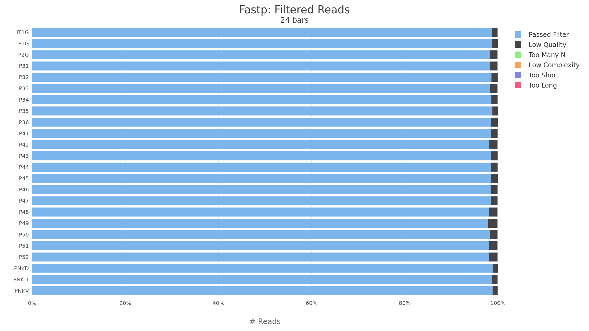
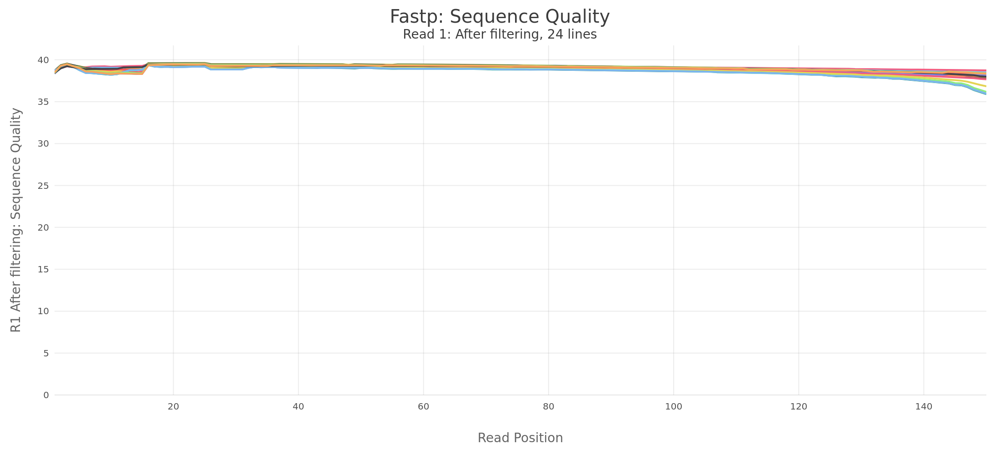
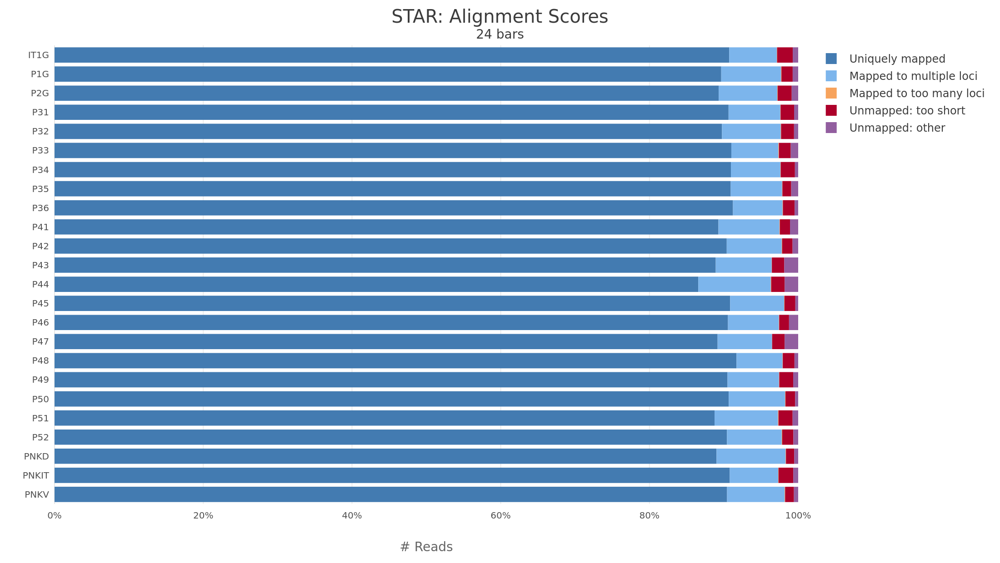
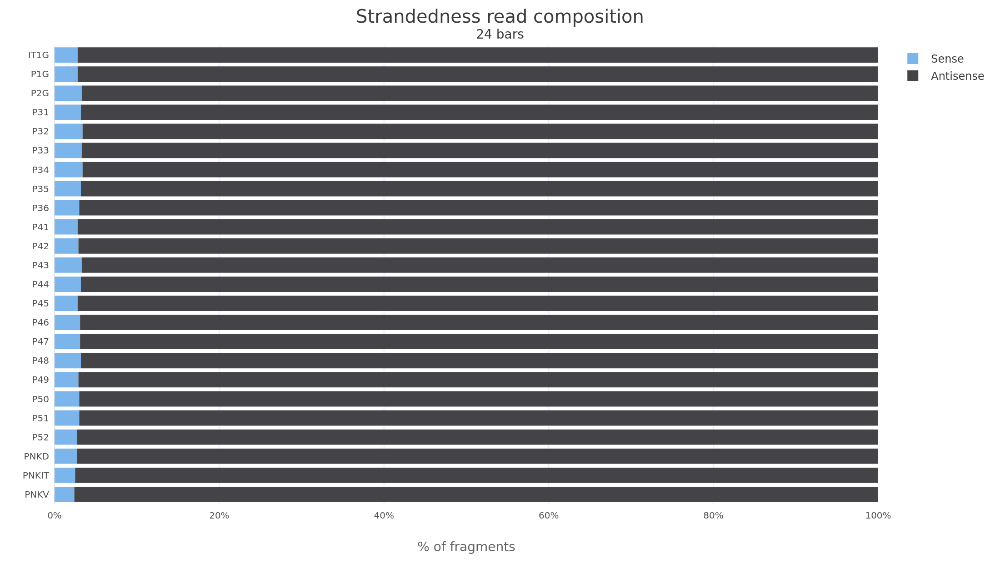

# Preprocesamiento bioinformático con nf-core/rnaseq

## Objetivo del bloque

Este capítulo describe la fase de procesamiento primario del RNA-seq. Su función es documentar cómo se transformaron los FASTQ en salidas auditables de calidad, alineamiento y cuantificación. Todavía no se prueban hipótesis biológicas; se verifica que los datos tienen calidad suficiente para sostener comparaciones transcriptómicas entre regiones de piel normal y pseudoalbina.

El procesamiento se realizó con **`nf-core/rnaseq`**, usando la estrategia **`star_salmon`**: control de calidad de lecturas, filtrado con `fastp`, alineamiento con `STAR`, cuantificación con `Salmon`, controles post-alineamiento e integración de métricas con `MultiQC`.

::: {.callout-note title="Resultado técnico global"}
El flujo procesó **24 bibliotecas** con métricas sólidas: **98.45%** de lecturas retenidas tras filtrado, **94.71%** de bases Q30 post-filtrado, **97.52%** de alineamiento STAR total y **90.09%** de alineamiento único. Estos valores apoyan el uso de las matrices **Salmon gene-level** como entrada principal del análisis diferencial.
:::

## Pregunta técnica

La pregunta central del preprocesamiento es si las lecturas, el alineamiento y la cuantificación son suficientemente consistentes como para interpretar diferencias de expresión sin que el resultado esté dominado por artefactos técnicos.

Para responderla se evaluaron:

- calidad de secuenciación, bases Q30, adaptadores y composición de lecturas;
- eficiencia de filtrado y proporción de lecturas conservadas;
- compatibilidad con la referencia de *Scophthalmus maximus*;
- orientación de biblioteca y coherencia de strandedness;
- duplicación y complejidad de biblioteca;
- trazabilidad de versiones, parámetros, informes MultiQC y matrices exportadas.

## Configuración reproducible

La ejecución documentada corresponde a `nf-core/rnaseq` versión **`v3.25.0-g891468c`**, con **Nextflow `25.10.3`**. La estrategia `star_salmon` combina un alineamiento genómico *splice-aware* con una cuantificación transcriptómica robusta.

::: {#tbl-nfcore-config}
| Aspecto | Valor utilizado | Interpretación |
|:--|:--|:--|
| Pipeline | `nf-core/rnaseq` | Flujo comunitario reproducible para RNA-seq |
| Versión workflow | `v3.25.0-g891468c` | Fija la lógica del pipeline |
| Motor | Nextflow `25.10.3` | Controla ejecución, caché y trazabilidad |
| Estrategia | `star_salmon` | STAR para alineamiento; Salmon para cuantificación |
| Trimming | fastp `1.0.1` | Recorte y filtrado automático de lecturas |
| Argumentos fastp | `--detect_adapter_for_pe` | Detección automática de adaptadores paired-end |
| Referencia FASTA | `Scophthalmus_maximus.ASM1334776v1.dna.toplevel.fa.gz` | Genoma completo de rodaballo |
| Anotación GTF | `Scophthalmus_maximus.ASM1334776v1.113.gtf.gz` | Anotación Ensembl release 113 |
| Salida principal | `results/nfcore_rnaseq/` | Carpeta con QC, alineamientos, Salmon y MultiQC |
| Recursos máximos | 32 CPUs, 160 GB RAM, 24 h | Límites de ejecución en CESGA |

: Configuración principal del procesamiento con `nf-core/rnaseq`.
:::

::: {.callout-tip title="Por qué STAR y Salmon"}
La combinación **STAR + Salmon** permite conservar evidencia de alineamiento genómico, útil para auditar tasas de mapeo y calidad de BAM, y al mismo tiempo obtener cuantificaciones transcriptómicas/gene-level preparadas para importación downstream. En este proyecto, Salmon gene-level se toma como matriz primaria para DESeq2.
:::

## Referencia genómica y anotación

Las lecturas se alinearon contra el ensamblado **ASM1334776v1** de *Scophthalmus maximus* procedente de **Ensembl release 113**. Se utilizó el FASTA `dna.toplevel`, que incluye cromosomas, contigs no colocados y scaffolds, junto con la anotación completa en formato GTF.

Esta decisión es relevante en una especie no modelo. Una referencia restringida a cromosomas principales podría perder lecturas de genes anotados en regiones todavía no integradas. El uso de `dna.toplevel` reduce ese riesgo y mejora la coherencia entre alineamiento, anotación y cuantificación.

::: {#tbl-reference-summary}
| Elemento | Valor | Consecuencia práctica |
|:--|:--|:--|
| Especie | *Scophthalmus maximus* | Referencia específica de rodaballo |
| Ensamblado | ASM1334776v1 | Misma base genómica para STAR y Salmon |
| Fuente | Ensembl release 113 | Anotación trazable y versionada |
| FASTA | `dna.toplevel.fa.gz` | Incluye cromosomas, contigs y scaffolds |
| Anotación | `gtf.gz` | Compatible con STAR, Salmon, featureCounts y HTSeq |
| Identificador primario | `ENSSMAG` | Clave estable durante todo el análisis |

: Referencia genómica usada para alineamiento y cuantificación.
:::

::: {.callout-important title="Identificadores de genes"}
Durante todo el análisis se mantiene **`ENSSMAG` como identificador primario**. Los símbolos, nombres funcionales y ortólogos se usan como etiquetas interpretativas, no como claves. Esta regla evita pérdidas de trazabilidad al conectar matrices, DEGs y enriquecimiento funcional.
:::

## Arquitectura del flujo

El pipeline puede leerse como una cadena de control de calidad progresivo. Cada etapa produce una salida útil para el análisis y una evidencia de auditoría para decidir si las muestras continúan hacia downstream.

::: {#tbl-nfcore-modules}
| Etapa | Herramienta principal | Salida relevante | Decisión que informa |
|:--|:--|:--|:--|
| Validación FASTQ | `fq` / `fq-lint` | Informes de integridad | Detectar ficheros corruptos o mal formados |
| QC inicial | FastQC | HTML/ZIP por lectura | Evaluar calidad, GC, adaptadores y sesgos |
| Filtrado | fastp | JSON/HTML/logs | Confirmar retención de lecturas y Q30 |
| Índices | STAR / Salmon | Índices genómicos/transcriptómicos | Reproducibilidad de referencia |
| Alineamiento | STAR | BAM y métricas de mapeo | Compatibilidad muestra-referencia |
| Duplicados | Picard | Porcentaje de duplicación | Complejidad de biblioteca |
| QC RNA-seq post-alineamiento | Qualimap | Informes RNA-seq QC | Origen genómico y sesgo de cobertura |
| Sesgos post-alineamiento | RSeQC | Distribución de lecturas, junctions y strandedness | Coherencia de biblioteca y anotación |
| Duplicación dependiente de expresión | dupRadar | Gráficos por muestra | Distinguir duplicación técnica de abundancia real |
| Conteo sobre anotación | featureCounts | Conteos por gen/feature | Matriz alternativa para sensibilidad |
| Reconstrucción/transcritos | StringTie | Abundancias y ficheros Ballgown | Recurso secundario |
| Cuantificación | Salmon | Abundancias por transcrito/gen | Entrada principal a matrices de expresión |
| Integración | MultiQC | Figuras y tablas comparativas | Revisión global del run |

: Etapas principales del procesamiento primario y uso de sus salidas.
:::

## Rendimiento global

El run procesó **24 bibliotecas paired-end**. La profundidad media reportada por STAR fue de **24.51 millones** de lecturas por muestra, con un rango entre **20.15 M** (`PNKV`) y **42.92 M** (`P33`). La variación de profundidad no es extrema para RNA-seq bulk y se trata posteriormente mediante normalización de tamaño de biblioteca.

::: {#tbl-run-summary}
| Métrica | Media | Mínimo | Máximo | Lectura técnica |
|:--|--:|--:|--:|:--|
| Lecturas STAR por muestra (M) | 24.51 | 20.15 (`PNKV`) | 42.92 (`P33`) | Profundidad suficiente y moderadamente variable |
| Lecturas retenidas por fastp (%) | 98.45 | 97.92 (`P49`) | 98.84 (`PNKD`) | Filtrado suave, sin pérdidas masivas |
| Bases Q30 post-filtrado (%) | 94.71 | 93.23 (`P49`) | 95.81 (`P33`) | Calidad alta en todo el lote |
| Adaptadores detectados (%) | 5.24 | 3.32 (`P34`) | 9.67 (`PNKIT`) | Contaminación por adaptadores controlada |
| Alineamiento STAR total (%) | 97.52 | 96.31 (`P44`) | 98.31 (`PNKD`) | Muy buena compatibilidad con referencia |
| Alineamiento único STAR (%) | 90.09 | 86.56 (`P44`) | 91.71 (`P48`) | Señal mayoritariamente específica |
| Duplicación fastp (%) | 22.35 | 9.86 (`P2G`) | 32.10 (`P47`) | Variación moderada de complejidad |

: Resumen cuantitativo de las métricas principales del preprocesamiento.
:::

## Filtrado con fastp

El filtrado con **fastp** fue eficaz y conservador. La proporción de lecturas retenidas se mantuvo entre **97.92%** y **98.84%**, lo que indica que el pipeline no tuvo que descartar grandes fracciones de ninguna muestra. Este patrón evita que la normalización posterior tenga que compensar pérdidas técnicas severas entre bibliotecas.

{#fig-fastp-filtered fig-align="center"}

La calidad por ciclo después del filtrado se mantuvo alta. La media de bases **Q30** fue **94.71%**, con valores entre **93.23%** (`P49`) y **95.81%** (`P33`).

{#fig-fastp-quality fig-align="center"}

## Alineamiento y orientación de biblioteca

El alineamiento frente a la referencia de rodaballo fue robusto. La tasa media de alineamiento total fue **97.52%**, con un rango estrecho entre **96.31%** (`P44`) y **98.31%** (`PNKD`). La fracción de lecturas unívocamente alineadas fue alta, con media **90.09%**, mínimo **86.56%** (`P44`) y máximo **91.71%** (`P48`).

{#fig-star-alignment fig-align="center"}

La comprobación de **strandedness** confirmó que las bibliotecas eran coherentes con una orientación `reverse`. Esta comprobación es importante porque una orientación mal especificada puede afectar genes solapantes, transcritos antisense y estimaciones de abundancia.

{#fig-strand-check fig-align="center"}

## Tabla por muestra

@tbl-sample-qc reúne las métricas principales por muestra en formato copiable.

::: {#tbl-sample-qc}
| Sample | STAR reads (M) | Mapped (%) | Unique (%) | Q30 after filtering (%) | Reads retained (%) | Duplication (%) | Adapter (%) |
|:--|--:|--:|--:|--:|--:|--:|--:|
| IT1G | 22.02 | 97.12 | 90.72 | 94.83 | 98.76 | 10.80 | 8.23 |
| P1G | 26.00 | 97.70 | 89.65 | 95.16 | 98.76 | 16.22 | 5.88 |
| P2G | 24.57 | 97.19 | 89.31 | 93.90 | 98.26 | 9.86 | 5.30 |
| P31 | 22.80 | 97.60 | 90.64 | 94.56 | 98.27 | 26.73 | 4.80 |
| P32 | 23.31 | 97.65 | 89.75 | 95.24 | 98.59 | 17.14 | 4.77 |
| P33 | 42.92 | 97.33 | 91.01 | 95.81 | 98.27 | 23.12 | 5.73 |
| P34 | 20.73 | 97.61 | 90.95 | 95.41 | 98.57 | 24.89 | 3.32 |
| P35 | 21.68 | 97.84 | 90.93 | 94.62 | 98.80 | 22.91 | 3.50 |
| P36 | 24.63 | 97.90 | 91.23 | 94.35 | 98.48 | 24.37 | 4.51 |
| P41 | 24.76 | 97.48 | 89.27 | 95.17 | 98.46 | 21.11 | 4.42 |
| P42 | 28.11 | 97.79 | 90.39 | 95.27 | 98.15 | 31.26 | 3.81 |
| P43 | 21.19 | 96.44 | 88.91 | 95.35 | 98.50 | 31.80 | 7.63 |
| P44 | 25.42 | 96.31 | 86.56 | 94.98 | 98.51 | 30.08 | 6.47 |
| P45 | 23.60 | 98.11 | 90.85 | 94.64 | 98.48 | 26.45 | 6.10 |
| P46 | 21.31 | 97.41 | 90.56 | 94.27 | 98.56 | 24.12 | 3.91 |
| P47 | 20.87 | 96.49 | 89.16 | 94.77 | 98.47 | 32.10 | 5.25 |
| P48 | 25.52 | 97.90 | 91.71 | 94.21 | 98.11 | 27.48 | 4.23 |
| P49 | 22.58 | 97.42 | 90.50 | 93.23 | 97.92 | 29.71 | 5.58 |
| P50 | 29.48 | 98.25 | 90.66 | 94.93 | 98.30 | 25.94 | 3.41 |
| P51 | 23.38 | 97.28 | 88.75 | 93.53 | 98.07 | 11.66 | 6.80 |
| P52 | 24.66 | 97.79 | 90.42 | 93.52 | 98.10 | 17.35 | 3.54 |
| PNKD | 25.15 | 98.31 | 89.02 | 95.32 | 98.84 | 21.12 | 4.52 |
| PNKIT | 23.51 | 97.32 | 90.80 | 95.08 | 98.74 | 12.64 | 9.67 |
| PNKV | 20.15 | 98.18 | 90.44 | 94.78 | 98.83 | 17.43 | 4.35 |

: Métricas principales por muestra extraídas de `multiqc_general_stats.txt`.
:::

## Salidas para downstream

Tras el alineamiento, `star_salmon` produjo cuantificaciones con Salmon y matrices agregadas a nivel de gen. Las salidas principales que alimentan el análisis downstream son:

```text
results/nfcore_rnaseq/star_salmon/salmon.merged.gene.SummarizedExperiment.rds
results/nfcore_rnaseq/star_salmon/salmon.merged.gene_counts.tsv
results/nfcore_rnaseq/star_salmon/salmon.merged.gene_tpm.tsv
```

La matriz **gene-level counts** se usa como entrada principal para **DESeq2**. La matriz **TPM** se conserva para exploración, visualización y comprobaciones de expresión relativa, pero no sustituye a los conteos en el modelado diferencial.

## Conclusión del bloque

El procesamiento primario generó una base cuantitativa adecuada para exploración de muestras, PCA, definición de contrastes y expresión diferencial. No hay evidencia de que el patrón biológico del estudio vaya a estar dominado por baja calidad de FASTQ, mala compatibilidad con la referencia o fallos globales de alineamiento.
