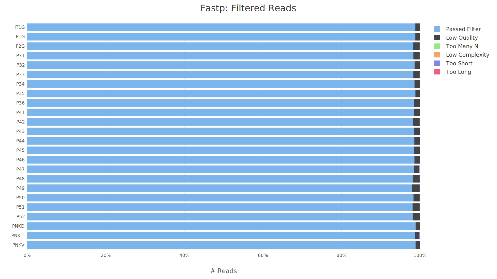
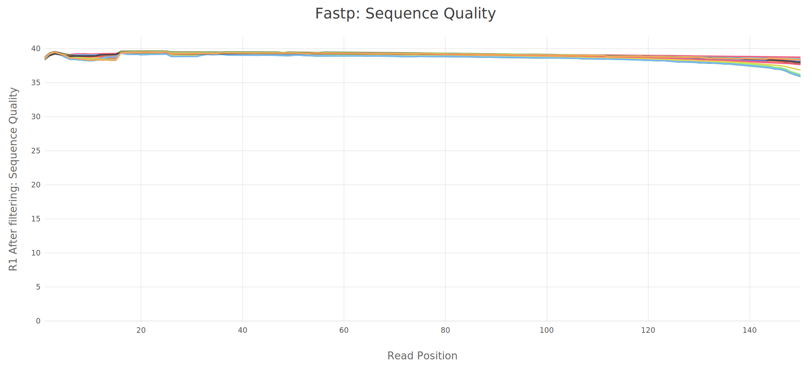
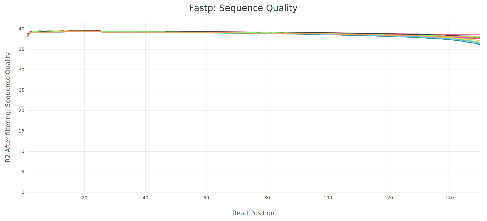
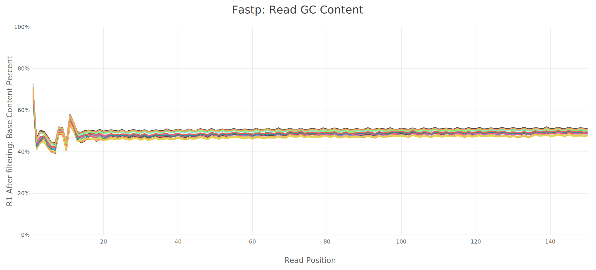
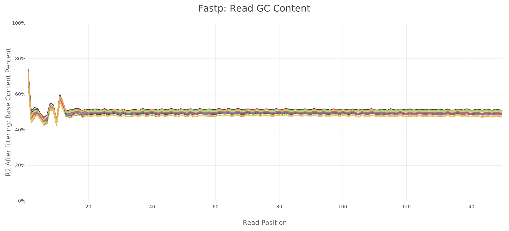
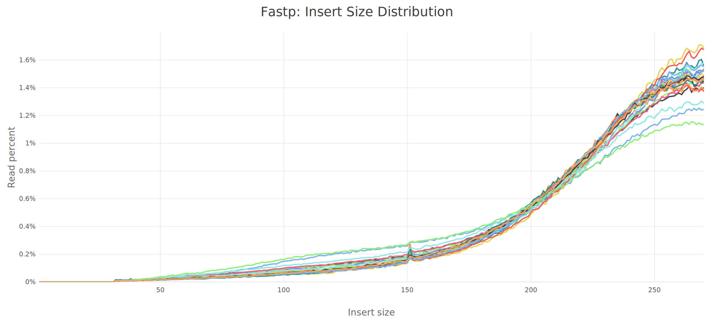
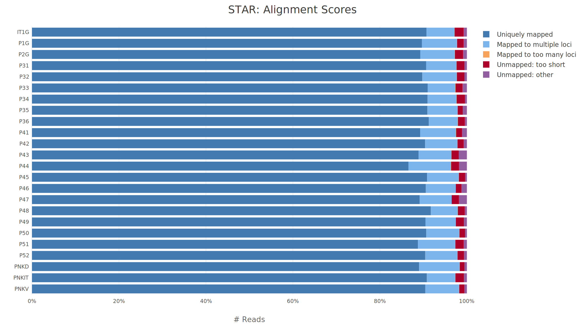
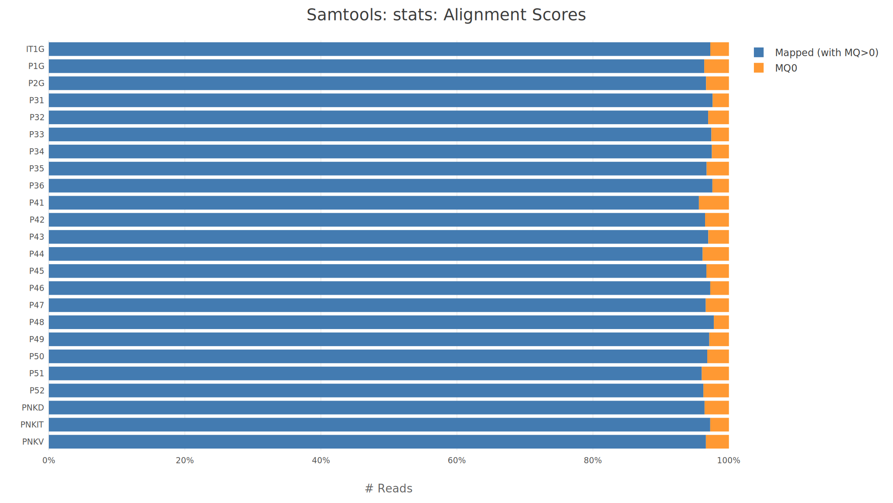
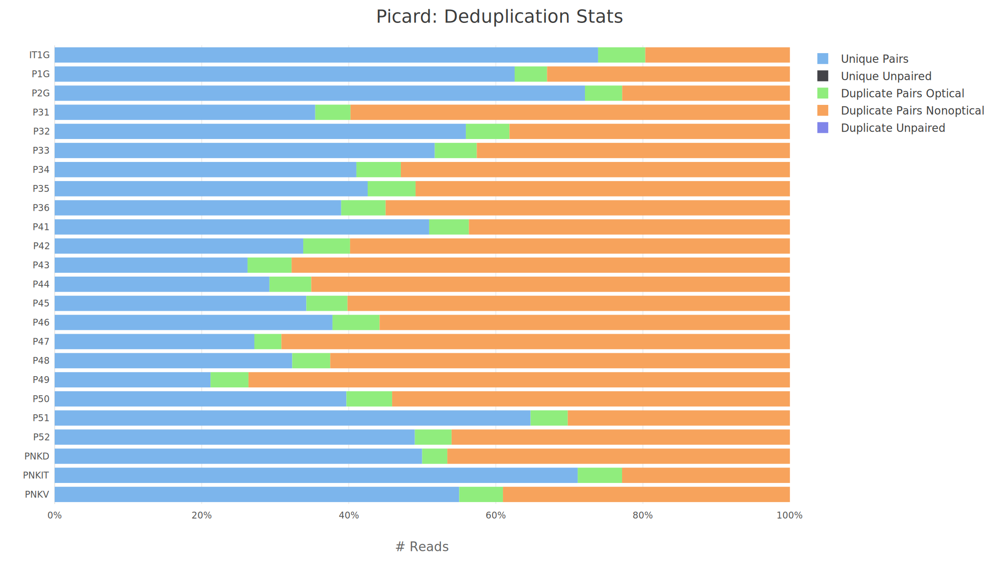
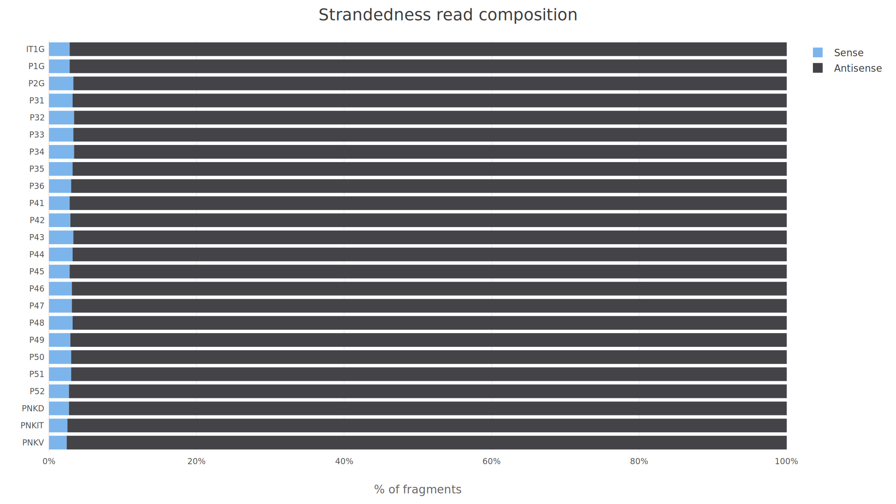

# Control de calidad integrado con MultiQC

El informe **MultiQC** se utiliza aquí como una fuente estructurada de resultados, no como una captura aislada. La idea es que el lector pueda seguir el control de calidad **herramienta por herramienta**, viendo las mismas figuras exportadas por MultiQC y consultando las tablas originales en formato copiable.

Este capítulo documenta los módulos principales generados por `nf-core/rnaseq` en la rama `star_salmon`: **fastp**, **STAR**, **Samtools**, **Picard**, **strand check** y **versiones de software**. La interpretación combina dos niveles: una lectura *técnica*, centrada en si las bibliotecas son válidas para el análisis downstream, y una lectura *biológica*, centrada en si los resultados permiten confiar en la señal transcriptómica posterior.

::: {.callout-tip title="Informe original"}
El informe MultiQC completo se conserva como anexo navegable. Las secciones siguientes integran sus figuras y tablas principales dentro del libro, pero el HTML original sigue disponible para inspección interactiva.

  <a class="btn btn-primary" href="../multiqc/star_salmon/multiqc_report.html" target="_blank" rel="noopener">Abrir informe MultiQC completo</a>
  <a class="btn btn-outline-secondary" href="../multiqc/star_salmon/multiqc_report_data/multiqc_general_stats.txt" target="_blank" rel="noopener">Descargar tabla General Stats</a>

:::

## Resumen ejecutivo del QC

El control de calidad global fue favorable. El lote contiene **24 muestras**, todas con tasas altas de filtrado y alineamiento. No se detectó un patrón técnico que justifique excluir muestras en esta fase. Algunos extremos moderados deben seguirse en PCA y análisis exploratorio, especialmente `P44`, `P47`, `P49` y `PNKIT`.

::: {.metric-grid}
::: {.metric-card}
**24**

Muestras procesadas por `nf-core/rnaseq`.
:::

::: {.metric-card}
**98.45%**

Retención media de lecturas tras `fastp`.
:::

::: {.metric-card}
**97.52%**

Alineamiento medio total con **STAR**.
:::

::: {.metric-card}
**90.09%**

Alineamiento único medio con **STAR**.
:::

::: {.metric-card}
**97.0%**

Orientación media inferida como *reverse* por Salmon.
:::
:::

::: {#tbl-qc-decision-matrix}
| Módulo MultiQC | Resultado observado | Decisión técnica | Lectura biológica |
|---|---:|---|---|
| `fastp` filtering | Retención media **98.45%**; mínimo **97.92%** (`P49`) | Aceptar | No hay pérdida diferencial fuerte de lecturas |
| `fastp` Q30 | Q30 post-filtrado medio **94.71%**; mínimo **93.23%** (`P49`) | Aceptar | Calidad suficiente para cuantificación transcriptómica |
| `fastp` adapters | Media **5.24%**; máximo **9.67%** (`PNKIT`) | Aceptar con recorte | La señal de adaptadores queda controlada por trimming |
| `STAR` alignment | Media **97.52%**; mínimo **96.31%** (`P44`) | Aceptar | Buena compatibilidad muestra-referencia |
| `STAR` unique alignment | Media **90.09%**; mínimo **86.56%** (`P44`) | Vigilar `P44` | Revisar en PCA, no excluir por QC primario |
| `Picard` duplicates | Media **54.31%**; máximo **78.80%** (`P49`) | Vigilar complejidad | Interpretar junto con abundancia de transcritos y profundidad |
| `Strand check` | **24/24** muestras inferidas como `reverse` | Aceptar | Diseño de biblioteca coherente |

: Matriz de decisión técnica derivada de las tablas y figuras exportadas por MultiQC.
:::

::: {.callout-note title="Criterio de interpretación"}
Una muestra no se elimina por ser el mínimo o máximo de una métrica. En RNA-seq bulk, algunas métricas como duplicación o profundidad pueden variar por razones biológicas y técnicas. La exclusión requiere un patrón consistente de fallo, no un valor extremo aislado.
:::

## General statistics

La tabla **General Statistics** de MultiQC resume en una sola matriz las métricas clave de todos los módulos. Es el punto de partida para detectar si una muestra se separa simultáneamente en varias dimensiones de QC: calidad, trimming, alineamiento, duplicación y mapeo.

::: {.callout-important title="Lectura rápida"}
No hay una muestra que falle globalmente en todas las métricas. `P49` combina menor retención relativa, menor Q30 y mayor duplicación Picard, por lo que debe marcarse como muestra de seguimiento. `P44` presenta el alineamiento único más bajo, pero mantiene una tasa total de alineamiento alta.
:::

Tabla MultiQC: General Statistics

## fastp: filtrado, calidad y composición

`fastp` realiza el control de calidad inicial de las lecturas, detecta y recorta adaptadores, filtra lecturas de baja calidad y resume la calidad por ciclo antes de enviar los FASTQ al alineamiento. En este proyecto, el filtrado fue homogéneo: la mayoría de las lecturas se conservaron y la calidad post-filtrado quedó en un rango alto.

{#fig-multiqc-fastp-filtered}

La figura @fig-multiqc-fastp-filtered muestra que la fracción de lecturas descartadas es baja en todas las muestras. El mínimo de retención fue `P49` con **97.92%**, todavía dentro de un rango aceptable para RNA-seq bulk. La muestra `PNKIT` presentó la mayor señal de adaptadores (**9.67%**), pero mantuvo **98.74%** de lecturas retenidas, indicando que el recorte fue efectivo.

::: {#fig-multiqc-fastp-quality layout-ncol="2"}

Calidad por ciclo después del filtrado con `fastp`. Las curvas altas y homogéneas apoyan que la señal de baja calidad fue eliminada antes del alineamiento.
:::

::: {#fig-multiqc-fastp-gc layout-ncol="2"}

Contenido GC por ciclo tras el filtrado. No se observa una desviación extrema que sugiera contaminación o sesgo fuerte de composición.
:::

{#fig-multiqc-fastp-insert}

La distribución de tamaños de inserto en @fig-multiqc-fastp-insert es útil para comprobar que las bibliotecas paired-end tienen una geometría razonable. Una distribución coherente reduce el riesgo de problemas graves de preparación de biblioteca o de mezcla de muestras.

Tabla MultiQC: fastp filtered reads

### Interpretación técnica y biológica de fastp

Técnicamente, `fastp` no detecta una degradación generalizada del lote. La combinación de alta retención, Q30 elevado y perfiles GC estables apoya continuar con el alineamiento. Biológicamente, esto es importante porque reduce la probabilidad de que las diferencias de expresión posteriores estén impulsadas por pérdidas diferenciales de lectura entre condiciones.

## STAR: alineamiento contra el genoma de referencia

`STAR` evalúa si las lecturas filtradas son compatibles con el genoma de referencia utilizado por el pipeline. En este lote, el alineamiento total fue muy alto, con una media de **97.52%**. La muestra con menor alineamiento total fue `P44` (**96.31%**), que sigue siendo un valor sólido.

{#fig-multiqc-star-alignment}

La figura @fig-multiqc-star-alignment muestra una proporción dominante de lecturas alineadas en todas las muestras. El alineamiento único medio fue **90.09%**, con mínimo en `P44` (**86.56%**) y máximo en `P48` (**91.71%**). Esta variación no sugiere un fallo de referencia, contaminación general ni baja calidad masiva.

Tabla MultiQC: STAR summary

::: {.callout-note title="Lectura técnica"}
`P44` queda como punto de vigilancia por su menor alineamiento único. La decisión correcta es conservarla en esta fase y comprobar si se comporta como outlier en PCA, clustering de muestras y distribución de conteos.
:::

## Samtools: métricas de BAM alineado

`Samtools` resume propiedades de los BAM ya alineados. Sus paneles funcionan como una comprobación posterior a STAR: mapeo, pares correctamente emparejados y proporciones de alineamientos. En este run no aparece una señal global de BAM problemático.

{#fig-multiqc-samtools-alignment}

La figura @fig-multiqc-samtools-alignment complementa a STAR y confirma que las muestras mantienen un comportamiento consistente una vez generados los BAM. Las tablas originales se conservan abajo para auditoría y copia directa.

Tabla MultiQC: Samtools flagstat counts

Tabla MultiQC: Samtools flagstat percentages

## Picard: duplicación y complejidad de biblioteca

`Picard MarkDuplicates` estima duplicación a nivel de alineamiento. Este valor suele ser más alto que la duplicación aproximada de `fastp` porque se calcula después del mapeo y considera pares alineados y coordenadas genómicas. En el lote, la duplicación Picard media fue **54.31%**, con mínimo en `IT1G` (**26.09%**) y máximo en `P49` (**78.80%**).

{#fig-multiqc-picard-dups}

La figura @fig-multiqc-picard-dups no debe leerse como un criterio automático de exclusión. En RNA-seq, una duplicación alta puede reflejar baja complejidad técnica, pero también la presencia de transcritos muy abundantes. La interpretación final debe cruzarse con profundidad, PCA y distribución de expresión.

Tabla MultiQC: Picard MarkDuplicates

::: {.callout-warning title="Puntos de seguimiento"}
`P49`, `P43`, `P47` y `P44` presentan duplicación Picard alta. No se descartan aquí, pero conviene revisarlas en la exploración multivariante y comprobar si concentran patrones de expresión anómalos.
:::

## Strand check: orientación de la biblioteca

El módulo de *strand check* compara la orientación esperada con la inferida por Salmon. En este análisis, las **24/24 muestras** fueron inferidas como `reverse`, con una proporción media de **97.0%** y rango aproximado **96.6-97.6%**.

{#fig-multiqc-strand-check}

La coherencia en @fig-multiqc-strand-check es una buena señal de reproducibilidad técnica: no hay evidencia de mezcla de orientación entre bibliotecas ni de configuración incorrecta de strandedness en el pipeline.

Tabla MultiQC: strand check summary

## Versiones de software

La reproducibilidad del análisis depende de fijar no solo los parámetros, sino también las versiones de software. MultiQC exporta una tabla de versiones por proceso, que se conserva aquí como parte del registro computacional del proyecto.

Tabla MultiQC: software versions

## Conclusión del QC integrado

El informe integrado apoya continuar con las salidas `star_salmon` como base del análisis downstream. La señal técnica principal es consistente: **alta calidad post-filtrado**, **alineamiento sólido contra la referencia**, **orientación de biblioteca coherente** y ausencia de un fallo global de muestra.

La lectura biológica es, por tanto, prudente pero positiva: si aparecen patrones fuertes en PCA o expresión diferencial, no hay evidencia en este QC primario de que deban atribuirse de entrada a un fallo general de secuenciación o alineamiento. Las muestras señaladas deben acompañar la interpretación, no bloquearla.

::: {.callout-important title="Decisión"}
Se mantienen todas las muestras para la exploración downstream. La exclusión, si ocurre más adelante, deberá justificarse con evidencia combinada de PCA, metadatos, distribución de conteos y coherencia con el diseño experimental.
:::

