# Control de calidad integrado con MultiQC

El informe **[MultiQC](https://seqera.io/multiqc/)** se utiliza aquí como una fuente estructurada de resultados, no como una captura aislada [@Ewels2016MultiQC]. La idea es que el lector pueda seguir el control de calidad **herramienta por herramienta**, viendo las mismas figuras exportadas por MultiQC y consultando las tablas originales en formato copiable.

Este capítulo documenta los módulos principales generados por **[`nf-core/rnaseq`](https://nf-co.re/rnaseq)** en la rama `star_salmon`, ejecutada sobre **[Nextflow](https://www.nextflow.io/)** [@Ewels2020Nfcore; @DiTommaso2017Nextflow]: **fastp**, **STAR**, **Samtools**, **Picard**, **strand check** y **versiones de software**. Además, integra el análisis post-alineamiento recuperado mediante `--resume` sobre los BAM ya generados: **Qualimap**, **RSeQC**, **dupRadar**, **Preseq** y **featureCounts**. La interpretación combina dos niveles: una lectura *técnica*, centrada en si las bibliotecas son válidas para el análisis downstream, y una lectura *biológica*, centrada en si los resultados permiten confiar en la señal transcriptómica posterior.

::: {.callout-tip title="Informe original"}
El informe MultiQC completo se conserva como anexo navegable. Las secciones siguientes integran sus figuras y tablas principales dentro del libro, pero el HTML original sigue disponible para inspección interactiva.

  <a class="btn btn-primary" href="../multiqc/star_salmon/multiqc_report.html" target="_blank" rel="noopener">Abrir informe MultiQC completo</a>
  <a class="btn btn-primary" href="../multiqc/bam_qc/multiqc_report.html" target="_blank" rel="noopener">Abrir MultiQC post-alineamiento</a>
  <a class="btn btn-outline-secondary" href="../multiqc/star_salmon/multiqc_report_data/multiqc_general_stats.txt" target="_blank" rel="noopener">Descargar tabla General Stats</a>

:::

## Resumen ejecutivo del QC

El control de calidad global fue favorable. El lote contiene **24 muestras**, todas con tasas altas de filtrado y alineamiento. No se detectó un patrón técnico que justifique excluir muestras en esta fase. Algunos extremos moderados deben seguirse en PCA y análisis exploratorio, especialmente `P44`, `P47`, `P49` y `PNKIT`.

::: {.metric-grid}
::: {.metric-card}
**24**

Muestras procesadas por [`nf-core/rnaseq`](https://nf-co.re/rnaseq).
:::

::: {.metric-card}
**98.45%**

Retención media de lecturas tras [`fastp`](https://github.com/OpenGene/fastp).
:::

::: {.metric-card}
**97.52%**

Alineamiento medio total con **STAR**.
:::

::: {.metric-card}
**90.09%**

Alineamiento único medio con **STAR**.
:::

::: {.metric-card}
**97.0%**

Orientación media inferida como *reverse* por [Salmon](https://combine-lab.github.io/salmon/).
:::
:::

::: {#tbl-qc-decision-matrix}
| Módulo MultiQC | Resultado observado | Decisión técnica | Lectura biológica |
|---|---:|---|---|
| `fastp` filtering | Retención media **98.45%**; mínimo **97.92%** (`P49`) | Aceptar | No hay pérdida diferencial fuerte de lecturas |
| `fastp` Q30 | Q30 post-filtrado medio **94.71%**; mínimo **93.23%** (`P49`) | Aceptar | Calidad suficiente para cuantificación transcriptómica |
| `fastp` adapters | Media **5.24%**; máximo **9.67%** (`PNKIT`) | Aceptar con recorte | La señal de adaptadores queda controlada por trimming |
| `STAR` alignment | Media **97.52%**; mínimo **96.31%** (`P44`) | Aceptar | Buena compatibilidad muestra-referencia |
| `STAR` unique alignment | Media **90.09%**; mínimo **86.56%** (`P44`) | Vigilar `P44` | Revisar en PCA, no excluir por QC primario |
| `Picard` duplicates | Media **54.31%**; máximo **78.80%** (`P49`) | Vigilar complejidad | Interpretar junto con abundancia de transcritos y profundidad |
| `Strand check` | **24/24** muestras inferidas como `reverse` | Aceptar | Diseño de biblioteca coherente |
| `Qualimap` RNA-seq QC | **24/24** muestras; sesgo 5'-3' medio **1.30**; rango **1.18-1.39** | Aceptar | No se observa degradación 5'/3' marcada |
| `RSeQC` infer experiment | **24/24** muestras; fracción `pe_antisense` media **72.73%** | Aceptar con vigilancia de `PNKIT` | Orientación mayoritaria compatible con biblioteca reverse |
| `dupRadar` | **24/24** muestras; intercepto medio **0.53**; máximo **1.57** (`P49`) | Vigilar `P49` | Separar duplicación técnica de genes altamente expresados |
| `Preseq` | **24/24** muestras con curvas de complejidad | Aceptar como auditoría de complejidad | No indica fallo global de complejidad de bibliotecas |
| `featureCounts` biotypes | **24/24** muestras; señal dominada por genes codificantes | Aceptar | La cuantificación cae mayoritariamente en biotipos esperados |

: Matriz de decisión técnica derivada de las tablas y figuras exportadas por MultiQC.
:::

::: {.callout-note title="Criterio de interpretación"}
Una muestra no se elimina por ser el mínimo o máximo de una métrica. En RNA-seq bulk, algunas métricas como duplicación o profundidad pueden variar por razones biológicas y técnicas. La exclusión requiere un patrón consistente de fallo, no un valor extremo aislado.
:::

## General statistics

La tabla **General Statistics** de MultiQC resume en una sola matriz las métricas clave de todos los módulos. Es el punto de partida para detectar si una muestra se separa simultáneamente en varias dimensiones de QC: calidad, trimming, alineamiento, duplicación y mapeo.

::: {.callout-important title="Lectura rápida"}
No hay una muestra que falle globalmente en todas las métricas. `P49` combina menor retención relativa, menor Q30 y mayor duplicación Picard, por lo que debe marcarse como muestra de seguimiento. `P44` presenta el alineamiento único más bajo, pero mantiene una tasa total de alineamiento alta.
:::

Tabla MultiQC: General Statistics

## [fastp](https://github.com/OpenGene/fastp): filtrado, calidad y composición

[`fastp`](https://github.com/OpenGene/fastp) es un preprocesador de FASTQ que combina **control de calidad**, **detección/recorte de adaptadores**, **filtrado por calidad**, evaluación de contenido de bases y generación de informes HTML/JSON [@Chen2018Fastp]. En este apartado se evalúa si el paso de trimming conserva suficientes lecturas, elimina señales técnicas evidentes y deja perfiles de calidad adecuados antes del alineamiento. En este proyecto, el filtrado fue homogéneo: la mayoría de las lecturas se conservaron y la calidad post-filtrado quedó en un rango alto.

{#fig-multiqc-fastp-filtered}

La figura @fig-multiqc-fastp-filtered muestra que la fracción de lecturas descartadas es baja en todas las muestras. El mínimo de retención fue `P49` con **97.92%**, todavía dentro de un rango aceptable para RNA-seq bulk. La muestra `PNKIT` presentó la mayor señal de adaptadores (**9.67%**), pero mantuvo **98.74%** de lecturas retenidas, indicando que el recorte fue efectivo.

::: {#fig-multiqc-fastp-quality layout-ncol="2"}

Calidad por ciclo después del filtrado con `fastp`. Las curvas altas y homogéneas apoyan que la señal de baja calidad fue eliminada antes del alineamiento.
:::

::: {#fig-multiqc-fastp-gc layout-ncol="2"}

Contenido GC por ciclo tras el filtrado. No se observa una desviación extrema que sugiera contaminación o sesgo fuerte de composición.
:::

{#fig-multiqc-fastp-insert}

La distribución de tamaños de inserto en @fig-multiqc-fastp-insert es útil para comprobar que las bibliotecas paired-end tienen una geometría razonable. Una distribución coherente reduce el riesgo de problemas graves de preparación de biblioteca o de mezcla de muestras.

Tabla MultiQC: fastp filtered reads

### Interpretación técnica y biológica de fastp

Técnicamente, `fastp` no detecta una degradación generalizada del lote. La combinación de alta retención, Q30 elevado y perfiles GC estables apoya continuar con el alineamiento. Biológicamente, esto es importante porque reduce la probabilidad de que las diferencias de expresión posteriores estén impulsadas por pérdidas diferenciales de lectura entre condiciones.

## [STAR](https://github.com/alexdobin/STAR): alineamiento contra el genoma de referencia

[`STAR`](https://github.com/alexdobin/STAR) es un alineador de RNA-seq diseñado para mapear lecturas contra un genoma de referencia teniendo en cuenta la estructura discontinua de los transcritos, especialmente los empalmes exon-exon [@Dobin2013STAR]. En este apartado se evalúa si las lecturas filtradas son compatibles con la referencia genómica y si el porcentaje de alineamiento único es suficiente para cuantificación robusta. En este lote, el alineamiento total fue muy alto, con una media de **97.52%**. La muestra con menor alineamiento total fue `P44` (**96.31%**), que sigue siendo un valor sólido.

{#fig-multiqc-star-alignment}

La figura @fig-multiqc-star-alignment muestra una proporción dominante de lecturas alineadas en todas las muestras. El alineamiento único medio fue **90.09%**, con mínimo en `P44` (**86.56%**) y máximo en `P48` (**91.71%**). Esta variación no sugiere un fallo de referencia, contaminación general ni baja calidad masiva.

Tabla MultiQC: STAR summary

::: {.callout-note title="Lectura técnica"}
`P44` queda como punto de vigilancia por su menor alineamiento único. La decisión correcta es conservarla en esta fase y comprobar si se comporta como outlier en PCA, clustering de muestras y distribución de conteos.
:::

## [Samtools](https://www.htslib.org/): métricas de BAM alineado

[`Samtools`](https://www.htslib.org/) es una suite para manipular y auditar archivos de alineamiento en formatos SAM/BAM/CRAM [@Danecek2021Samtools]. En este apartado se comprueba el comportamiento de los BAM después del alineamiento: proporción de lecturas mapeadas, pares correctamente emparejados, flags de alineamiento y consistencia general del archivo alineado. Sus paneles funcionan como una comprobación posterior a STAR. En este run no aparece una señal global de BAM problemático.

{#fig-multiqc-samtools-alignment}

La figura @fig-multiqc-samtools-alignment complementa a STAR y confirma que las muestras mantienen un comportamiento consistente una vez generados los BAM. Las tablas originales se conservan abajo para auditoría y copia directa.

Tabla MultiQC: Samtools flagstat counts

Tabla MultiQC: Samtools flagstat percentages

## [Picard](https://broadinstitute.github.io/picard/): duplicación y complejidad de biblioteca

[`Picard`](https://broadinstitute.github.io/picard/) es un conjunto de herramientas para manipular datos de secuenciación en formatos SAM/BAM/CRAM y VCF [@BroadInstitutePicard]. Aquí se usa el módulo `MarkDuplicates`, que estima duplicación a nivel de alineamiento. Este valor suele ser más alto que la duplicación aproximada de `fastp` porque se calcula después del mapeo y considera pares alineados y coordenadas genómicas. En el lote, la duplicación Picard media fue **54.31%**, con mínimo en `IT1G` (**26.09%**) y máximo en `P49` (**78.80%**).

{#fig-multiqc-picard-dups}

La figura @fig-multiqc-picard-dups no debe leerse como un criterio automático de exclusión. En RNA-seq, una duplicación alta puede reflejar baja complejidad técnica, pero también la presencia de transcritos muy abundantes. La interpretación final debe cruzarse con profundidad, PCA y distribución de expresión.

Tabla MultiQC: Picard MarkDuplicates

::: {.callout-warning title="Puntos de seguimiento"}
`P49`, `P43`, `P47` y `P44` presentan duplicación Picard alta. No se descartan aquí, pero conviene revisarlas en la exploración multivariante y comprobar si concentran patrones de expresión anómalos.
:::

## [Salmon](https://combine-lab.github.io/salmon/) / strand check: orientación de la biblioteca

[Salmon](https://combine-lab.github.io/salmon/) es una herramienta de cuantificación transcriptómica rápida y consciente de sesgos que puede inferir propiedades de la biblioteca durante el proceso de cuantificación [@Patro2017Salmon]. En este apartado, el módulo de *strand check* compara la orientación esperada con la orientación inferida por Salmon a partir de las lecturas. Esta comprobación permite detectar errores de configuración de strandedness o mezcla de bibliotecas con orientaciones incompatibles. En este análisis, las **24/24 muestras** fueron inferidas como `reverse`, con una proporción media de **97.0%** y rango aproximado **96.6-97.6%**.

{#fig-multiqc-strand-check}

La coherencia en @fig-multiqc-strand-check es una buena señal de reproducibilidad técnica: no hay evidencia de mezcla de orientación entre bibliotecas ni de configuración incorrecta de strandedness en el pipeline.

Tabla MultiQC: strand check summary

## Versiones de software

La reproducibilidad del análisis depende de fijar no solo los parámetros, sino también las versiones de software. MultiQC exporta una tabla de versiones por proceso, que se conserva aquí como parte del registro computacional del proyecto. Esta tabla conecta el resultado biológico con el entorno computacional real: pipeline, módulos, herramientas y versiones ejecutadas.

Tabla MultiQC: software versions

## QC post-alineamiento recuperado con `--resume`

El primer MultiQC integrado en este libro recogía el flujo principal `star_salmon`, pero no incluía de forma completa varios módulos post-alineamiento. Para completar esa parte se lanzó una segunda ejecución de **nf-core/rnaseq** con `--resume`, usando los **BAM marcados como duplicados** de la corrida original y activando los módulos de QC faltantes.

::: {.callout-note title="Nota sobre el nombre de carpeta `hisat2`"}
Los BAM evaluados proceden del alineamiento original con **STAR**. La carpeta `hisat2` aparece en la ejecución de recuperación por una decisión de configuración necesaria para evitar que nf-core/rnaseq reentrara en la rama de cuantificación `star_salmon` durante el reprocesado de BAM. Por tanto, las métricas de Qualimap, RSeQC, dupRadar, Preseq y featureCounts deben interpretarse como **QC post-alineamiento de los BAM STAR originales**.
:::

El job de recuperación terminó correctamente (**Slurm `COMPLETED`, exit code `0:0`**) y generó un MultiQC global con **24/24 muestras**. El informe completo queda publicado como anexo:

  <a class="btn btn-primary" href="../multiqc/bam_qc/multiqc_report.html" target="_blank" rel="noopener">Abrir MultiQC post-alineamiento</a>
  <a class="btn btn-outline-secondary" href="../multiqc/bam_qc/multiqc_report_data/multiqc_general_stats.txt" target="_blank" rel="noopener">Descargar General Stats post-alineamiento</a>

::: {#tbl-bam-qc-modules}
| Herramienta | Cobertura | Qué evalúa | Resultado principal |
|---|---:|---|---|
| [`Qualimap`](http://qualimap.conesalab.org/) | 24/24 | Origen genómico, cobertura sobre cuerpo génico y sesgo 5'-3' | Sesgo 5'-3' moderado, media **1.30**, rango **1.18-1.39** |
| [`RSeQC`](http://rseqc.sourceforge.net/) | 24/24 | BAM, orientación, distribución de lecturas, distancia interna, junctions y duplicación | Orientación mayoritaria compatible con biblioteca reverse; `PNKIT` con fracción no determinada alta |
| [`dupRadar`](https://bioconductor.org/packages/dupRadar/) | 24/24 | Duplicación dependiente del nivel de expresión | Intercepto medio **0.53**; máximo **1.57** en `P49` |
| [`Preseq`](http://smithlabresearch.org/software/preseq/) | 24/24 | Complejidad molecular y rendimiento esperado al resecuenciar | Curvas disponibles para todas las muestras; sin fallo global evidente |
| [`featureCounts`](https://subread.sourceforge.net/featureCounts.html) | 24/24 | Asignación de lecturas a biotipos anotados | La señal está dominada por genes codificantes, media **98.89%** |

: Estado actualizado de los módulos post-alineamiento tras el `--resume`.
:::

### [Qualimap](http://qualimap.conesalab.org/): origen genómico y sesgo de cobertura

[`Qualimap`](http://qualimap.conesalab.org/) evalúa la calidad de alineamientos de secuenciación y, en modo RNA-seq, resume cómo se distribuyen las lecturas respecto a la anotación: regiones exónicas, intrónicas, intergénicas, lecturas en junctions y perfil de cobertura a lo largo del cuerpo génico [@GarciaAlcalde2012Qualimap].

En esta recuperación, Qualimap se generó para **24/24 muestras**. El sesgo 5'-3' fue bajo-moderado, con media **1.30**, mínimo **1.18** (`P49`) y máximo **1.39** (`P44`). Esto no sugiere degradación extrema ni un sesgo sistemático fuerte a lo largo del cuerpo génico.

::: {#fig-qualimap-bamqc layout-ncol="2"}
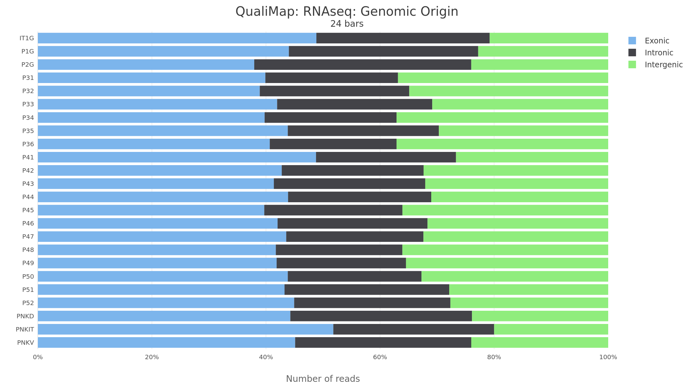

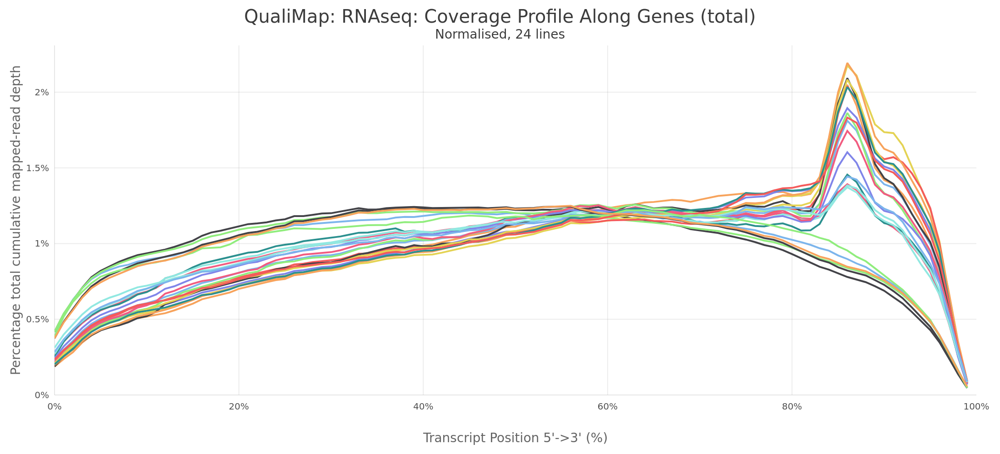

Resumen Qualimap del QC post-alineamiento. El origen genómico ayuda a evaluar la compatibilidad con la anotación, mientras que el perfil de cobertura permite detectar sesgos 5'-3' o degradación.
:::

La proporción relativa de lecturas exónicas, intrónicas e intergénicas debe leerse con prudencia. En transcriptómica de especies con anotación perfectible, una fracción intergénica o intrónica apreciable no implica automáticamente contaminación; puede reflejar anotaciones incompletas, transcritos no anotados, pre-mRNA o regiones reguladoras transcritas.

Tabla MultiQC BAM-QC: Qualimap RNA-seq genome results

### [RSeQC](http://rseqc.sourceforge.net/): coherencia de BAM, biblioteca y anotación

[`RSeQC`](http://rseqc.sourceforge.net/) es un conjunto de módulos de control de calidad para RNA-seq alineado [@Wang2012RSeQC]. A diferencia de STAR o Samtools, que resumen métricas generales de mapeo, RSeQC entra en detalles propios del RNA-seq: distribución de lecturas sobre genes, compatibilidad con la orientación de biblioteca, saturación de junctions, distancia interna entre pares y patrones de duplicación.

:::: panel-tabset
## Orientación

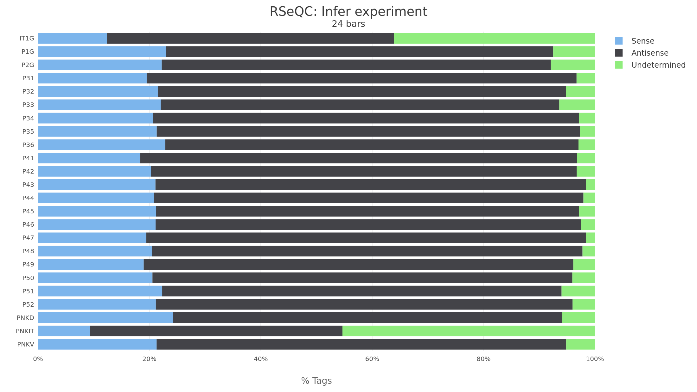{#fig-rseqc-infer}

El patrón dominante corresponde a `pe_antisense`, con media **72.73%**, compatible con bibliotecas de orientación reverse. La fracción no determinada fue baja en la mayoría de muestras, aunque `PNKIT` alcanzó **45.34%** y queda como punto de vigilancia técnico. Esta observación se interpreta junto con el `strand check` de Salmon, que fue coherente en las 24 muestras.

## Distribución

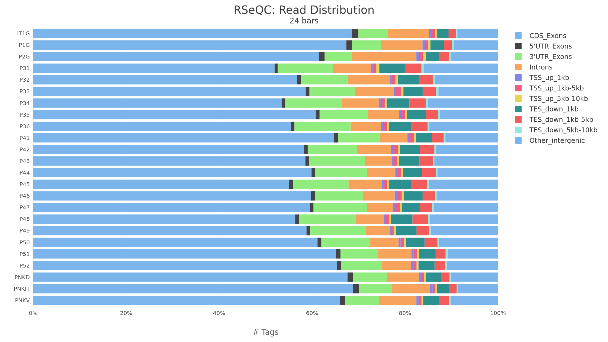{#fig-rseqc-read-dist}

La distribución de lecturas se concentra mayoritariamente en regiones codificantes y UTR, con una contribución intrónica media moderada. Esta señal es compatible con bibliotecas RNA-seq de mRNA y no muestra un patrón global de contaminación o fallo de anotación.

## Distancia interna

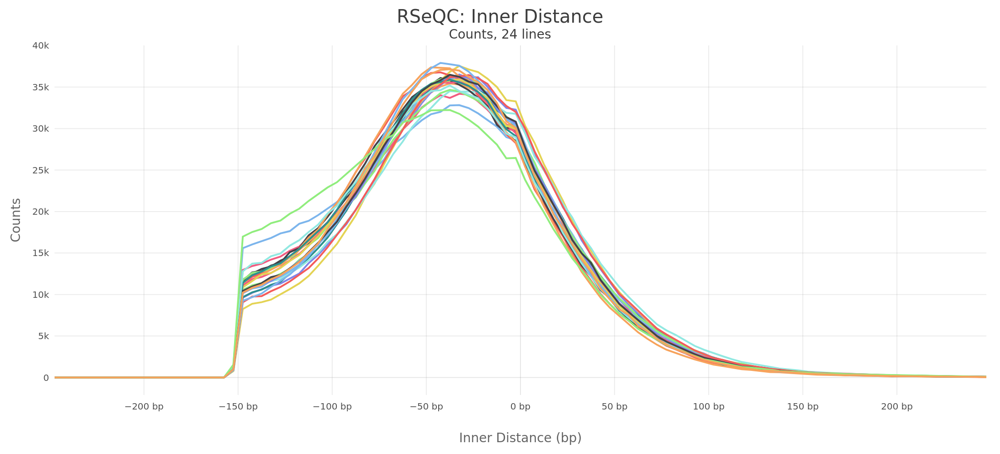{#fig-rseqc-inner-distance}

La distancia interna evalúa la geometría paired-end después del alineamiento. Las distribuciones son útiles para detectar bibliotecas con inserto inesperado, colapso de fragmentos o comportamiento anómalo de pares.

## Junctions

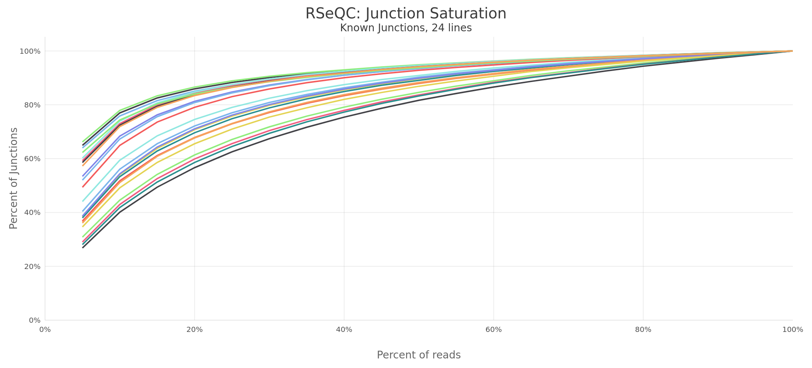{#fig-rseqc-junction-saturation}

La saturación de junctions permite valorar si la profundidad de secuenciación captura de forma estable los eventos de empalme detectables. No se observa una muestra aislada que rompa de manera evidente la tendencia del lote.

## Duplicación

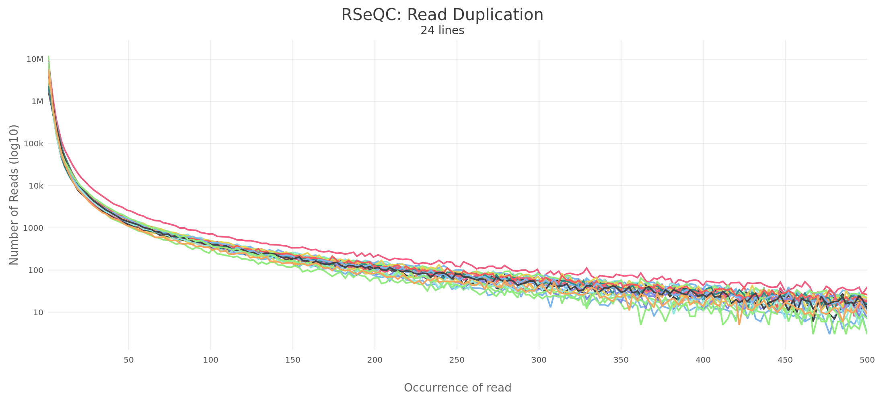{#fig-rseqc-read-dups}

Este panel complementa Picard y dupRadar. En RNA-seq, la duplicación se interpreta siempre junto con expresión génica: transcritos muy abundantes pueden producir duplicación elevada sin que exista necesariamente fallo de biblioteca.
::::

Tabla MultiQC BAM-QC: RSeQC infer experiment

Tabla MultiQC BAM-QC: RSeQC read distribution

### [dupRadar](https://bioconductor.org/packages/dupRadar/): duplicación dependiente de expresión

[`dupRadar`](https://bioconductor.org/packages/dupRadar/) evalúa si la duplicación aumenta de forma esperable con el nivel de expresión o si existe una señal compatible con artefactos de PCR [@Sayols2016DupRadar]. Esto es especialmente útil en RNA-seq: los genes muy expresados tienden a generar más lecturas duplicadas incluso en bibliotecas técnicamente válidas.

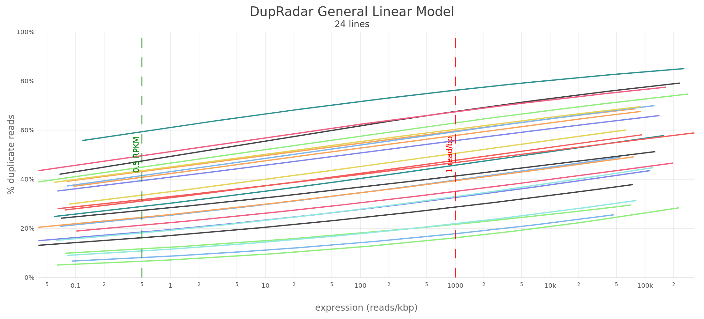{#fig-dupradar-bamqc}

El intercepto dupRadar se calculó para **24/24 muestras**. La media fue **0.53**, con mínimo **0.08** (`PNKIT`) y máximo **1.57** (`P49`). `P49` confirma el patrón observado previamente con Picard: tiene una señal de duplicación mayor que el resto y debe seguirse en PCA y análisis exploratorio. Aun así, la presencia de duplicación dependiente de expresión no equivale por sí sola a un fallo técnico, especialmente si la muestra mantiene buen alineamiento y buena calidad de lectura.

Tabla MultiQC BAM-QC: General Stats con intercepto dupRadar

### [Preseq](http://smithlabresearch.org/software/preseq/): complejidad molecular

[`Preseq`](http://smithlabresearch.org/software/preseq/) extrapola la complejidad molecular de una biblioteca y estima cuánta señal nueva se esperaría al aumentar la profundidad de secuenciación [@Daley2013Preseq]. A diferencia de Picard o RSeQC, que miden duplicación observada, Preseq intenta proyectar el rendimiento potencial de resecuenciar la misma biblioteca.

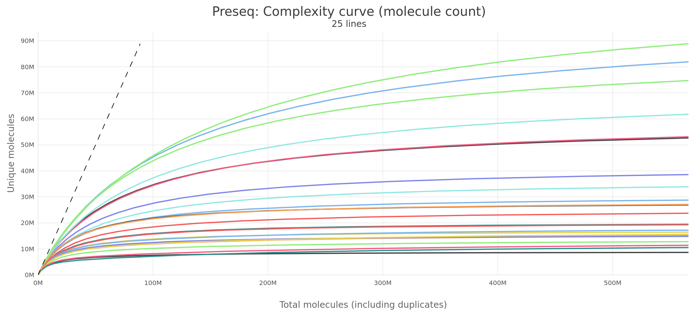{#fig-preseq-bamqc}

Preseq se generó para **24/24 muestras**. Las curvas son coherentes con bibliotecas de RNA-seq bulk donde la ganancia de moléculas nuevas se desacelera al aumentar la profundidad. No se detecta una señal global que obligue a excluir muestras por complejidad, aunque las curvas deben interpretarse junto con duplicación, profundidad y distribución de expresión.

::: {.callout-tip title="Tabla Preseq"}
La tabla `preseq.txt` tiene muchas columnas porque exporta la curva completa de extrapolación. Por eso no se renderiza como tabla copiable dentro de la página, para no hacer pesada la navegación. Se conserva en el anexo MultiQC: [descargar `preseq.txt`](../multiqc/bam_qc/multiqc_report_data/preseq.txt).
:::

### [featureCounts](https://subread.sourceforge.net/featureCounts.html): biotipos asignados

[`featureCounts`](https://subread.sourceforge.net/featureCounts.html), parte del paquete Subread, asigna lecturas alineadas a features genómicas anotadas de forma eficiente [@Liao2014FeatureCounts]. En este QC se utiliza para resumir la contribución relativa de distintos biotipos, como genes codificantes, lncRNA, rRNA, snRNA o pseudogenes.

::: {#fig-featurecounts-bamqc layout-ncol="2"}
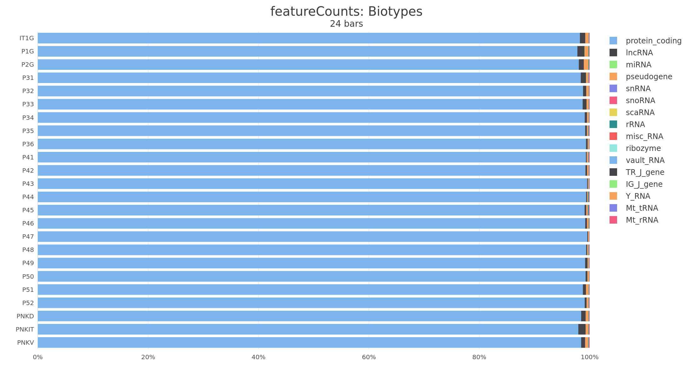

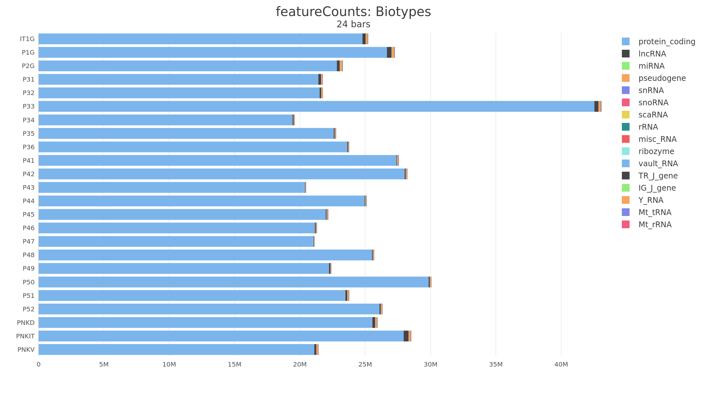

Distribución de biotipos estimada por featureCounts. La dominancia de genes codificantes es compatible con bibliotecas de mRNA enriquecidas por poli(A).
:::

La señal está fuertemente dominada por genes **protein_coding**, con una proporción media aproximada de **98.89%** entre los biotipos representados en la tabla exportada. Esto es coherente con bibliotecas de mRNA y no sugiere una contaminación masiva por biotipos no esperados.

Tabla MultiQC BAM-QC: featureCounts biotypes

### Herramientas no ejecutadas: Trim Galore

[`Trim Galore`](https://github.com/FelixKrueger/TrimGalore) no se ejecutó en este proyecto. El recorte de adaptadores y filtrado de lecturas fue realizado por **fastp**, que ya está documentado arriba. Por tanto, la ausencia de Trim Galore no representa una pérdida de resultados: responde a la configuración del pipeline.

## Conclusión del QC integrado

El informe integrado apoya continuar con las salidas `star_salmon` como base del análisis downstream. La señal técnica principal es consistente: **alta calidad post-filtrado**, **alineamiento sólido contra la referencia**, **orientación de biblioteca coherente** y ausencia de un fallo global de muestra.

La lectura biológica es, por tanto, prudente pero positiva: si aparecen patrones fuertes en PCA o expresión diferencial, no hay evidencia en este QC primario de que deban atribuirse de entrada a un fallo general de secuenciación o alineamiento. Las muestras señaladas deben acompañar la interpretación, no bloquearla.

::: {.callout-important title="Decisión"}
Se mantienen todas las muestras para la exploración downstream. La exclusión, si ocurre más adelante, deberá justificarse con evidencia combinada de PCA, metadatos, distribución de conteos y coherencia con el diseño experimental.
:::

## Referencias {.unnumbered}

::: {#refs}
:::

