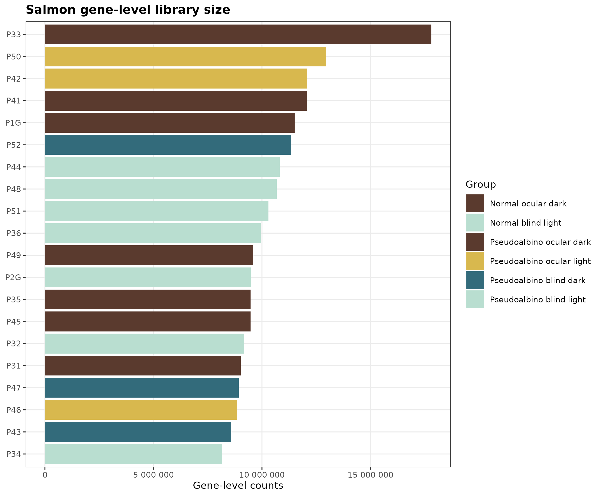
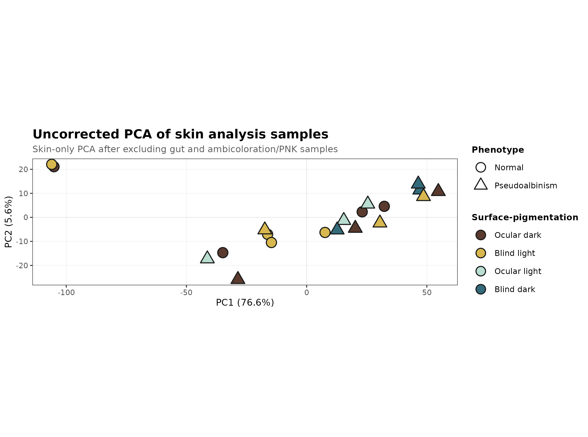
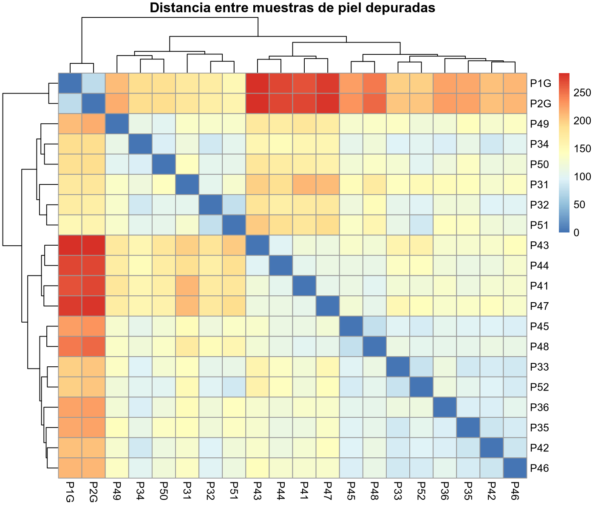

# Alineamiento, cuantificación y matrices de expresión

## Objetivo del bloque

Este capítulo conecta el procesamiento primario con el análisis estadístico. El objetivo es explicar qué representan los alineamientos STAR, qué salidas de cuantificación se generaron, por qué **Salmon gene-level counts** es la matriz principal para DESeq2 y cómo se usan `featureCounts` y `HTSeq` como recursos secundarios de sensibilidad.

## Alineamiento con STAR

El alineamiento se realizó con **STAR** contra el genoma de referencia de rodaballo ASM1334776v1 y la anotación Ensembl release 113. STAR es adecuado para RNA-seq porque permite mapear lecturas que cruzan uniones exon-exon y conserva información sobre alineamiento único, multimapeo y lecturas no alineadas [@Dobin2013STAR].

La tasa media de alineamiento total fue **97.52%**, mientras que la tasa media de alineamiento único fue **90.09%**. Estos valores indican que la mayoría de lecturas son compatibles con la referencia y que la señal principal procede de alineamientos específicos.

{#fig-alignment-star-summary fig-align="center"}

::: {.callout-note title="Lectura técnica"}
El alineamiento alto no demuestra por sí solo que todos los genes estén perfectamente anotados, pero sí descarta problemas graves de especie, contaminación masiva o incompatibilidad general entre lecturas y referencia. Para un análisis de expresión en una especie no modelo, esta es una condición necesaria antes de interpretar diferencias biológicas.
:::

## Cuantificación con Salmon

La cuantificación primaria se realizó con **Salmon**, dentro de la estrategia `star_salmon` de nf-core/rnaseq. Salmon estima abundancias transcriptómicas y permite obtener matrices agregadas a nivel de gen, corrigiendo sesgos de longitud y composición cuando se trabaja con abundancias relativas [@Patro2017Salmon].

En este proyecto, la inferencia diferencial usa **conteos gene-level** importados desde Salmon. La matriz de TPM se conserva para exploración y visualización, pero no se usa como entrada de DESeq2, ya que DESeq2 modela conteos y estima factores de tamaño y dispersión a partir de la distribución de conteos [@Love2014DESeq2].

::: {#tbl-quantification-outputs}
| Salida | Uso en el proyecto | Decisión |
|:--|:--|:--|
| `salmon.merged.gene_counts.tsv` | Conteos génicos para DESeq2 | Entrada principal |
| `salmon.merged.gene_tpm.tsv` | Expresión relativa para exploración | No se usa para inferencia DESeq2 |
| `salmon.merged.gene.SummarizedExperiment.rds` | Objeto integrado de expresión | Recurso reproducible |
| Matrices featureCounts | Conteo sobre anotación desde BAM | Sensibilidad técnica |
| Matrices HTSeq | Conteo alternativo sobre anotación | Sensibilidad técnica |

: Salidas de cuantificación y uso analítico.
:::

## Tamaño de librería y genes detectados

El número total de conteos Salmon a nivel génico fue suficiente en todas las bibliotecas. No se observó una biblioteca colapsada o con pérdida extrema de señal. La muestra `P33` tuvo la mayor profundidad de conteos y `P34` la menor, mientras que `P43` presentó el menor número de genes detectados con al menos 10 conteos. Estos extremos se consideran en la interpretación, pero no justifican exclusión automática.

{#fig-salmon-library-sizes width="90%" fig-align="center"}

::: {#tbl-salmon-summary}
| Métrica | Resultado | Interpretación |
|:--|:--|:--|
| Conteos Salmon medios por muestra | 10.55 millones | Profundidad adecuada para RNA-seq bulk |
| Mínimo de conteos Salmon | 8.15 millones (`P34`) | Sin colapso de biblioteca |
| Máximo de conteos Salmon | 17.81 millones (`P33`) | Mayor profundidad, tratada por normalización |
| Genes detectados medios con conteo ≥ 10 | 13,826 | Complejidad compatible con análisis génico |
| Mínimo de genes detectados con conteo ≥ 10 | 11,678 (`P43`) | Punto de vigilancia, no exclusión automática |

: Resumen de rendimiento de la matriz Salmon gene-level.
:::

## Comparación conceptual entre cuantificadores

El proyecto conserva tres aproximaciones complementarias:

- **Salmon gene-level**: entrada principal para DESeq2, porque procede del flujo `star_salmon`, integra cuantificación transcriptómica y se maneja de forma estable en el análisis downstream.
- **featureCounts**: conteo directo de lecturas alineadas contra features anotadas; útil para comprobar si los patrones principales dependen de la forma de cuantificar.
- **HTSeq**: alternativa de conteo sobre anotación, mantenida como recurso de contraste técnico.

La existencia de matrices alternativas no significa que el análisis deba mezclar resultados indiscriminadamente. Para evitar conclusiones dependientes de cambios de herramienta, el informe fija una fuente principal y reserva las otras para sensibilidad.

::: {.callout-important title="Decisión de matriz"}
La matriz primaria para expresión diferencial es **Salmon gene-level counts**. `featureCounts` y `HTSeq` son recursos secundarios. Un resultado biológico se interpreta principalmente desde Salmon, y solo se contrasta con las matrices alternativas si aparece una señal técnica dudosa o una pregunta específica de robustez.
:::

## Normalización y transformación

DESeq2 no compara conteos crudos directamente. Primero estima factores de tamaño para corregir diferencias de profundidad de biblioteca y después modela la dispersión de cada gen. Para exploración no supervisada, como PCA y distancias entre muestras, se usó una transformación estabilizadora de varianza. Esta transformación no sustituye al modelo de expresión diferencial; solo hace que las distancias globales entre muestras sean más interpretables.

La separación observada en PCA se interpreta como una mezcla de estructura biológica, superficie, pigmentación, fenotipo y posibles contribuciones de fecha o individuo. Por este motivo, la inferencia se realiza por contraste y no mediante una lectura única del PCA.

::: {#fig-expression-exploration layout-ncol="2"}

Exploración global de la matriz de expresión en las muestras de piel usadas para el análisis principal.
:::

## Trazabilidad de identificadores

La anotación de *Scophthalmus maximus* utiliza identificadores Ensembl con prefijo `ENSSMAG`. Estos identificadores se conservan como clave primaria en todas las tablas. Los símbolos génicos, nombres funcionales y anotaciones por ortología son etiquetas auxiliares que facilitan la lectura biológica, pero no sustituyen al identificador estable.

Este criterio es especialmente importante porque varios genes con efectos fuertes no tienen símbolo funcional local en la anotación disponible. En lugar de eliminarlos, se mantienen como candidatos trazables para curación manual posterior.

## Limitaciones

La cuantificación gene-level simplifica la complejidad de isoformas y transcritos alternativos. Esta decisión es adecuada para el objetivo principal, que es comparar programas génicos de piel, pero no permite una interpretación fina de isoformas sin análisis adicional. Del mismo modo, las anotaciones funcionales dependen de la calidad del genoma y del GTF de Ensembl release 113; genes sin símbolo o términos incompletos no deben interpretarse como ausencia de función.

## Conclusión del bloque

La combinación de STAR y Salmon produjo una matriz de expresión coherente, con profundidad suficiente y sin bibliotecas fallidas. El análisis downstream queda anclado a una decisión reproducible: **DESeq2 sobre Salmon gene-level counts**, manteniendo `ENSSMAG` como clave primaria y usando cuantificaciones alternativas solo como controles de sensibilidad.
