# Expresión diferencial

## Objetivo y Criterios de Lectura

Este capítulo documenta el bloque de expresión diferencial del proyecto **HOLOFISHCOLOUR**. La pregunta general es si las regiones de piel normal y pseudoalbina de rodaballo mantienen un eje transcriptómico coherente con pigmentación, superficie anatómica y estado tisular, o si el pseudoalbinismo reorganiza esos ejes de forma más compleja.

La lectura se organiza en dos niveles. Primero se presenta una síntesis agregada de todos los contrastes, con el número de genes evaluados, genes diferencialmente expresados y sesgo direccional. Después se desglosan los resultados comparación por comparación, incorporando para cada una el objetivo biológico, el diseño usado, los genes principales, los gráficos diagnósticos y la interpretación. La interpretación funcional detallada de GO, melanogénesis, matriz extracelular, cresta neural, retinoides y estructura tisular se desarrolla en el capítulo siguiente; aquí se conserva el foco en la evidencia diferencial.

El análisis parte de la cuantificación génica generada por [`Salmon`](https://combine-lab.github.io/salmon/) [@Patro2017Salmon] dentro del flujo `star_salmon` de nf-core/rnaseq. Los modelos se ajustaron con [`DESeq2`](https://bioconductor.org/packages/release/bioc/html/DESeq2.html) [@Love2014DESeq2], usando conteos enteros a nivel de gen, filtrado mínimo de expresión y diseños específicos para cada contraste.

::: {.callout-note title="Lectura de los efectos"}
En todas las tablas, un `log2FoldChange` positivo indica mayor expresión en el **primer grupo** del contraste. En `N_OD_vs_N_BL`, por ejemplo, un efecto positivo significa mayor expresión en piel normal ocular oscura (`N_OD`) que en piel normal blind clara (`N_BL`). Un efecto negativo significa mayor expresión en el segundo grupo.
:::

::: {.callout-important title="Diferencia entre significación y lista interpretativa"}
La columna de DEGs resume genes con FDR < 0.05. Las columnas `Up` y `Down` se calcularon sobre la lista usada para interpretación, que además exige |log2FC| >= 1. Por eso `N_OD_vs_N_BL` tiene 218 genes significativos por FDR, pero 188 genes en la lista direccional filtrada por tamaño de efecto.
:::

## Diseño Analítico

El bloque inferencial se restringió a **20 muestras de piel**. Las muestras intestinales y el bloque exploratorio PNK/ambicoloration permanecen documentados en el QC global, pero no se mezclaron con los contrastes principales. Esta decisión evita que el análisis diferencial responda a una pregunta demasiado amplia y conserva comparaciones interpretables entre superficie, pigmentación y condición.

El filtrado previo mantuvo genes con al menos **10 conteos en 3 muestras**. Los contrastes pareados incorporaron `turbot_id` para controlar diferencias basales entre individuos cuando las dos regiones proceden del mismo pez. Los contrastes no pareados frente a piel normal esperada se ajustaron con `~ group_code`, porque comparan grupos fenotípicos distintos y no todas las muestras comparten individuo.

| Contraste | Pregunta biológica | Diseño | Lectura del coeficiente |
|---|---|---|---|
| `N_OD_vs_N_BL` | Eje fisiológico normal entre piel ocular oscura y blind clara. | `~ turbot_id + group_code` | Positivo: mayor en `N_OD`; negativo: mayor en `N_BL`. |
| `P_OD_vs_P_OL` | Qué cambia dentro de superficie ocular pseudoalbina entre zona oscura y zona clara. | `~ turbot_id + group_code` | Positivo: mayor en `P_OD`; negativo: mayor en `P_OL`. |
| `P_BD_vs_P_BL` | Qué se asocia a pigmentación ectópica en la superficie blind pseudoalbina. | `~ turbot_id + group_code` | Positivo: mayor en `P_BD`; negativo: mayor en `P_BL`. |
| `P_OL_vs_P_BL` | Si las zonas claras pseudoalbinas son equivalentes entre superficies. | `~ turbot_id + group_code` | Positivo: mayor en `P_OL`; negativo: mayor en `P_BL`. |
| `P_BD_vs_P_OD` | Si las zonas oscuras pseudoalbinas son equivalentes entre superficies. | `~ turbot_id + group_code` | Positivo: mayor en `P_BD`; negativo: mayor en `P_OD`. |
| `P_surface_x_pigmentation` | Si el efecto dark/light depende de la superficie en pseudoalbinos. | `~ turbot_id + surface + pigmentation + surface:pigmentation` | Positivo: interacción más alta para el eje blind-dark relativo al ocular-dark; negativo: interacción en sentido contrario. |
| `P_OL_vs_N_OD` | Cuánto se separa una zona ocular clara anómala del estado ocular oscuro esperado. | `~ group_code` | Positivo: mayor en `P_OL`; negativo: mayor en `N_OD`. |
| `P_BD_vs_N_BL` | Cuánto se separa una zona blind oscura anómala del estado blind claro esperado. | `~ group_code` | Positivo: mayor en `P_BD`; negativo: mayor en `N_BL`. |

: Contrastes diferenciales ajustados con DESeq2 y lectura direccional de cada coeficiente. {#tbl-de-contrast-design}

Los contrastes tienen tres papeles complementarios. `N_OD_vs_N_BL` define la referencia fisiológica. `P_OD_vs_P_OL` y `P_BD_vs_P_BL` interrogan el pseudoalbinismo dentro de cada superficie. `P_OL_vs_P_BL`, `P_BD_vs_P_OD` y `P_surface_x_pigmentation` separan efecto de superficie, efecto de color e interacción. Por último, `P_OL_vs_N_OD` y `P_BD_vs_N_BL` comparan regiones anómalas con el estado normal esperado para esa superficie.

## Resumen Integrado de Contrastes

Los ocho contrastes se completaron correctamente. El número de genes evaluados varió entre **13878** y **15101**, en función del subconjunto de muestras y del filtrado de expresión. `P_BD_vs_N_BL` fue el contraste con más genes diferencialmente expresados, seguido de `N_OD_vs_N_BL` y `P_OD_vs_P_OL`.

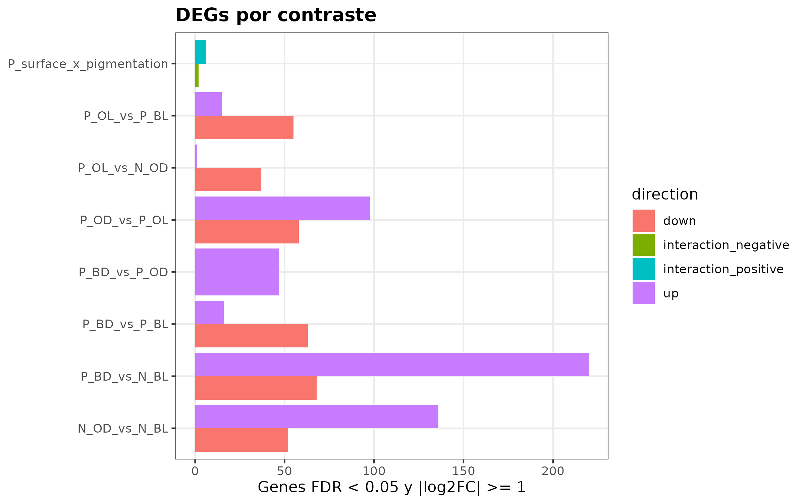{#fig-de-summary-counts width="90%"}

| Contraste | n muestras | Genes testados | DEGs FDR < 0.05 | DEGs con efecto | Up | Down | Lectura rápida |
|---|---:|---:|---:|---:|---:|---:|---|
| `N_OD_vs_N_BL` | 8 | 15084 | 218 | 188 | 136 | 52 | Referencia fisiológica dark/light; recupera pigmentación normal y diferencias estructurales de superficie. |
| `P_OD_vs_P_OL` | 6 | 14371 | 156 | 156 | 98 | 58 | Pseudoalbinismo ocular; mezcla señal de pigmentación con matriz extracelular y remodelado tisular. |
| `P_BD_vs_P_BL` | 6 | 13878 | 79 | 79 | 16 | 63 | Pigmentación ectópica en superficie blind; no reproduce limpiamente el eje melanogénico normal. |
| `P_OL_vs_P_BL` | 6 | 14468 | 70 | 70 | 15 | 55 | Color claro constante; las zonas claras pseudoalbinas retienen identidad de superficie. |
| `P_BD_vs_P_OD` | 6 | 13908 | 47 | 47 | 47 | 0 | Color oscuro constante; separación completa hacia `P_BD`. |
| `P_surface_x_pigmentation` | 12 | 15101 | 8 | 8 | 6 | 2 | Interacción superficie por pigmentación focalizada y no masiva. |
| `P_OL_vs_N_OD` | 7 | 15005 | 38 | 38 | 1 | 37 | Zona ocular clara anómala frente al estado ocular oscuro esperado. |
| `P_BD_vs_N_BL` | 7 | 14483 | 288 | 288 | 220 | 68 | Blind dark anómalo frente a blind claro esperado; contraste más intenso del bloque. |

: Resumen agregado de expresión diferencial. `Up` y `Down` usan FDR < 0.05 y |log2FC| >= 1. {#tbl-de-summary}

La síntesis de @tbl-de-summary y @fig-de-summary-counts deja tres mensajes claros. El eje normal `N_OD_vs_N_BL` recupera genes de pigmentación y melanocitos, pero también una señal fuerte de matriz extracelular en sentido opuesto. El pseudoalbinismo ocular (`P_OD_vs_P_OL`) conserva parte de esa organización, aunque con un componente estructural notable. La pigmentación ectópica blind (`P_BD_vs_P_BL` y, sobre todo, `P_BD_vs_N_BL`) es la señal más divergente: produce muchos cambios, pero dominados por estructura tisular, músculo/sarcomero, epidermis e inmunidad más que por una simple activación melanogénica terminal.

## Candidatos Agregados

La tabla siguiente no pretende sustituir las listas completas de DEGs. Resume genes que ayudan a leer cada comparación por su significación, tamaño de efecto o coherencia biológica. Los identificadores `ENSSMAG` sin símbolo no se han eliminado: en un genoma no modelo pueden ser señales reales pendientes de curación funcional.

| Contraste | Dirección | Genes representativos | Lectura |
|---|---|---|---|
| `N_OD_vs_N_BL` | Up en `N_OD` | `tyrp1b`, `TYRP1`, `tmem130`, `slc24a4b`, `KIF5B` | Programa pigmentario normal con genes de melanosoma y melanocitos. |
| `N_OD_vs_N_BL` | Down en `N_OD` | `thbs4a`, `c1qtnf5`, `CPZ`, `fndc1`, `abi3bpa` | Mayor peso de matriz extracelular y adhesión en la superficie blind clara. |
| `P_OD_vs_P_OL` | Up en `P_OD` | `col10a1a`, `col5a2b`, `col10a1b`, `cilp2`, `tnn` | Región ocular oscura pseudoalbina con fuerte componente de matriz y tejido. |
| `P_OD_vs_P_OL` | Down en `P_OD` | `dgat2`, `crabp1a`, `mmp30`, `rab15` | Mayor señal en `P_OL` de metabolismo lipídico, retinoides y remodelado. |
| `P_BD_vs_P_BL` | Up en `P_BD` | `dgat2`, `MLF1`, `lbx2`, `pvalb1`, `lemd1` | Lista positiva menor, heterogénea, sin eje melanogénico dominante. |
| `P_BD_vs_P_BL` | Down en `P_BD` | `mpx`, `irg1l`, `anxa3a`, varios `ENSSMAG` | La señal diferencial dominante queda más alta en `P_BL`. |
| `P_OL_vs_P_BL` | Up en `P_OL` | `crabp1a`, `dgat2`, `ACVR1C`, `ttc9b`, `mab21l2` | Diferencia de superficie bajo color claro con retinoides/lípidos en `P_OL`. |
| `P_OL_vs_P_BL` | Down en `P_OL` | `col10a1a`, `col5a2b`, `col10a1b`, `spp1`, `notum2` | Matriz extracelular y estructura tisular más altas en `P_BL`. |
| `P_BD_vs_P_OD` | Up en `P_BD` | `mybpc2a`, `atp2a1l`, `casq1a`, `gatm`, `TPM1` | Señal direccional de músculo/sarcomero y metabolismo en blind dark. |
| `P_surface_x_pigmentation` | Interacción positiva | `crabp1a`, `dgat2`, `ACVR1C`, `rab15`, `plin2` | Interacción focal con retinoides, lípidos y señalización. |
| `P_surface_x_pigmentation` | Interacción negativa | `sdk2a`, `htr2b` | Adhesión/señalización con efecto no aditivo en sentido opuesto. |
| `P_OL_vs_N_OD` | Down en `P_OL` | varios `ENSSMAG`, con `N_OD` como grupo alto | Pérdida parcial del programa ocular oscuro esperado. |
| `P_BD_vs_N_BL` | Up en `P_BD` | `vcla`, `usp13`, `ca2`, `smyd2b`, `frmd5a` | Activación amplia en región blind oscura anómala. |
| `P_BD_vs_N_BL` | Down en `P_BD` | varios `ENSSMAG`, `trim25` | Señal más alta en el estado blind claro normal, con componente inmune/epidérmico. |

: Genes y ejes interpretativos destacados por contraste. La tabla completa de genes por dirección está disponible como TSV. {#tbl-de-candidates}

## Resultados por Comparación

### Eje Normal Dark Light

`N_OD_vs_N_BL` es la referencia fisiológica del estudio. Compara piel ocular oscura normal frente a piel blind clara normal, controlando el efecto de individuo con `~ turbot_id + group_code`. Se evaluaron **15084 genes**; **218** fueron significativos por FDR < 0.05 y **188** superaron además |log2FC| >= 1.

| Dirección | Gen | log2FC | FDR | Lectura |
|---|---|---:|---:|---|
| Up en `N_OD` | `tyrp1b / ENSSMAG00000012712` | 8.39 | 1.93e-23 | Marcador de pigmentación, muy alto en piel ocular oscura. |
| Up en `N_OD` | `TYRP1 / ENSSMAG00000010205` | 5.29 | 4.03e-08 | Melanogénesis y melanosoma, coherente con la referencia normal. |
| Up en `N_OD` | `slc24a4b / ENSSMAG00000002036` | 4.84 | 8.40e-08 | Transporte iónico asociado a pigmentación en vertebrados. |
| Down en `N_OD` | `thbs4a / ENSSMAG00000010306` | -1.69 | 7.17e-08 | Matriz extracelular más alta en `N_BL`. |
| Down en `N_OD` | `c1qtnf5 / ENSSMAG00000016467` | -1.85 | 4.94e-06 | Señal estructural/metabólica en piel blind clara. |
| Down en `N_OD` | `CPZ / ENSSMAG00000009599` | -1.26 | 7.85e-06 | Matriz y procesamiento extracelular, mayor en `N_BL`. |

: Genes representativos del contraste `N_OD_vs_N_BL`.

::: {#fig-de-nod-nbl layout-ncol="3"}
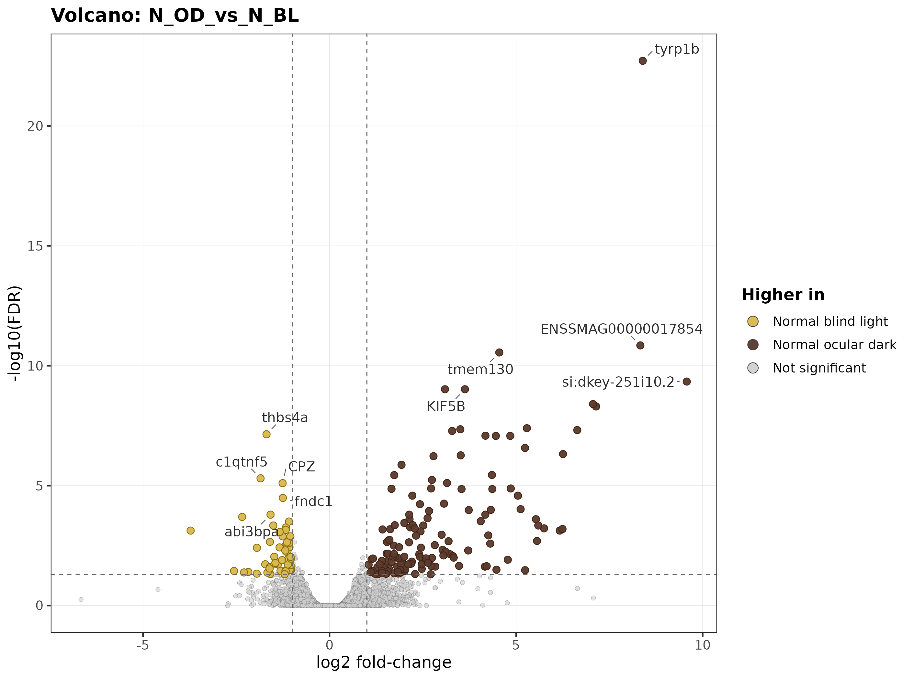

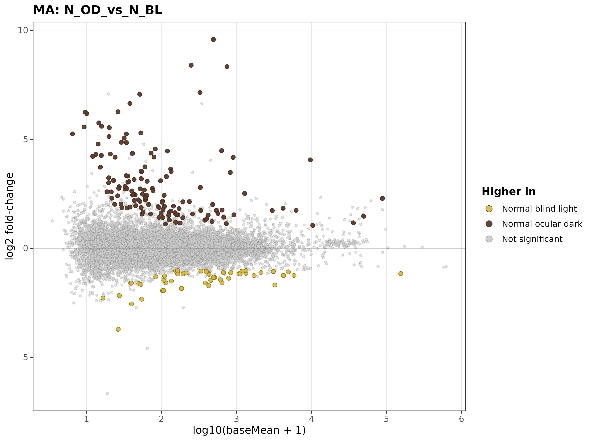

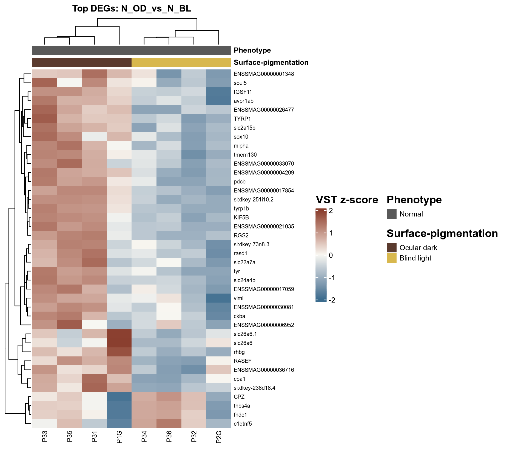

Contraste `N_OD_vs_N_BL`. Los efectos positivos corresponden a piel ocular oscura normal y los negativos a piel blind clara normal.
:::

La señal positiva recupera un programa de pigmentación esperado, con genes de melanosoma y diferenciación melanocítica. En paralelo, la señal negativa se enriquece en matriz extracelular, colágeno y adhesión. Esta mezcla es importante: el contraste fisiológico no mide solo color, sino también identidad de superficie y composición tisular.

Archivo principal: [DEGs significativos anotados de `N_OD_vs_N_BL`](../tables/05_de/by_contrast/N_OD_vs_N_BL_significant_annotated.tsv).

### Pseudoalbinismo Ocular

`P_OD_vs_P_OL` compara dentro de pseudoalbinos la región ocular oscura frente a la región ocular clara. Es un contraste pareado por individuo y, por tanto, una de las comparaciones más directas para preguntar qué cambia cuando aparece una zona clara anómala dentro de la superficie ocular. Se evaluaron **14371 genes** y se detectaron **156 DEGs**; todos ellos superaron el umbral de |log2FC| >= 1.

| Dirección | Gen | log2FC | FDR | Lectura |
|---|---|---:|---:|---|
| Up en `P_OD` | `col10a1a / ENSSMAG00000018410` | 5.62 | 1.08e-13 | Colágeno, eje fuerte de matriz extracelular. |
| Up en `P_OD` | `col5a2b / ENSSMAG00000011709` | 4.41 | 1.50e-12 | Matriz y remodelado tisular. |
| Up en `P_OD` | `col10a1b / ENSSMAG00000018381` | 4.55 | 1.22e-09 | Refuerza la señal de colágeno. |
| Down en `P_OD` | `dgat2 / ENSSMAG00000001438` | -4.81 | 6.65e-15 | Metabolismo lipídico más alto en `P_OL`. |
| Down en `P_OD` | `crabp1a / ENSSMAG00000005604` | -3.88 | 4.19e-06 | Unión a ácido retinoico, mayor en `P_OL`. |
| Down en `P_OD` | `mmp30 / ENSSMAG00000025841` | -2.35 | 1.21e-04 | Remodelado de matriz, mayor en `P_OL`. |

: Genes representativos del contraste `P_OD_vs_P_OL`.

::: {#fig-de-pod-pol layout-ncol="3"}
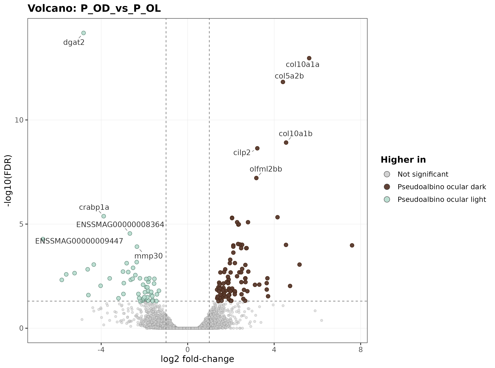

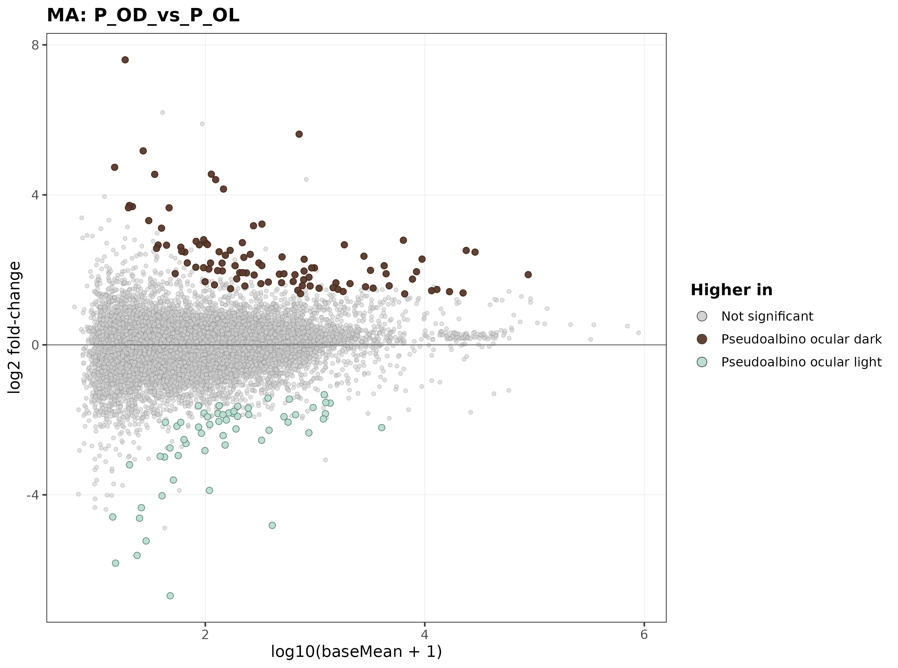

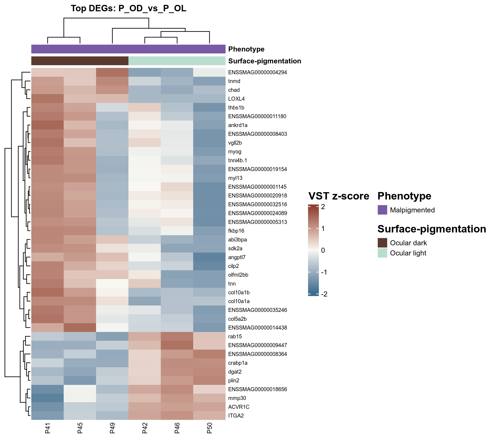

Contraste `P_OD_vs_P_OL`. Los efectos positivos corresponden a regiones oculares oscuras pseudoalbinas; los negativos, a regiones oculares claras pseudoalbinas.
:::

El resultado no se limita a una caída simple de genes de melanogénesis. La región `P_OD` muestra una señal fuerte de colágenos y matriz, mientras que `P_OL` concentra genes como `dgat2` y `crabp1a`, vinculados a lípidos y retinoides. Esto sugiere que la pérdida local de pigmentación en la superficie ocular va acompañada de cambios de microambiente o estado tisular.

Archivo principal: [DEGs significativos anotados de `P_OD_vs_P_OL`](../tables/05_de/by_contrast/P_OD_vs_P_OL_significant_annotated.tsv).

### Pigmentación Ectópica Blind

`P_BD_vs_P_BL` compara zonas oscuras y claras dentro de la superficie blind pseudoalbina. Este contraste es clave porque pregunta si la pigmentación ectópica de la cara ciega activa un programa parecido al eje normal. Se evaluaron **13878 genes** y se detectaron **79 DEGs**, con un sesgo marcado hacia genes más altos en `P_BL` (**63 Down** frente a **16 Up**).

| Dirección | Gen | log2FC | FDR | Lectura |
|---|---|---:|---:|---|
| Up en `P_BD` | `dgat2 / ENSSMAG00000001438` | 1.87 | 3.05e-03 | Señal lipídica moderada en blind dark. |
| Up en `P_BD` | `MLF1 / ENSSMAG00000015219` | 1.40 | 4.18e-03 | Cambio positivo, sin lectura pigmentaria directa. |
| Up en `P_BD` | `lbx2 / ENSSMAG00000008154` | 1.51 | 5.91e-03 | Desarrollo/identidad celular, candidato a revisar. |
| Down en `P_BD` | `mpx / ENSSMAG00000020424` | -3.55 | 4.54e-15 | Componente inmune/mieloide más alto en `P_BL`. |
| Down en `P_BD` | `irg1l / ENSSMAG00000005426` | -4.46 | 4.41e-07 | Inmunidad/metabolismo, mayor en `P_BL`. |
| Down en `P_BD` | `anxa3a / ENSSMAG00000015210` | -3.13 | 1.23e-04 | Señal celular/epitelial más alta en `P_BL`. |

: Genes representativos del contraste `P_BD_vs_P_BL`.

::: {#fig-de-pbd-pbl layout-ncol="3"}
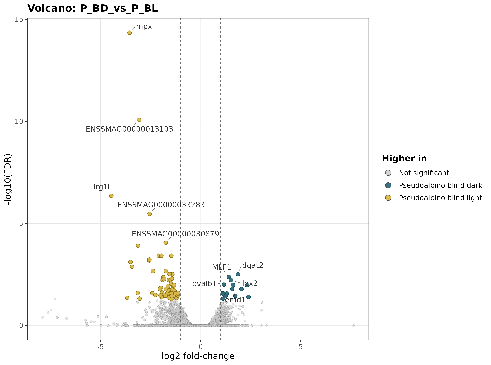

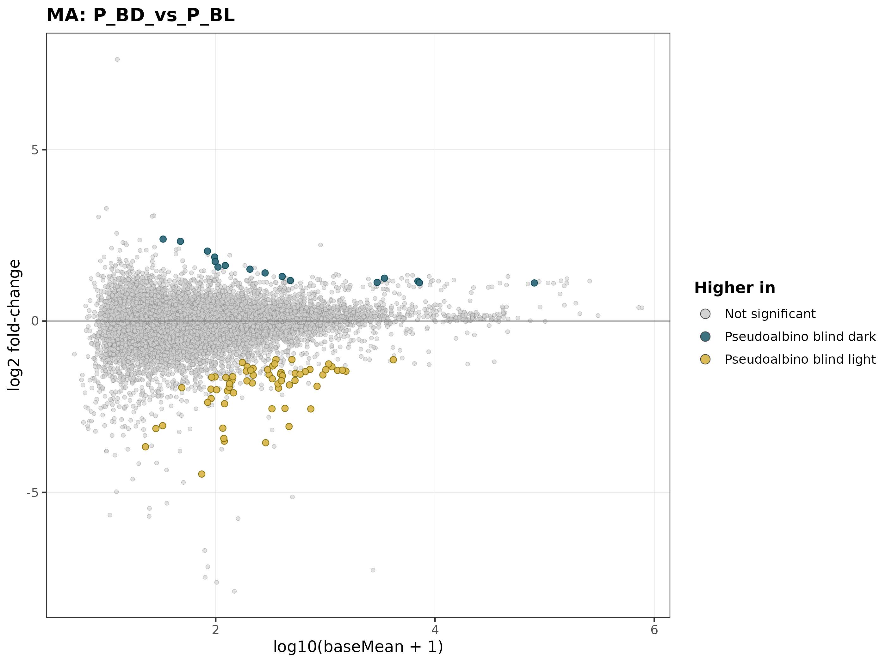

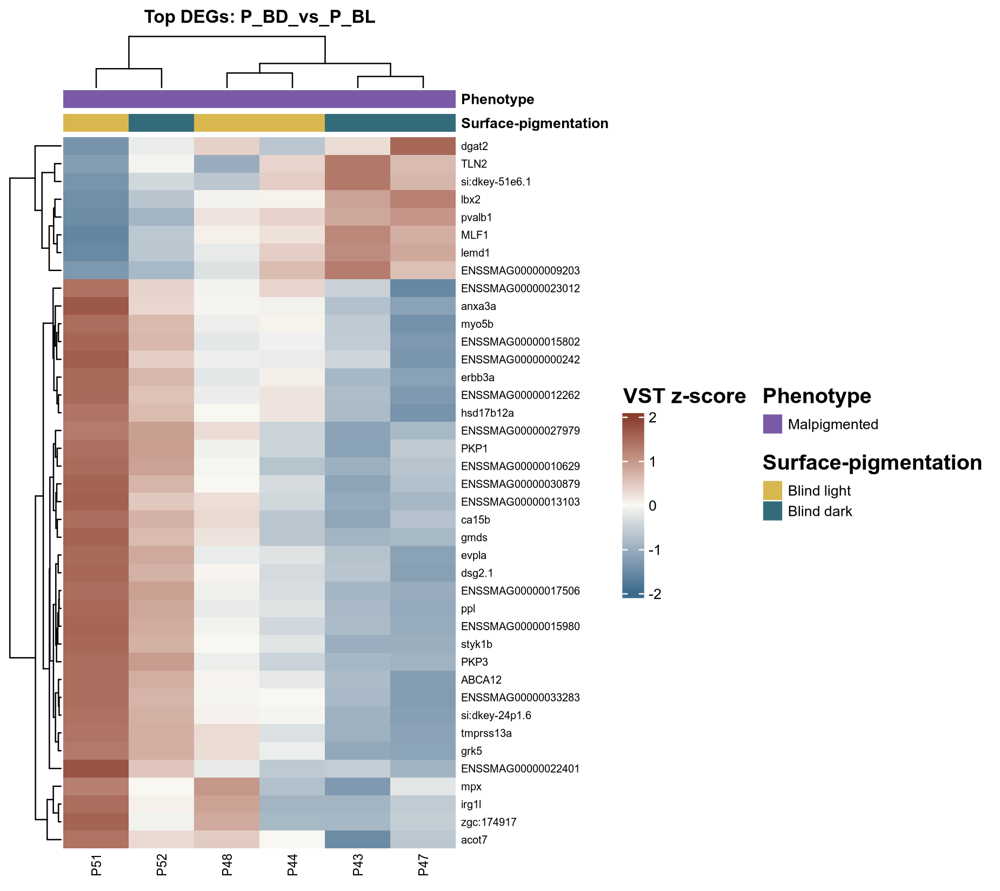

Contraste `P_BD_vs_P_BL`. Los efectos positivos corresponden a blind dark pseudoalbino; los negativos, a blind light pseudoalbino.
:::

La dirección del contraste es informativa. Si la pigmentación ectópica blind fuese una copia transcriptómica de la piel ocular oscura normal, esperaríamos una señal positiva clara de melanogénesis. En cambio, la lista filtrada es pequeña y está dominada por genes más altos en `P_BL`. En el ranking completo aparecen términos de sarcómero y músculo en el lado positivo, mientras que melanosoma y diferenciación melanocítica no aparecen como un bloque positivo dominante. La conclusión prudente es que `P_BD` representa un estado tisular divergente, no una simple transposición del programa ocular oscuro.

Archivo principal: [DEGs significativos anotados de `P_BD_vs_P_BL`](../tables/05_de/by_contrast/P_BD_vs_P_BL_significant_annotated.tsv).

### Superficie Bajo Color Claro

`P_OL_vs_P_BL` mantiene constante el fenotipo claro y compara superficie ocular frente a blind dentro de pseudoalbinos. Se evaluaron **14468 genes** y se detectaron **70 DEGs**. La mayoría (**55**) fueron negativos, es decir, más altos en `P_BL`.

| Dirección | Gen | log2FC | FDR | Lectura |
|---|---|---:|---:|---|
| Up en `P_OL` | `crabp1a / ENSSMAG00000005604` | 4.21 | 1.29e-09 | Retinoides y desarrollo, mayor en ocular light. |
| Up en `P_OL` | `dgat2 / ENSSMAG00000001438` | 4.07 | 1.85e-07 | Metabolismo lipídico, mayor en ocular light. |
| Up en `P_OL` | `ACVR1C / ENSSMAG00000011491` | 5.89 | 3.53e-04 | Señalización TGF-beta/activina, candidato regulador. |
| Down en `P_OL` | `col10a1a / ENSSMAG00000018410` | -7.26 | 2.32e-28 | Colágeno mucho más alto en blind light. |
| Down en `P_OL` | `col5a2b / ENSSMAG00000011709` | -5.55 | 1.39e-18 | Matriz extracelular más alta en blind light. |
| Down en `P_OL` | `notum2 / ENSSMAG00000007311` | -3.91 | 1.50e-06 | Modulación de Wnt, mayor en blind light. |

: Genes representativos del contraste `P_OL_vs_P_BL`.

::: {#fig-de-pol-pbl layout-ncol="3"}
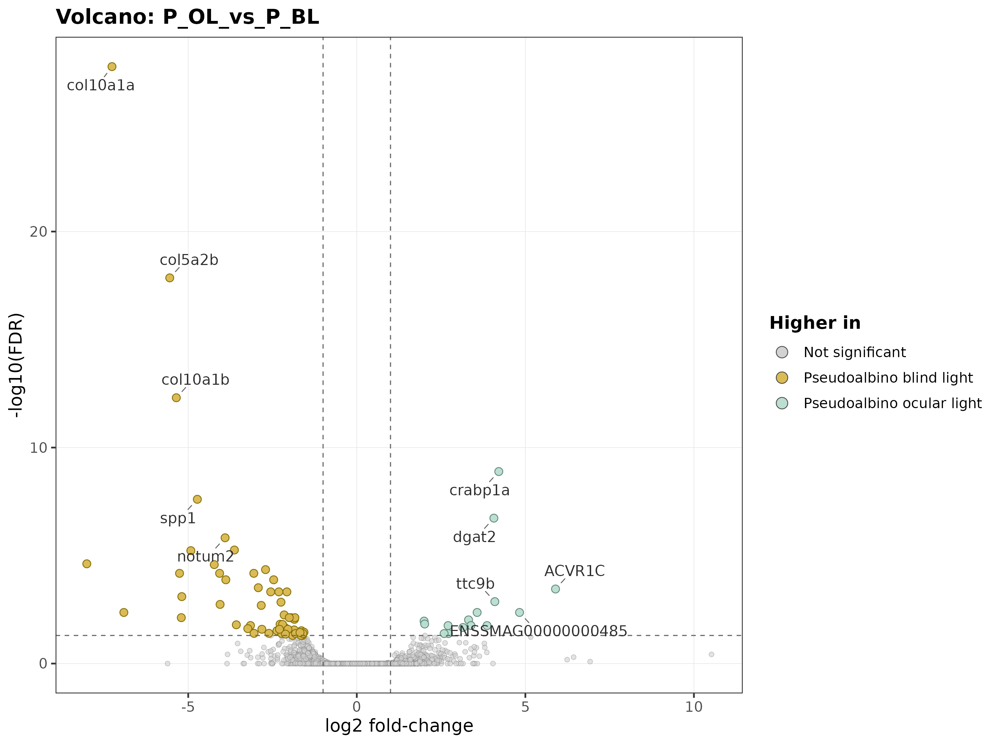

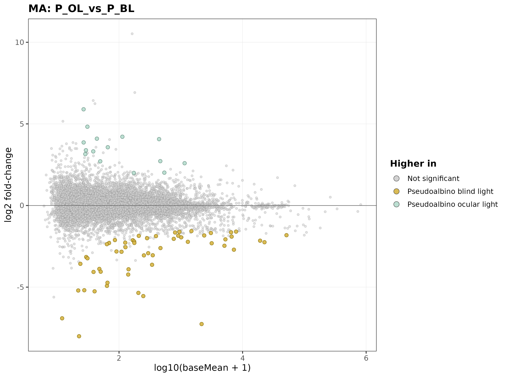

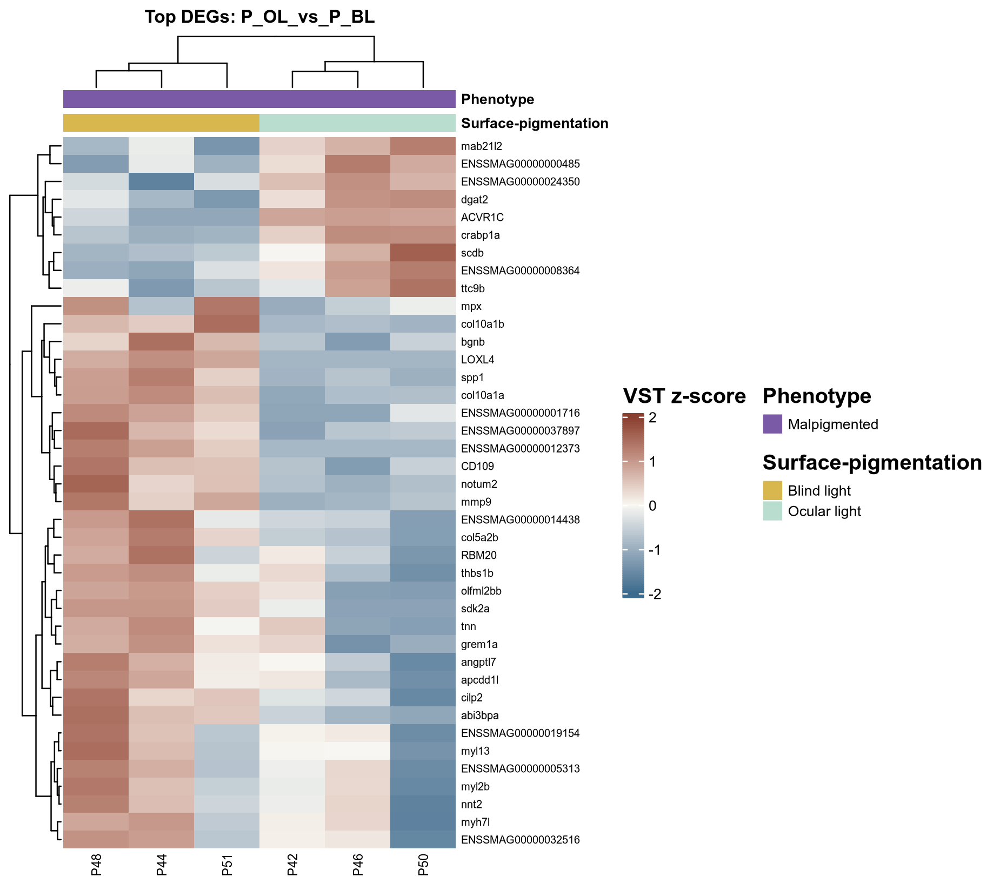

Contraste `P_OL_vs_P_BL`. Los efectos positivos corresponden a ocular light pseudoalbino; los negativos, a blind light pseudoalbino.
:::

La similitud macroscópica de color no implica equivalencia transcriptómica. `P_OL` retiene señales de retinoides y lípidos, mientras que `P_BL` acumula colágenos, matriz y términos de estructura muscular o tisular. Este contraste separa muy bien pigmentación visible de identidad de superficie.

Archivo principal: [DEGs significativos anotados de `P_OL_vs_P_BL`](../tables/05_de/by_contrast/P_OL_vs_P_BL_significant_annotated.tsv).

### Superficie Bajo Color Oscuro

`P_BD_vs_P_OD` mantiene constante el color oscuro y compara la superficie blind frente a la ocular en pseudoalbinos. Se evaluaron **13908 genes** y se detectaron **47 DEGs**, todos positivos. En otras palabras, con el umbral definido no hubo genes más altos en `P_OD`; la separación viene completa desde `P_BD`.

| Dirección | Gen | log2FC | FDR | Lectura |
|---|---|---:|---:|---|
| Up en `P_BD` | `mybpc2a / ENSSMAG00000008209` | 3.36 | 9.70e-05 | Proteína sarcomérica, señal muscular. |
| Up en `P_BD` | `atp2a1l / ENSSMAG00000016974` | 3.06 | 8.29e-04 | Manejo de calcio, músculo/contracción. |
| Up en `P_BD` | `casq1a / ENSSMAG00000013960` | 2.91 | 8.29e-04 | Calcio y músculo estriado. |
| Up en `P_BD` | `gatm / ENSSMAG00000014093` | 2.91 | 1.26e-03 | Metabolismo energético. |
| Up en `P_BD` | `prr33 / ENSSMAG00000006257` | 2.55 | 4.11e-03 | Gen estructural/candidato sin lectura pigmentaria directa. |
| Up en `P_BD` | `TPM1 / ENSSMAG00000016387` | 2.59 | 6.92e-03 | Tropomiosina, estructura contráctil. |

: Genes representativos del contraste `P_BD_vs_P_OD`.

::: {#fig-de-pbd-pod layout-ncol="3"}
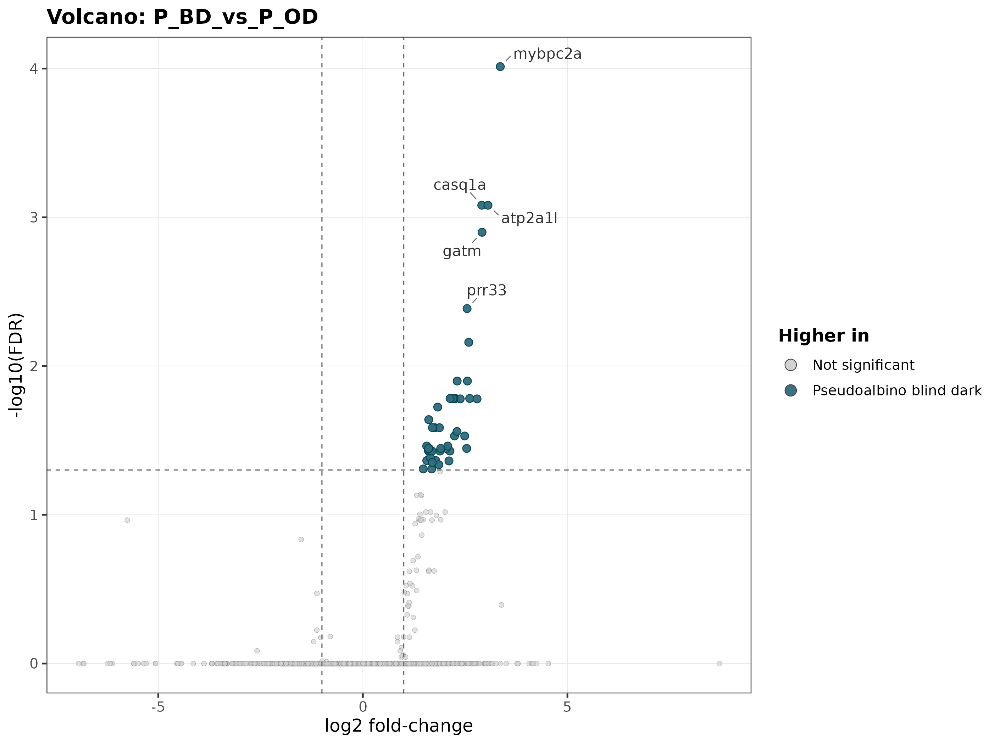

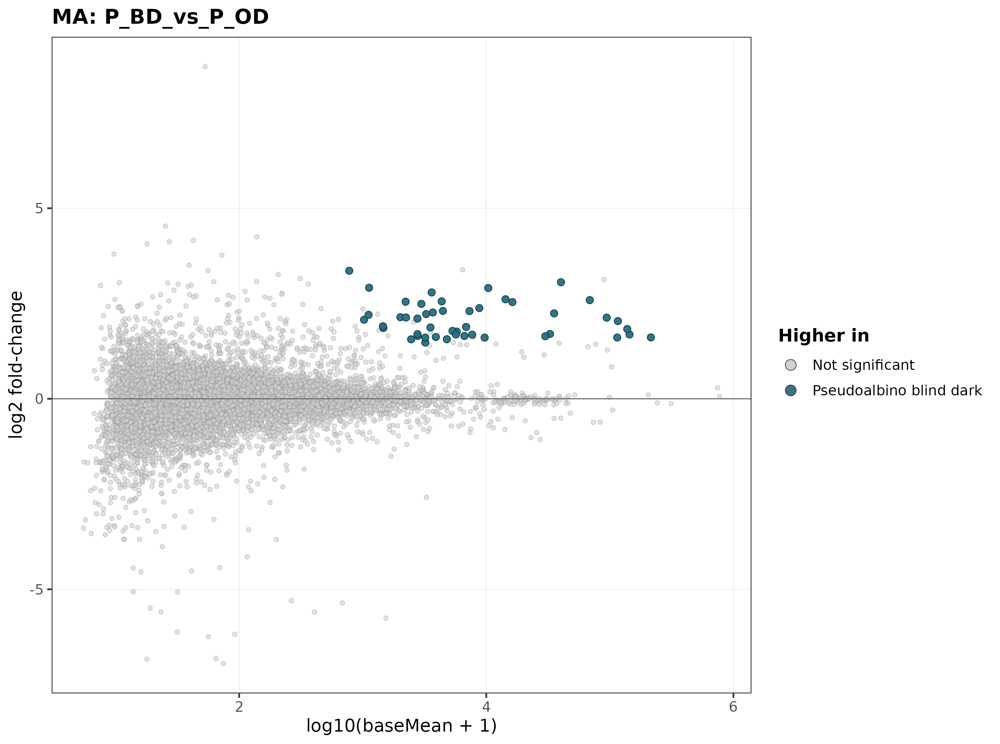

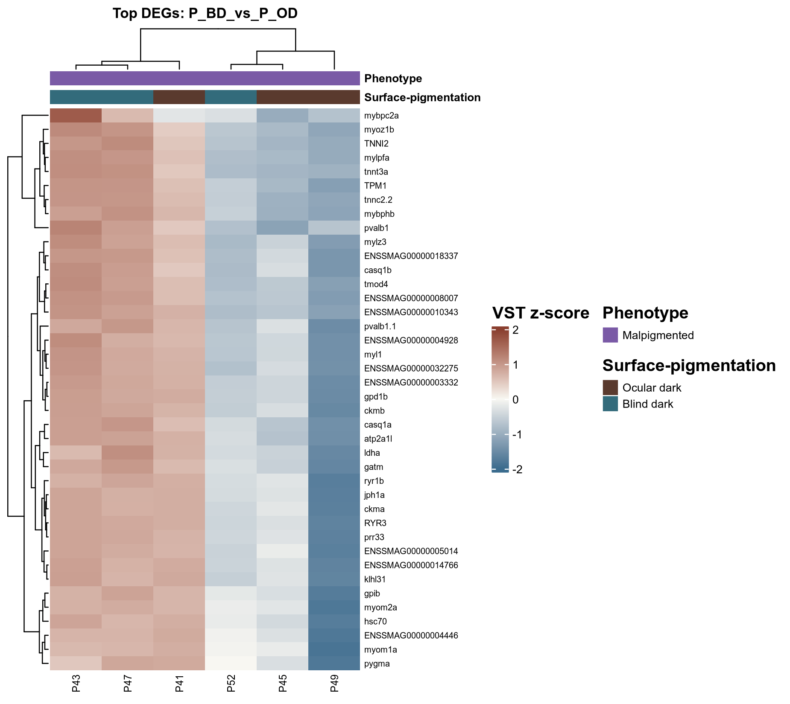

Contraste `P_BD_vs_P_OD`. Los efectos positivos corresponden a blind dark pseudoalbino.
:::

Este resultado es uno de los argumentos más sólidos contra una interpretación puramente pigmentaria. Aunque ambas regiones son oscuras, la región blind dark expresa más genes asociados a músculo, sarcómero, calcio y metabolismo. La señal probablemente refleja composición tisular, estado de la dermis o proximidad a estructuras subyacentes, y debe interpretarse como identidad de superficie dentro de un color compartido.

Archivo principal: [DEGs significativos anotados de `P_BD_vs_P_OD`](../tables/05_de/by_contrast/P_BD_vs_P_OD_significant_annotated.tsv).

### Interacción Superficie Por Pigmentación

`P_surface_x_pigmentation` prueba formalmente si el efecto dark/light dentro de pseudoalbinos cambia según la superficie. Es una hipótesis más estricta que los contrastes simples, porque pregunta por efectos no aditivos. Se evaluaron **15101 genes** y se detectaron **8 DEGs**.

| Dirección | Gen | log2FC | FDR | Lectura |
|---|---|---:|---:|---|
| Interacción positiva | `crabp1a / ENSSMAG00000005604` | 6.41 | 2.01e-07 | Ácido retinoico; candidato principal de interacción. |
| Interacción positiva | `dgat2 / ENSSMAG00000001438` | 6.39 | 7.28e-06 | Metabolismo lipídico dependiente de superficie. |
| Interacción positiva | `ACVR1C / ENSSMAG00000011491` | 8.00 | 1.45e-02 | Señalización; efecto no aditivo. |
| Interacción positiva | `plin2 / ENSSMAG00000011239` | 5.52 | 2.54e-02 | Gota lipídica y almacenamiento de lípidos. |
| Interacción negativa | `sdk2a / ENSSMAG00000000976` | -4.68 | 4.76e-02 | Adhesión celular, interacción en sentido opuesto. |
| Interacción negativa | `htr2b / ENSSMAG00000001733` | -3.89 | 4.76e-02 | Receptor serotoninérgico, candidato de señalización. |

: Genes representativos del modelo de interacción `P_surface_x_pigmentation`.

::: {#fig-de-interaction layout-ncol="3"}
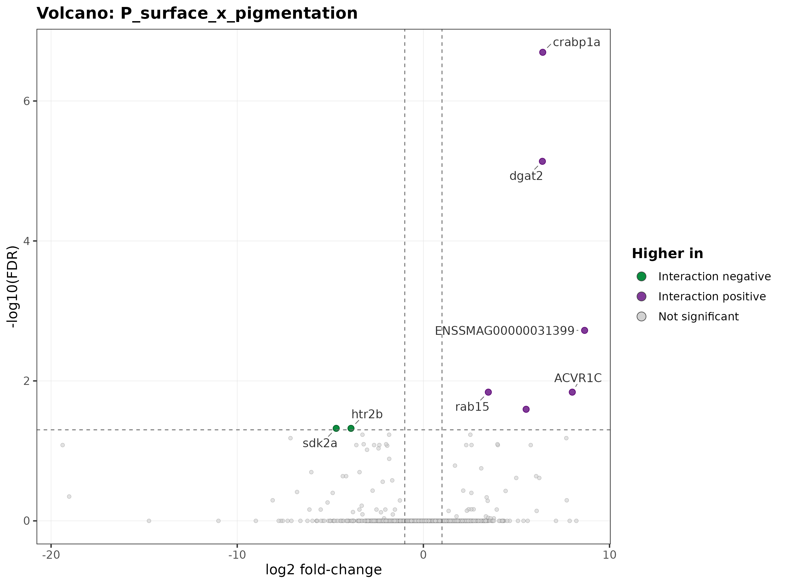

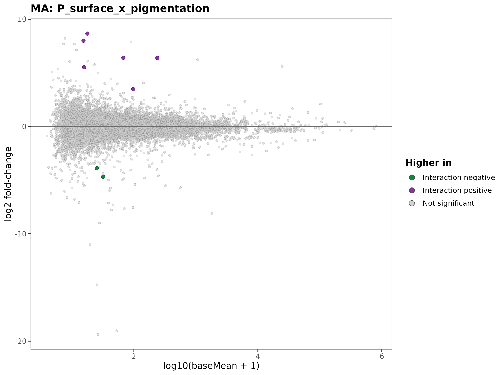

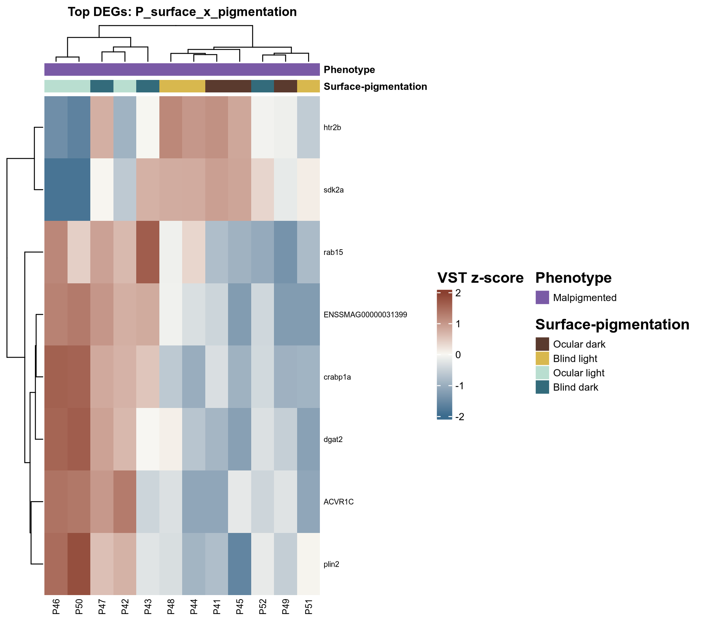

Modelo `P_surface_x_pigmentation`. Los efectos representan genes cuyo cambio asociado a pigmentación depende de la superficie.
:::

La lista corta no debilita el resultado; al contrario, indica que la interacción estricta está concentrada en pocos genes. `crabp1a`, `dgat2`, `ACVR1C` y `plin2` conectan retinoides, lípidos y señalización, un eje biológicamente plausible para modular pigmentación y diferenciación tisular. La señal negativa añade adhesión y señalización serotoninérgica como hipótesis secundaria.

Archivo principal: [DEGs significativos anotados de `P_surface_x_pigmentation`](../tables/05_de/by_contrast/P_surface_x_pigmentation_significant_annotated.tsv).

### Ocular Claro Anómalo Frente a Ocular Oscuro Normal

`P_OL_vs_N_OD` compara una zona ocular clara pseudoalbina con el estado ocular oscuro normal esperado. No es un contraste pareado por individuo, por lo que debe leerse como contraste de estado, no como estimación intraindividuo. Se evaluaron **15005 genes** y se detectaron **38 DEGs**. Solo uno fue positivo; los restantes fueron más altos en `N_OD`.

| Dirección | Gen | log2FC | FDR | Lectura |
|---|---|---:|---:|---|
| Up en `P_OL` | `tnfaip6 / ENSSMAG00000012177` | 2.32 | 9.41e-03 | Único DEG más alto en ocular claro pseudoalbino. |
| Down en `P_OL` | `ENSSMAG00000036716` | -3.12 | 1.98e-06 | Mayor en el estado ocular oscuro normal. |
| Down en `P_OL` | `ENSSMAG00000015984` | -3.99 | 1.76e-05 | Candidato sin anotación local, mayor en `N_OD`. |
| Down en `P_OL` | `ENSSMAG00000036554` | -4.50 | 2.96e-04 | Cambio intenso pendiente de curación. |
| Down en `P_OL` | `ENSSMAG00000029313` | -3.49 | 2.96e-04 | Mayor en el estado esperado normal. |
| Down en `P_OL` | `ENSSMAG00000014583` | -3.67 | 2.02e-03 | Mayor en `N_OD`, anotación funcional pendiente. |

: Genes representativos del contraste `P_OL_vs_N_OD`.

::: {#fig-de-pol-nod layout-ncol="3"}
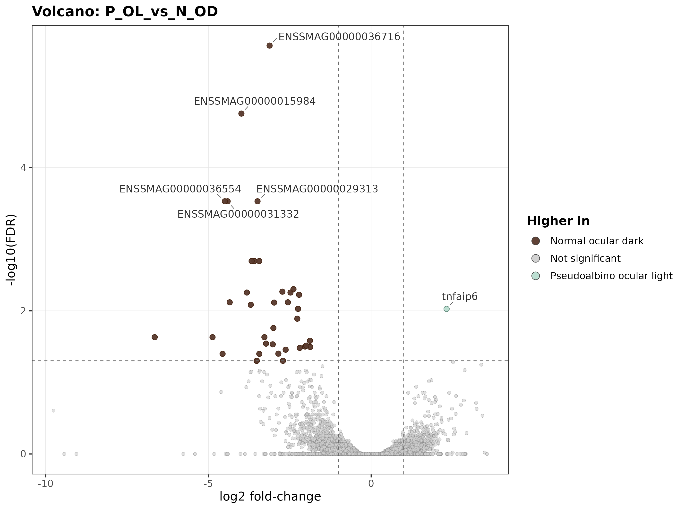

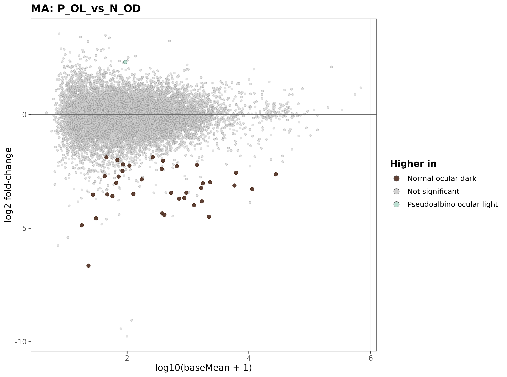

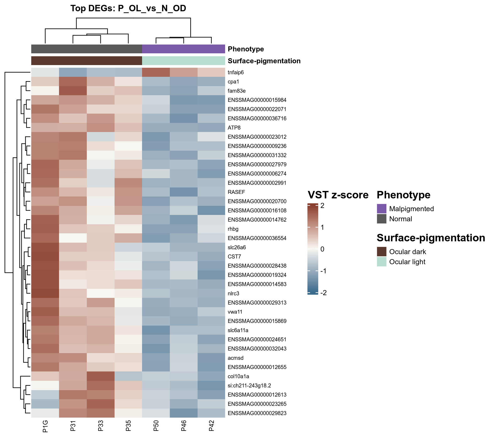

Contraste `P_OL_vs_N_OD`. Los efectos negativos corresponden a genes más altos en piel ocular oscura normal.
:::

El resultado sugiere pérdida parcial del programa ocular oscuro normal en la zona clara pseudoalbina, pero con una lista moderada. La abundancia de genes sin símbolo entre los cambios más fuertes obliga a mantener una lectura cauta: son señales útiles para priorización, aunque requieren anotación por ortología o dominios antes de construir un relato mecanístico cerrado.

Archivo principal: [DEGs significativos anotados de `P_OL_vs_N_OD`](../tables/05_de/by_contrast/P_OL_vs_N_OD_significant_annotated.tsv).

### Blind Oscuro Anómalo Frente a Blind Claro Normal

`P_BD_vs_N_BL` compara la región blind oscura pseudoalbina con la región blind clara normal esperada. Es el contraste con mayor señal del capítulo: **14483 genes** evaluados y **288 DEGs**, con **220** genes más altos en `P_BD`.

| Dirección | Gen | log2FC | FDR | Lectura |
|---|---|---:|---:|---|
| Up en `P_BD` | `vcla / ENSSMAG00000005062` | 4.08 | 9.39e-06 | Vinculina, adhesión/estructura celular. |
| Up en `P_BD` | `usp13 / ENSSMAG00000003050` | 3.09 | 1.23e-05 | Regulación proteica, mayor en blind dark anómalo. |
| Up en `P_BD` | `ca2 / ENSSMAG00000005625` | 3.62 | 3.07e-05 | Carbonic anhydrase, metabolismo/tejido. |
| Up en `P_BD` | `smyd2b / ENSSMAG00000013183` | 4.34 | 9.98e-05 | Regulación epigenética/cromatina, candidato. |
| Down en `P_BD` | `ENSSMAG00000002702` | -4.35 | 2.48e-17 | Mayor en blind claro normal; candidato sin anotación local. |
| Down en `P_BD` | `trim25 / ENSSMAG00000012664` | -3.65 | 1.70e-03 | Inmunidad innata/regulación antiviral, mayor en `N_BL`. |

: Genes representativos del contraste `P_BD_vs_N_BL`.

::: {#fig-de-pbd-nbl layout-ncol="3"}
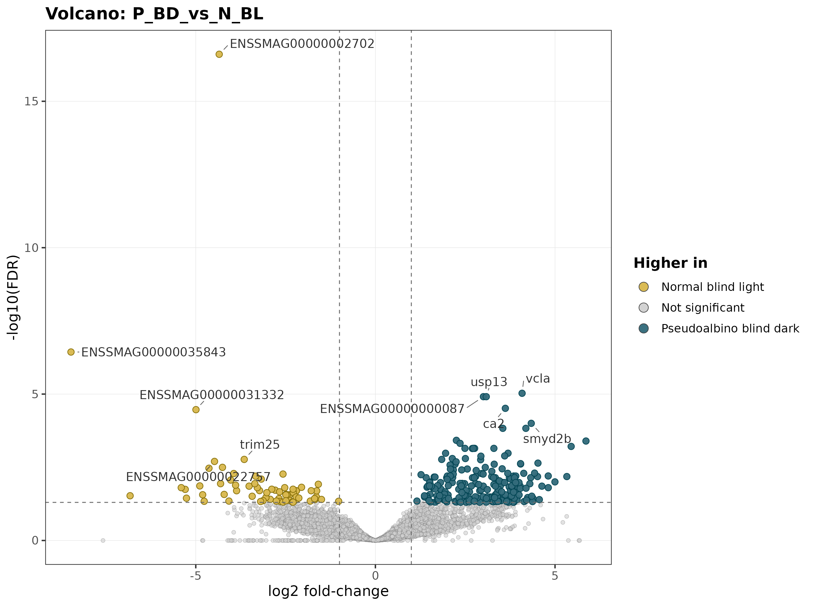

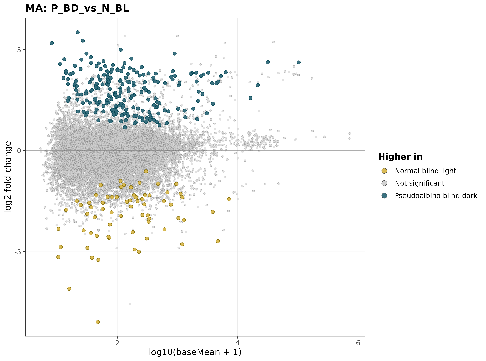

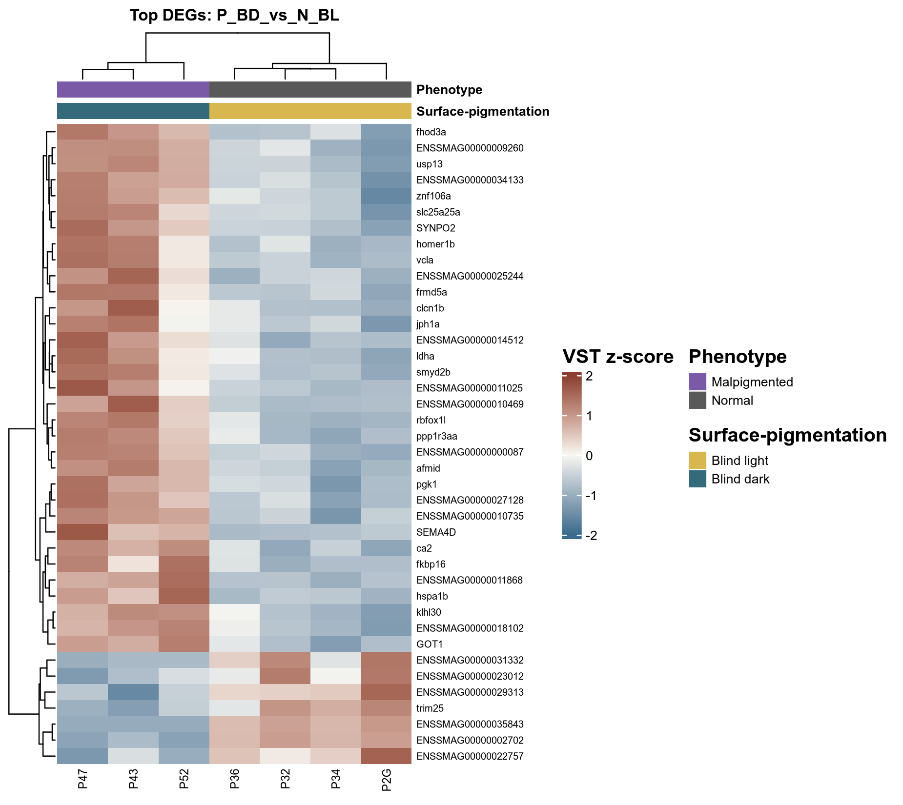

Contraste `P_BD_vs_N_BL`. Los efectos positivos corresponden a blind dark pseudoalbino y los negativos a blind light normal.
:::

La magnitud del contraste indica que la pigmentación ectópica blind no es un cambio superficial menor. El enriquecimiento positivo está dominado por Z disc, sarcómero, contracción muscular y estructura celular. En sentido negativo aparecen epidermis, inmunidad y lisosoma. Esta comparación debe leerse como un estado tisular anómalo amplio, no como una simple ganancia de melanina sobre un fondo normal.

Archivo principal: [DEGs significativos anotados de `P_BD_vs_N_BL`](../tables/05_de/by_contrast/P_BD_vs_N_BL_significant_annotated.tsv).

## Coherencia Entre Contrastes

Los solapamientos y correlaciones confirman que los ejes no son intercambiables. La correlación entre el eje normal `N_OD_vs_N_BL` y el eje ocular pseudoalbino `P_OD_vs_P_OL` es positiva pero baja, mientras que la comparación del eje normal con `P_BD_vs_P_BL` es negativa. El pseudoalbinismo ocular conserva parte del programa normal; la pigmentación blind ectópica se separa mucho más.

| Comparación | Pearson | Spearman | Interpretación |
|---|---:|---:|---|
| Normal frente a pseudoalbino ocular dark/light | 0.221 | 0.162 | Conservación parcial, insuficiente para hablar de programa idéntico. |
| Normal frente a pseudoalbino blind dark/light | -0.141 | -0.102 | Divergencia clara del eje blind ectópico. |
| Pseudoalbino ocular frente a pseudoalbino blind dark/light | 0.236 | 0.304 | Concordancia moderada-baja entre ejes pseudoalbinos. |

: Correlaciones de efecto génico entre contrastes relacionados. Se calcularon sobre genes comparables, no solo DEGs filtrados. {#tbl-de-correlations}

| Solapamiento direccional | Genes compartidos | Lectura |
|---|---:|---|
| Genes altos en dark normal y altos en dark pseudoalbino ocular | 8 | Conservación limitada del programa dark. |
| Genes altos en light normal y altos en light pseudoalbino ocular | 3 | Conservación baja del estado light. |
| Genes altos en dark normal y altos en blind dark pseudoalbino | 1 | Pigmentación ectópica blind muy divergente. |
| Genes altos en light normal y altos en blind light pseudoalbino | 0 | Sin conservación detectable en este cruce. |

: Solapamientos direccionales entre el eje fisiológico y los ejes pseudoalbinos. {#tbl-de-directional-overlap}

::: {#fig-de-overlaps layout-ncol="2"}
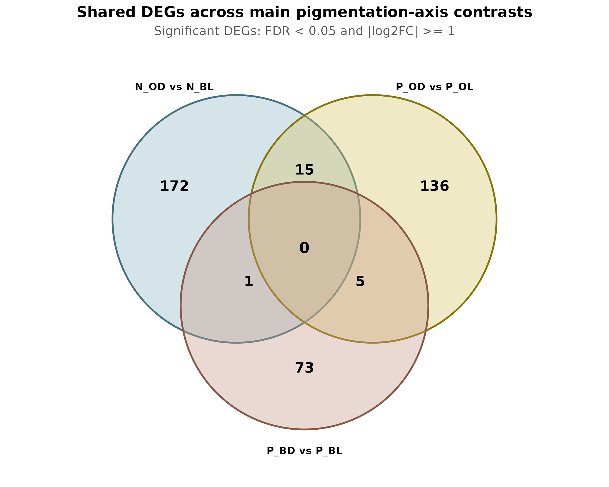

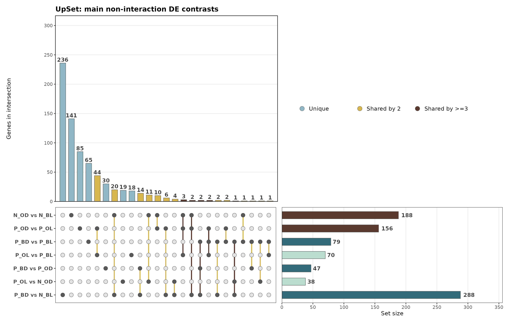

Solapamientos entre contrastes principales. La señal compartida existe, pero es limitada, especialmente cuando se compara el eje normal con pigmentación ectópica blind.
:::

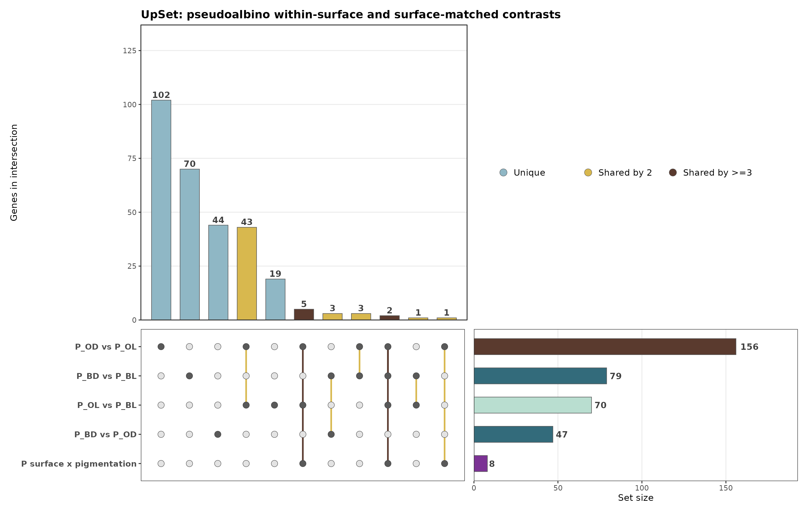{#fig-de-upset-pseudo width="90%"}

La lectura integrada es que el pseudoalbinismo no puede describirse como una inversión simple de dark y light. La región ocular clara pseudoalbina parece perder parte del estado ocular oscuro normal. La región blind oscura pseudoalbina, en cambio, se comporta como un estado más profundo de reorganización tisular, con fuerte contribución de estructura y composición celular.

## Análisis de Síntesis Añadidos

Para reforzar este capítulo se añadieron tablas derivadas reproducibles a partir de los resultados ya generados, sin relanzar los modelos DESeq2. El script [`scripts/prepare_de_chapter_tables.R`](../scripts/prepare_de_chapter_tables.R) crea:

- un resumen agregado de contrastes con DEGs por FDR, DEGs con umbral de tamaño de efecto y sesgo direccional;
- TSV separados por contraste con los DEGs significativos anotados;
- una tabla de genes destacados por contraste y dirección;
- una tabla resumida de términos GO por contraste para enlazar este capítulo con la interpretación funcional.

Estos archivos quedan incorporados como recursos descargables del libro:

- [Resumen del capítulo por contraste](../tables/05_de/chapter_summaries/chapter_contrast_summary.tsv)
- [Genes destacados por contraste y dirección](../tables/05_de/chapter_summaries/chapter_top_genes_by_contrast_direction.tsv)
- [Genes destacados compactos](../tables/05_de/chapter_summaries/chapter_top_genes_compact.tsv)
- [Términos GO resumidos por contraste](../tables/05_de/chapter_summaries/chapter_go_terms_by_contrast.tsv)
- [Inventario de figuras y tablas por contraste](../tables/05_de/chapter_summaries/chapter_contrast_inventory.tsv)
- [Todos los DEGs significativos anotados](../tables/05_de/deg_significant_all_contrasts_annotated.tsv)
- [Top 50 genes anotados por contraste](../tables/05_de/deg_top50_by_contrast_annotated.tsv)
- [Correlaciones de efecto génico](../tables/05_de/gene_effect_correlations.tsv)
- [Solapamientos direccionales](../tables/05_de/deg_directional_overlaps.tsv)

## Puente Hacia Interpretación Funcional

La expresión diferencial establece la arquitectura estadística del resultado. `N_OD_vs_N_BL` define un eje normal con pigmentación y matriz; `P_OD_vs_P_OL` conserva parte de esa estructura pero introduce lípidos, retinoides y remodelado; `P_BD_vs_P_BL` y `P_BD_vs_N_BL` muestran que la pigmentación ectópica blind es mucho más divergente. El capítulo siguiente usa esta base para interpretar términos GO, categorías funcionales dirigidas y procesos biológicos en un marco más mecanístico.

::: {.callout-note title="Muestras a vigilar al interpretar DE"}
Las muestras `P43`, `P44`, `P47` y `P49` mostraron señales técnicas moderadas en QC, principalmente duplicación elevada o menor complejidad. No fueron excluidas porque no mostraron fallo global, pero conviene evitar conclusiones que dependan de una sola muestra, especialmente en contrastes pseudoalbinos con n reducido.
:::

## Referencias {.unnumbered}

::: {#refs}
:::
