# Enriquecimiento funcional e interpretación biológica

## Objetivo y Enfoque

Este capítulo reorganiza el enriquecimiento funcional del análisis de RNA-seq de piel de rodaballo. El objetivo no es acumular listas de términos GO, sino convertir los resultados de expresión diferencial en una lectura biológica defendible por contraste: qué procesos se desplazan, en qué dirección, con qué consistencia entre GSEA y ORA, y qué interpretación es razonable para cada comparación.

La capa funcional se reconstruyó desde las salidas completas de `analysis/results/05_functional_enrichment`, no desde una tabla resumida. Se generaron tablas y figuras nuevas en `tables/06_functional/` y `figures/06_functional/` con el script [`scripts/prepare_functional_chapter_assets.R`](../scripts/prepare_functional_chapter_assets.R). Este script no cambia los modelos DESeq2 ni relanza `clusterProfiler` [@Yu2012]; reanaliza y estructura las salidas funcionales ya calculadas: GSEA, ORA, categorías dirigidas de desarrollo/cresta neural/Wnt-retinoides, y estado de módulos.

::: {.callout-note title="Cómo leer este capítulo"}
GSEA se usa como lectura principal de programas coordinados en el ranking completo de genes. ORA se usa como apoyo para genes filtrados como DEGs. Cuando ambas capas apuntan al mismo proceso, la evidencia es más fuerte; cuando divergen, se interpreta como diferencia entre señal distribuida y señal concentrada en genes significativos.
:::

## Inputs, Métodos y Trazabilidad

El enriquecimiento se basa en una base GO custom para *Scophthalmus maximus* con **20441 genes anotados**. La ejecución funcional completó:

| Módulo | Estado | Resultado clave |
|---|---|---|
| GO custom | Completado | 20441 genes con anotación GO custom. |
| GO ORA | Completado | 460 filas ORA con FDR < 0.05. |
| GO GSEA | Completado | 1252 filas GSEA con FDR < 0.05. |
| compareCluster | Completado | 4744 filas en comparación multi-contraste. |
| KEGG | Revisado, no ejecutado | No hay mapeo validado `ENSSMAG -> KEGG`; se evita una interpretación no trazable. |
| Interpretación automática | Omitida | La versión instalada de `clusterProfiler` no exporta `interpret()`. |
| Categorías dirigidas | Completado | 429 filas enfocadas en desarrollo, migración, pigmentación y Wnt/retinoides. |

: Estado de los módulos funcionales usados como fuente del capítulo. {#tbl-functional-module-status}

La lectura direccional sigue la misma lógica que en expresión diferencial. En GSEA, un NES positivo se desplaza hacia genes con log2FC positivo, es decir, hacia el primer grupo del contraste. Un NES negativo se desplaza hacia el segundo grupo. En ORA, las listas `up` y `down` separan genes más altos en el primer o segundo grupo; la lista `all` resume todos los DEGs filtrados, sin separar dirección.

::: {.callout-important title="Qué análisis nuevos se añadieron"}
Se añadieron análisis de síntesis: recuentos significativos por método y dirección, mapas de categorías funcionales por contraste, tablas por contraste con GSEA/ORA significativos, tablas de términos top y figuras nuevas separadas para cada comparación. Esto convierte el bloque en un resultado navegable, no en un volcado de GO.
:::

## Resumen Global

El número de términos significativos varía mucho entre contrastes. `N_OD_vs_N_BL`, `P_OL_vs_N_OD` y `P_BD_vs_N_BL` muestran señales amplias en GSEA, mientras que `P_BD_vs_P_OD` y el modelo de interacción son más focales. ORA es especialmente informativo en `N_OD_vs_N_BL`, `P_OD_vs_P_OL`, `P_OL_vs_P_BL`, `P_surface_x_pigmentation` y `P_BD_vs_N_BL`; en `P_OL_vs_N_OD` no produjo términos significativos con el umbral aplicado, aunque GSEA sí detectó programas coordinados.

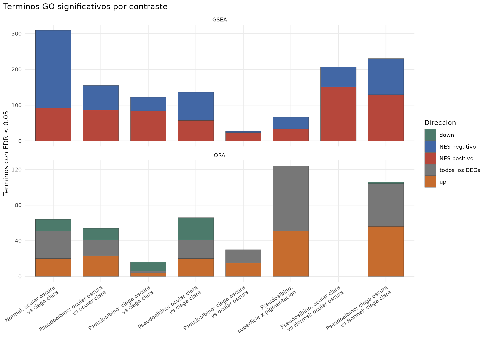{#fig-functional-counts width="95%"}

| Contraste | GSEA FDR < 0.05 | GSEA positivo | GSEA negativo | ORA FDR < 0.05 | Lectura funcional rápida |
|---|---:|---:|---:|---:|---|
| `N_OD_vs_N_BL` | 309 | 92 | 217 | 64 | Pigmentación y metabolismo hacia `N_OD`; matriz, adhesión y desarrollo hacia `N_BL`. |
| `P_OD_vs_P_OL` | 155 | 86 | 69 | 54 | Mitochondria/músculo y matriz en `P_OD`; desmosoma, retinoides e integrina hacia `P_OL`. |
| `P_BD_vs_P_BL` | 122 | 84 | 38 | 16 | Sarcómero hacia `P_BD`; desmosoma, epidermis y melanosoma hacia `P_BL`. |
| `P_OL_vs_P_BL` | 136 | 57 | 79 | 66 | Desarrollo/Wnt hacia `P_OL`; sarcómero y matriz hacia `P_BL`. |
| `P_BD_vs_P_OD` | 27 | 23 | 4 | 30 | Z disc, sarcómero y músculo hacia `P_BD`; señal negativa limitada. |
| `P_surface_x_pigmentation` | 66 | 34 | 32 | 124 | Interacción focal: lípidos/desarrollo en positivo y mitocondria en negativo. |
| `P_OL_vs_N_OD` | 207 | 151 | 56 | 0 | Matriz/desarrollo/Wnt hacia `P_OL`; inmunidad innata hacia `N_OD`. |
| `P_BD_vs_N_BL` | 230 | 129 | 101 | 106 | Mitocondria/sarcómero hacia `P_BD`; lisosoma, epidermis e inmunidad hacia `N_BL`. |

: Resumen de términos funcionales significativos por contraste. {#tbl-functional-contrast-summary}

El mapa de categorías de @fig-functional-category-heatmap resume el patrón más útil para interpretar el bloque. Los círculos indican cuántos términos GSEA significativos caen en cada categoría; el color muestra el NES dominante. El resultado es más claro que un dotplot global: el eje normal tiene pigmentación positiva y matriz negativa; el pseudoalbinismo ocular mezcla músculo/mitocondria/matriz con epitelio y retinoides; la cara ciega oscura se desplaza hacia músculo, sarcómero y metabolismo; y los contrastes anómalos frente a normal capturan reprogramación tisular amplia.

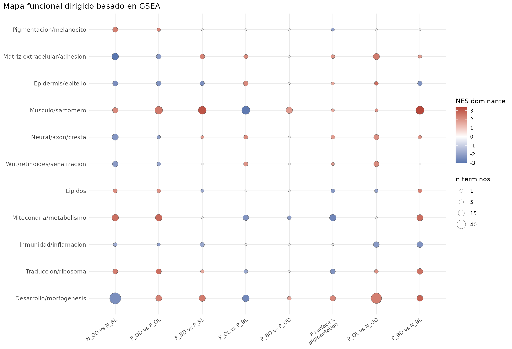{#fig-functional-category-heatmap width="95%"}

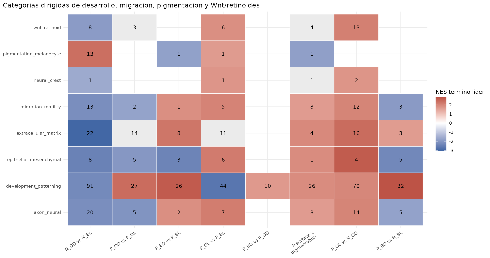{#fig-functional-focused width="95%"}

## Resultados por Comparación

### Normal: Superficie Ocular Oscura Frente a Superficie Ciega Clara

`N_OD_vs_N_BL` valida la referencia fisiológica del estudio. GSEA detectó **309 términos** significativos: **92** con NES positivo hacia `N_OD` y **217** con NES negativo hacia `N_BL`. El lado positivo incluye mitocondria, traducción/ribosoma, melanosoma, diferenciación melanocítica y metabolismo relacionado con pigmentación. ORA refuerza esa lectura con términos como biosíntesis de tetrahidrobiopterina, diferenciación melanocítica y melanosoma en la lista `up`.

En sentido negativo aparecen matriz extracelular, colágeno, adhesión, heparin binding, angiogénesis, desarrollo y guía axonal. Esto confirma que el contraste normal no es un eje de color puro: combina pigmentación ocular con diferencias profundas de superficie y organización tisular.

::: {#fig-functional-nod-nbl layout-ncol="2"}
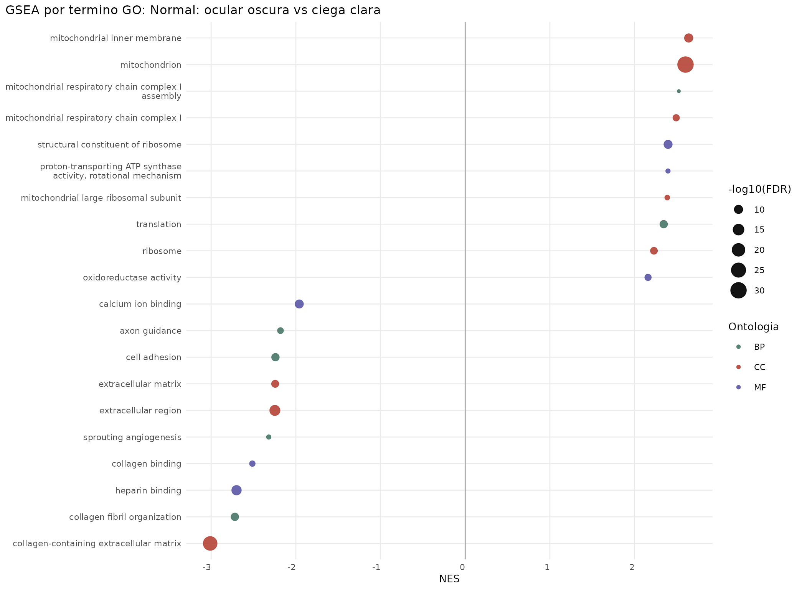

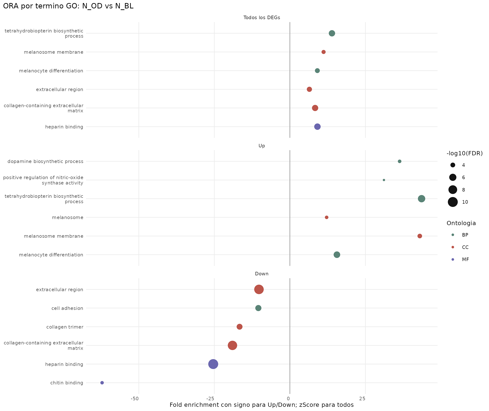

Enriquecimiento funcional de `N_OD_vs_N_BL`. Los términos positivos se desplazan hacia `N_OD`; los negativos, hacia `N_BL`.
:::

Archivos: [GSEA significativo](../tables/06_functional/by_contrast/N_OD_vs_N_BL_gsea_significant.tsv), [ORA significativo](../tables/06_functional/by_contrast/N_OD_vs_N_BL_ora_significant.tsv), [términos top](../tables/06_functional/by_contrast/N_OD_vs_N_BL_functional_top_terms.tsv).

### Pseudoalbino: Superficie Ocular Oscura Frente a Superficie Ocular Clara

`P_OD_vs_P_OL` separa la región ocular oscura pseudoalbina de la ocular clara pseudoalbina. GSEA detectó **155 términos** significativos, con un reparto relativamente equilibrado: **86** positivos y **69** negativos. El lado positivo se inclina hacia mitocondria, ribosoma, sarcómero, músculo y matriz extracelular. ORA añade colágeno y matriz como señales robustas de la lista de DEGs.

El lado negativo es biológicamente interesante porque reúne desmosoma, unión célula-célula, señalización intracelular, diferenciación neuronal y unión a ácido retinoico. Junto con los genes `dgat2` y `crabp1a` vistos en expresión diferencial, esto sugiere que la zona ocular clara pseudoalbina no es solo una región con menos pigmento: muestra un estado epitelial/de señalización distinto, con retinoides y adhesión celular como ejes plausibles.

::: {#fig-functional-pod-pol layout-ncol="2"}
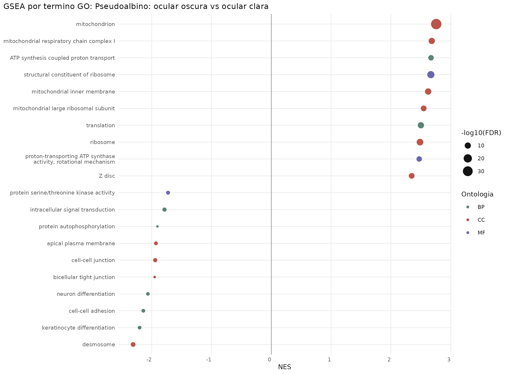

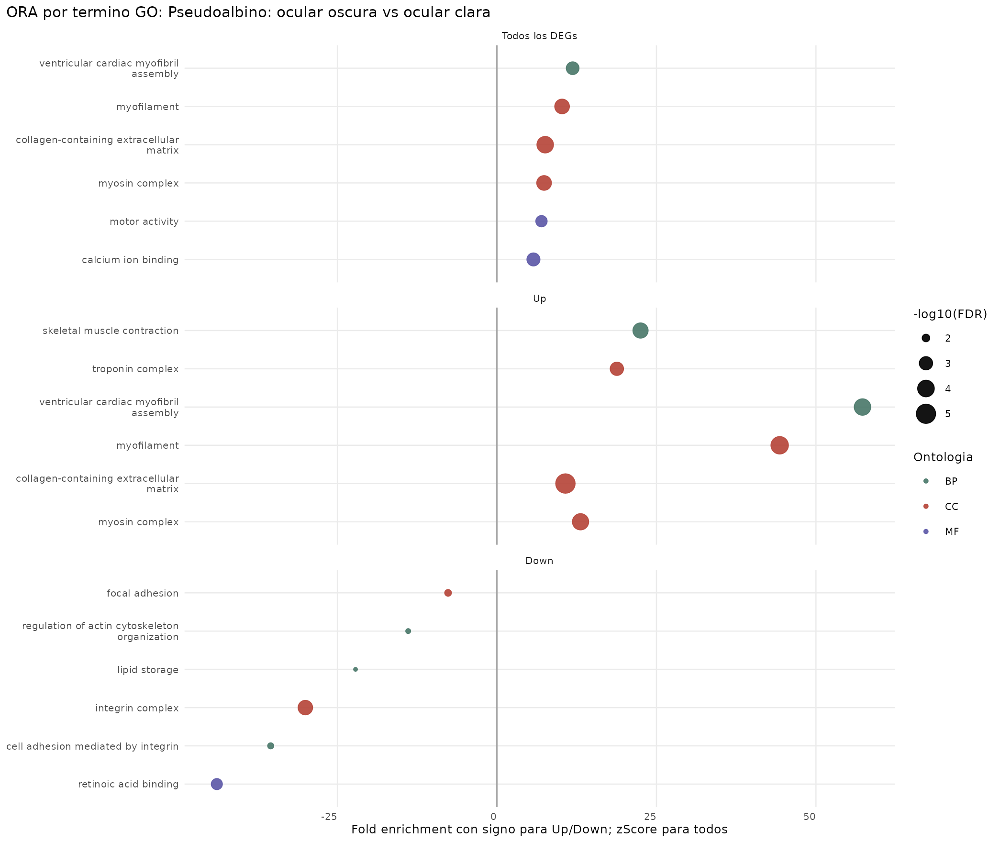

Enriquecimiento funcional de `P_OD_vs_P_OL`. La señal positiva se desplaza hacia `P_OD`; la negativa, hacia `P_OL`.
:::

Archivos: [GSEA significativo](../tables/06_functional/by_contrast/P_OD_vs_P_OL_gsea_significant.tsv), [ORA significativo](../tables/06_functional/by_contrast/P_OD_vs_P_OL_ora_significant.tsv), [términos top](../tables/06_functional/by_contrast/P_OD_vs_P_OL_functional_top_terms.tsv).

### Pseudoalbino: Superficie Ciega Oscura Frente a Superficie Ciega Clara

`P_BD_vs_P_BL` pregunta si la pigmentación oscura ectópica en la cara ciega activa un programa funcional comparable al eje normal. La respuesta es no de forma simple. GSEA detectó **122 términos** significativos, **84** positivos y **38** negativos. El lado positivo está dominado por Z disc, sarcómero, contracción muscular, alpha-actinin binding y metabolismo energético. ORA confirma una señal estructural, pero no una activación clara de melanogénesis en `P_BD`.

El lado negativo contiene desmosoma, epidermis, filamento intermedio, receptor complex y, de forma muy relevante, melanosoma y diferenciación melanocítica. Es decir, en este contraste los términos de pigmentación no sostienen que `P_BD` sea una copia molecular de la piel ocular oscura; aparecen más asociados al lado `P_BL` o a una dirección opuesta a la esperada para una simple ganancia de color.

::: {#fig-functional-pbd-pbl layout-ncol="2"}
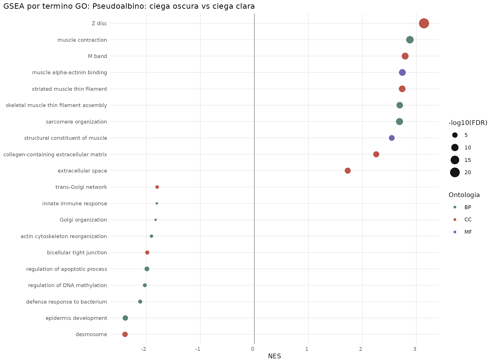

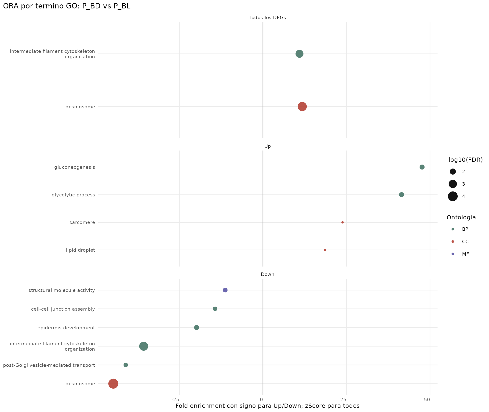

Enriquecimiento funcional de `P_BD_vs_P_BL`. La señal positiva se desplaza hacia `P_BD`; la negativa, hacia `P_BL`.
:::

Archivos: [GSEA significativo](../tables/06_functional/by_contrast/P_BD_vs_P_BL_gsea_significant.tsv), [ORA significativo](../tables/06_functional/by_contrast/P_BD_vs_P_BL_ora_significant.tsv), [términos top](../tables/06_functional/by_contrast/P_BD_vs_P_BL_functional_top_terms.tsv).

### Pseudoalbino: Superficie Ocular Clara Frente a Superficie Ciega Clara

`P_OL_vs_P_BL` mantiene constante el color claro y compara superficies pseudoalbinas. GSEA detectó **136 términos** significativos. Los términos positivos hacia `P_OL` incluyen morfogénesis embrionaria, proliferación/desarrollo, diferenciación neuronal, epidermis y señalización Wnt/categorías relacionadas. ORA en `up` destaca almacenamiento lipídico y gota lipídica, coherente con la presencia de `crabp1a` y `dgat2` en expresión diferencial.

La dirección negativa hacia `P_BL` es muy fuerte para Z disc, M band, organización de sarcómero, contracción muscular, filamento fino, matriz extracelular y colágeno. Esta comparación muestra que dos regiones claras no son funcionalmente equivalentes: el color macroscópico queda subordinado a la identidad de superficie.

::: {#fig-functional-pol-pbl layout-ncol="2"}
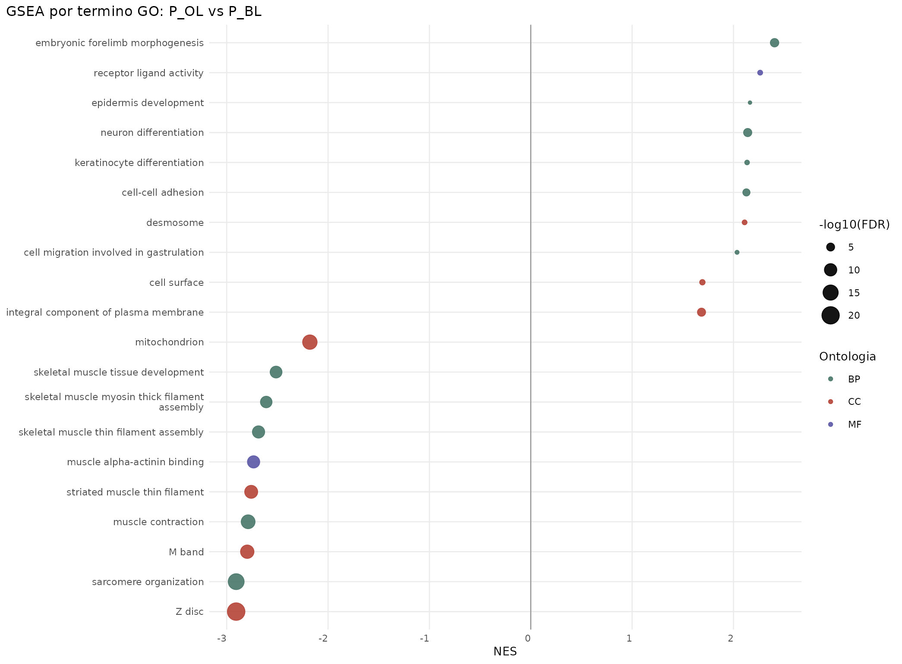

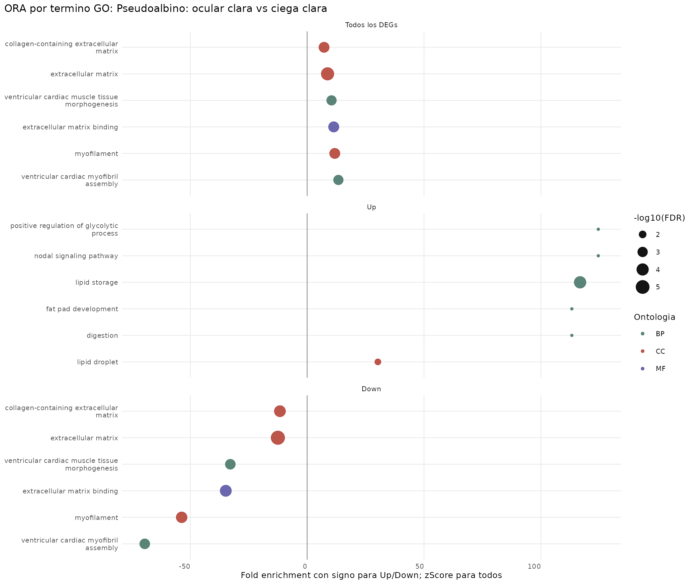

Enriquecimiento funcional de `P_OL_vs_P_BL`. La señal positiva se desplaza hacia `P_OL`; la negativa, hacia `P_BL`.
:::

Archivos: [GSEA significativo](../tables/06_functional/by_contrast/P_OL_vs_P_BL_gsea_significant.tsv), [ORA significativo](../tables/06_functional/by_contrast/P_OL_vs_P_BL_ora_significant.tsv), [términos top](../tables/06_functional/by_contrast/P_OL_vs_P_BL_functional_top_terms.tsv).

### Pseudoalbino: Superficie Ciega Oscura Frente a Superficie Ocular Oscura

`P_BD_vs_P_OD` mantiene constante el color oscuro dentro de pseudoalbinos. La señal funcional es más compacta que en otros contrastes: **27 términos** GSEA significativos, **23** positivos y **4** negativos. El lado positivo está dominado por Z disc, sarcómero, filamento fino, actin filament organization, skeletal myofibril assembly y structural constituent of muscle. ORA refuerza exactamente el mismo eje en la lista `up`.

La señal negativa es escasa y se relaciona sobre todo con región extracelular, regeneración de aleta y complejos mitocondriales. La conclusión es muy consistente con el capítulo de expresión diferencial: bajo el mismo color oscuro, `P_BD` se distingue de `P_OD` por un programa estructural/muscular, no por melanogénesis terminal.

::: {#fig-functional-pbd-pod layout-ncol="2"}
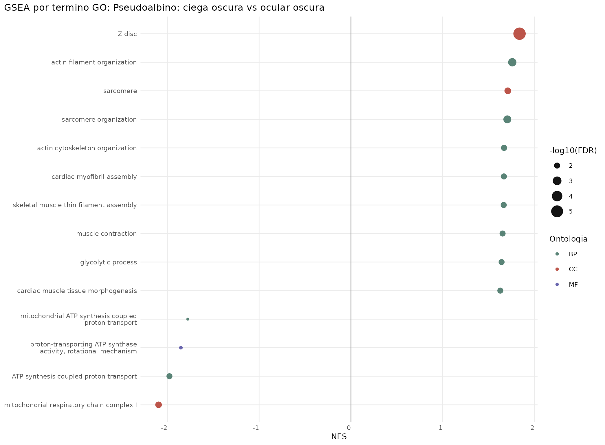

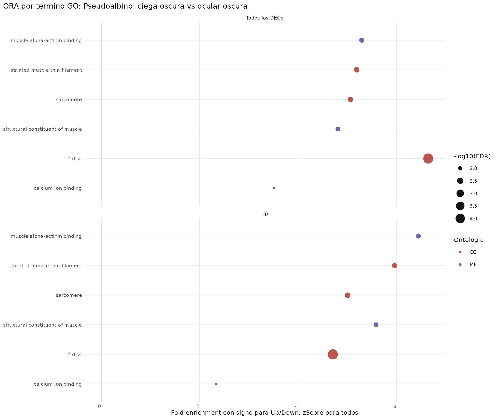

Enriquecimiento funcional de `P_BD_vs_P_OD`. La señal positiva se desplaza hacia `P_BD`; la negativa, hacia `P_OD`.
:::

Archivos: [GSEA significativo](../tables/06_functional/by_contrast/P_BD_vs_P_OD_gsea_significant.tsv), [ORA significativo](../tables/06_functional/by_contrast/P_BD_vs_P_OD_ora_significant.tsv), [términos top](../tables/06_functional/by_contrast/P_BD_vs_P_OD_functional_top_terms.tsv).

### Pseudoalbino: Interacción Superficie Por Pigmentación

El modelo `P_surface_x_pigmentation` identifica procesos cuyo efecto de pigmentación clara/oscura cambia según la superficie ocular/ciega. GSEA detectó **66 términos** significativos con equilibrio entre direcciones (**34** positivos y **32** negativos), mientras que ORA detectó **124** términos, principalmente en `all` y `up`.

La señal positiva combina desarrollo multicelular, lipid storage, signaling receptor binding, membrana plasmática, cytokine activity y categorías de señalización. ORA destaca con fuerza `BP: lipid storage`, en línea con los genes de interacción `dgat2`, `crabp1a` y `plin2`. La señal negativa agrupa mitocondria, complejo I respiratorio, NADH dehydrogenase y membrana interna mitocondrial. Por tanto, la interacción no es un gran programa de pigmentación, sino un eje no aditivo entre lípidos/señalización/desarrollo y metabolismo mitocondrial.

::: {#fig-functional-interaction layout-ncol="2"}
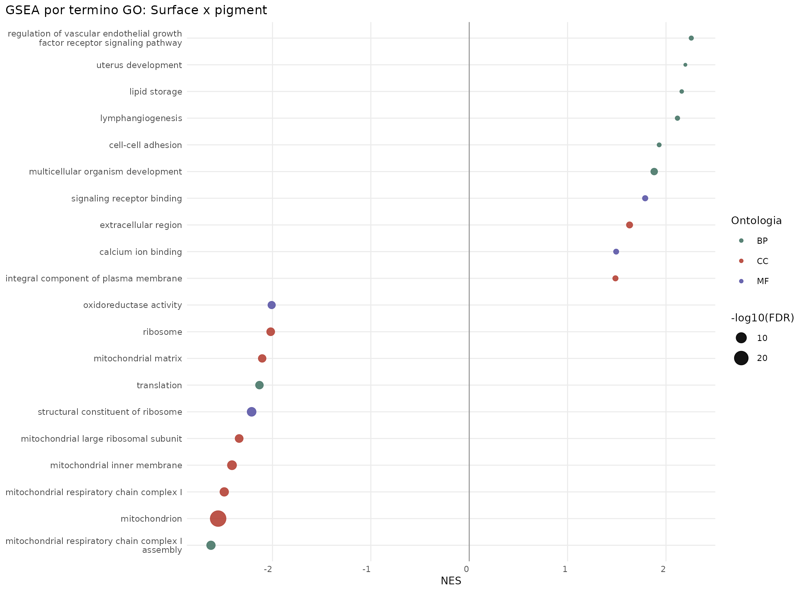

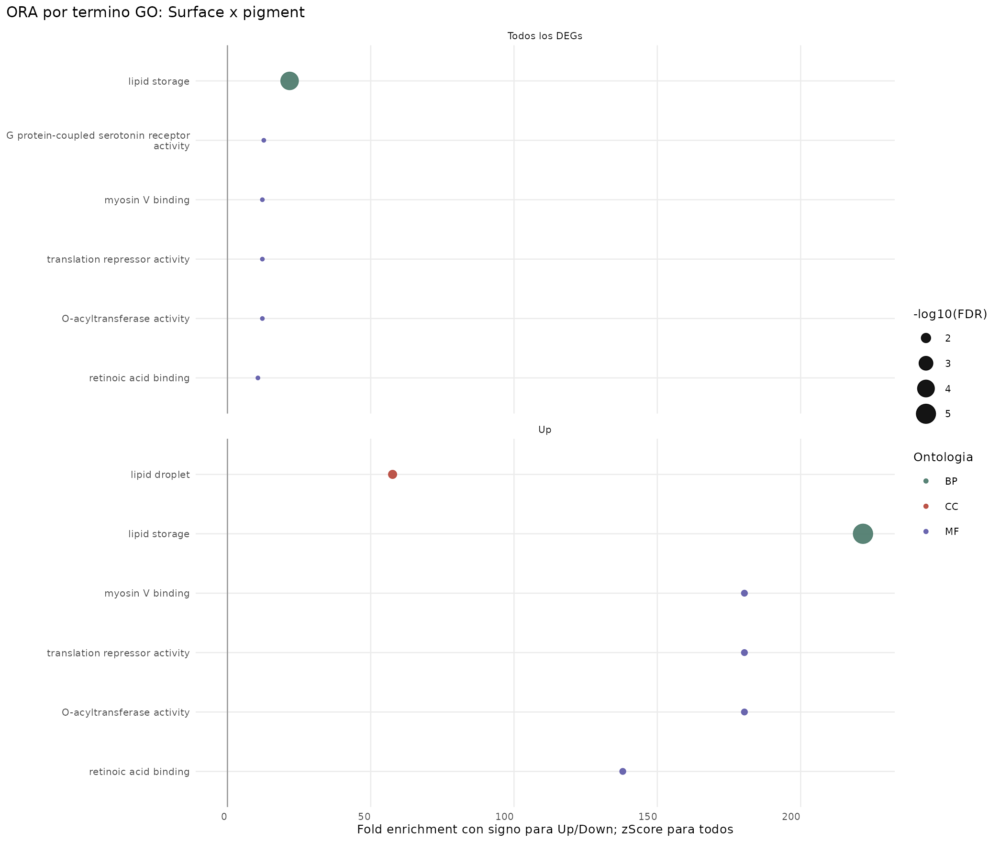

Enriquecimiento funcional de `P_surface_x_pigmentation`. Los términos representan efectos no aditivos entre superficie y pigmentación.
:::

Archivos: [GSEA significativo](../tables/06_functional/by_contrast/P_surface_x_pigmentation_gsea_significant.tsv), [ORA significativo](../tables/06_functional/by_contrast/P_surface_x_pigmentation_ora_significant.tsv), [términos top](../tables/06_functional/by_contrast/P_surface_x_pigmentation_functional_top_terms.tsv).

### Pseudoalbino: Superficie Ocular Clara Frente a Normal: Superficie Ocular Oscura

`P_OL_vs_N_OD` compara una zona ocular clara pseudoalbina con el estado ocular oscuro normal esperado. ORA no detectó términos significativos con FDR < 0.05, pero GSEA sí identificó **207 términos**, con **151** positivos hacia `P_OL` y **56** negativos hacia `N_OD`.

La señal positiva hacia `P_OL` incluye matriz extracelular, región extracelular, heparin binding, calcium ion binding, collagen fibril organization, Wnt signaling, transición epitelio-mesénquima, axon guidance y neural crest cell migration. Esta lectura es importante: la región ocular clara anómala no solo pierde rasgos del ocular oscuro normal; también gana un programa coordinado de matriz, desarrollo y señalización. En sentido negativo hacia `N_OD` aparecen inmunidad innata, respuesta inmune, metabolismo de ácido araquidónico, deubiquitinación y ubiquitin-protein transferase activity.

::: {#fig-functional-pol-nod layout-ncol="2"}
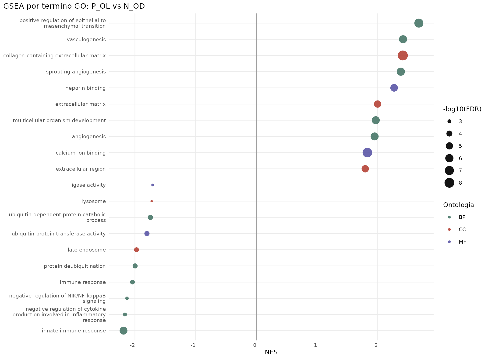

Enriquecimiento funcional de `P_OL_vs_N_OD`. GSEA detecta señal coordinada aunque ORA no genera términos significativos.
:::

Archivos: [GSEA significativo](../tables/06_functional/by_contrast/P_OL_vs_N_OD_gsea_significant.tsv), [ORA significativo](../tables/06_functional/by_contrast/P_OL_vs_N_OD_ora_significant.tsv), [términos top](../tables/06_functional/by_contrast/P_OL_vs_N_OD_functional_top_terms.tsv).

### Pseudoalbino: Superficie Ciega Oscura Frente a Normal: Superficie Ciega Clara

`P_BD_vs_N_BL` es el contraste funcionalmente más contundente junto con el eje normal. GSEA detectó **230 términos** significativos: **129** positivos hacia `P_BD` y **101** negativos hacia `N_BL`. ORA añadió **106** términos, con una señal `up` muy clara.

El lado positivo hacia `P_BD` combina mitocondria, Z disc, sarcómero, contracción muscular, desarrollo de tejido muscular esquelético, sarcolemma y estructura celular. El lado negativo hacia `N_BL` incluye lisosoma, epidermis, inmunidad, respuesta inmune, regulación de apoptosis y señalización NIK/NF-kappaB. En conjunto, esta comparación no describe simplemente una mancha oscura: describe una región ciega anómala con fuerte reorganización estructural, metabólica e inmuno-epidérmica.

::: {#fig-functional-pbd-nbl layout-ncol="2"}
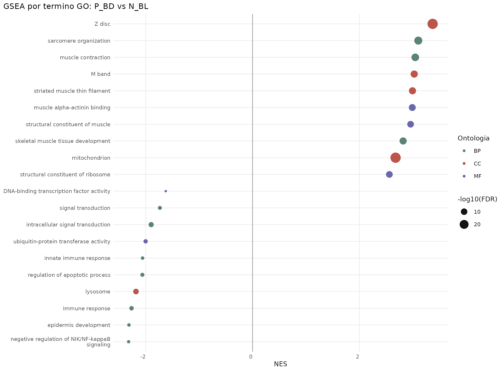

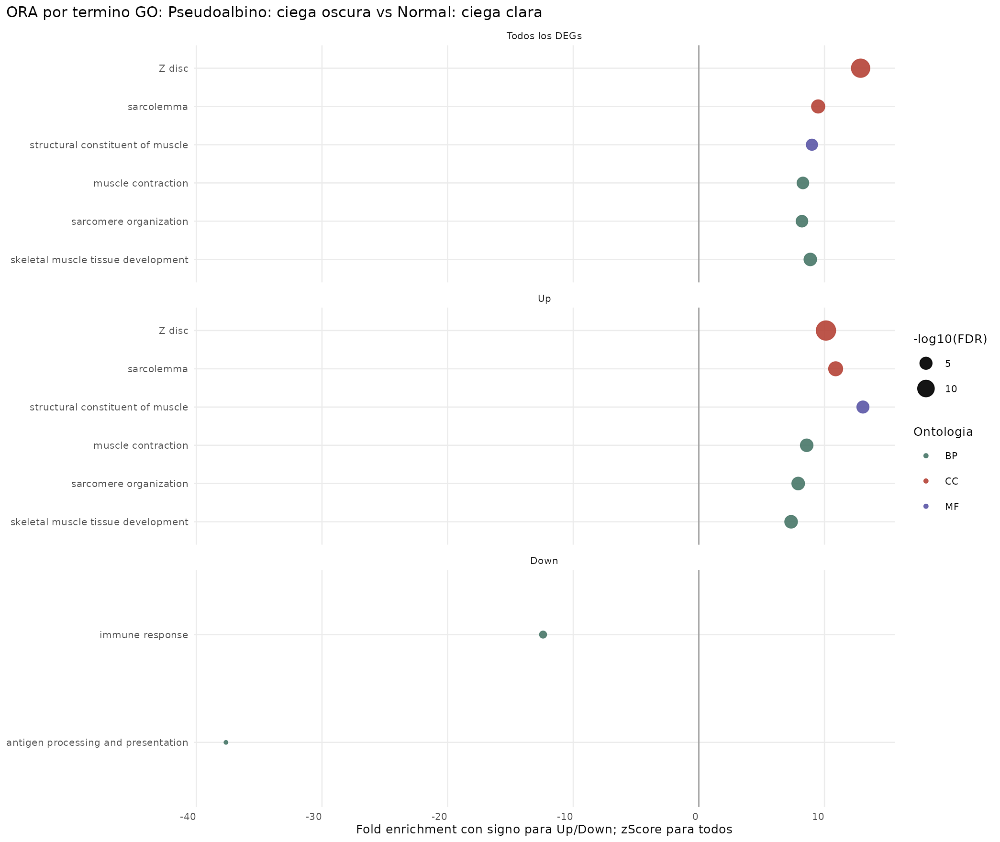

Enriquecimiento funcional de `P_BD_vs_N_BL`. La señal positiva se desplaza hacia `P_BD`; la negativa, hacia `N_BL`.
:::

Archivos: [GSEA significativo](../tables/06_functional/by_contrast/P_BD_vs_N_BL_gsea_significant.tsv), [ORA significativo](../tables/06_functional/by_contrast/P_BD_vs_N_BL_ora_significant.tsv), [términos top](../tables/06_functional/by_contrast/P_BD_vs_N_BL_functional_top_terms.tsv).

## Síntesis Biológica

La lectura funcional reordena el resultado en cuatro capas:

- `N_OD_vs_N_BL` confirma que el eje normal contiene pigmentación/melanocitos hacia piel ocular oscura, y matriz/desarrollo hacia piel ciega clara.
- `P_OD_vs_P_OL` indica que el pseudoalbinismo ocular combina cambios de matriz, mitocondria, músculo, adhesión epitelial y retinoides; no es un apagado simple de melanogénesis.
- `P_BD_vs_P_BL`, `P_BD_vs_P_OD` y `P_BD_vs_N_BL` muestran que la pigmentación ectópica ciega está dominada por estructura tisular, músculo/sarcómero, metabolismo y epidermis/inmunidad, con poca evidencia de que reproduzca el programa ocular oscuro normal.
- `P_surface_x_pigmentation` concentra la interacción en lípidos, retinoides/señalización y mitocondria, lo que propone un mecanismo no aditivo más focal que los contrastes simples.

Esta síntesis es más compatible con una hipótesis tisular que con una hipótesis puramente pigmentaria. Los genes de melanogénesis son importantes en la referencia normal, pero la malpigmentación pseudoalbina parece depender también del microambiente cutáneo, matriz extracelular, identidad de superficie, señalización del desarrollo y composición celular.

## Archivos Derivados

Los archivos principales creados para este capítulo quedan disponibles como recursos del libro:

- [Resumen funcional por contraste](../tables/06_functional/functional_contrast_summary.tsv)
- [Resumen de categorías funcionales GSEA](../tables/06_functional/functional_category_summary_gsea.tsv)
- [Términos top por contraste](../tables/06_functional/functional_top_terms_by_contrast.tsv)
- [GSEA significativo combinado](../tables/06_functional/functional_gsea_significant.tsv)
- [ORA significativo combinado](../tables/06_functional/functional_ora_significant.tsv)
- [GSEA y ORA significativos combinados](../tables/06_functional/functional_go_significant_combined.tsv)
- [Categorías dirigidas de desarrollo y cresta neural](../tables/06_functional/functional_focused_development_terms_fdr_0_10.tsv)
- [Estado de módulos funcionales](../tables/06_functional/functional_enrichment_module_status.tsv)

Además, cada contraste tiene tablas separadas en `tables/06_functional/by_contrast/`, con resultados GSEA, ORA y términos top.

## Limitaciones

La interpretación funcional depende de la anotación GO custom disponible para rodaballo. Un término enriquecido no identifica por sí solo el tipo celular responsable de la señal, ni distingue composición tisular de regulación transcripcional dentro de la misma célula. ORA depende de umbrales de DEG, mientras que GSEA detecta desplazamientos distribuidos y puede destacar procesos sin una lista grande de genes individuales significativos.

KEGG no se ejecutó porque no existe un mapeo validado de `ENSSMAG` a identificadores KEGG dentro del proyecto. Mantener esa decisión evita introducir rutas no trazables. Para validar mecanismos concretos será necesario integrar anotación manual, histología, marcadores celulares, localización espacial o experimentos funcionales.

## Referencias {.unnumbered}

::: {#refs}
:::
