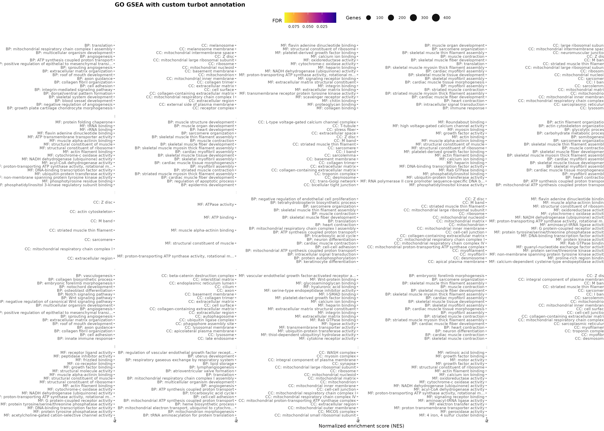
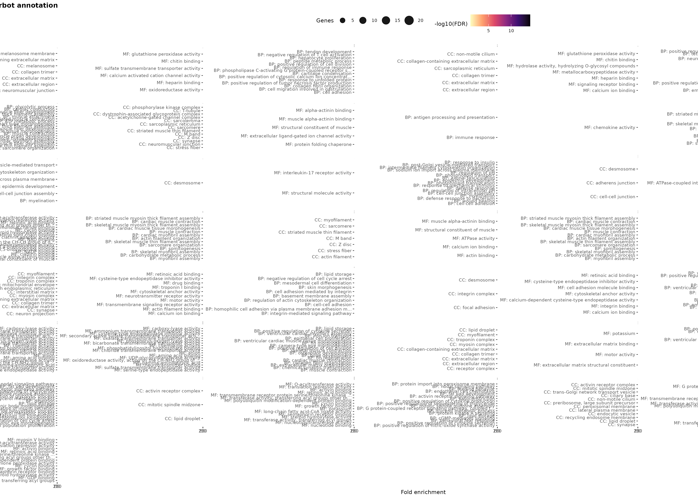
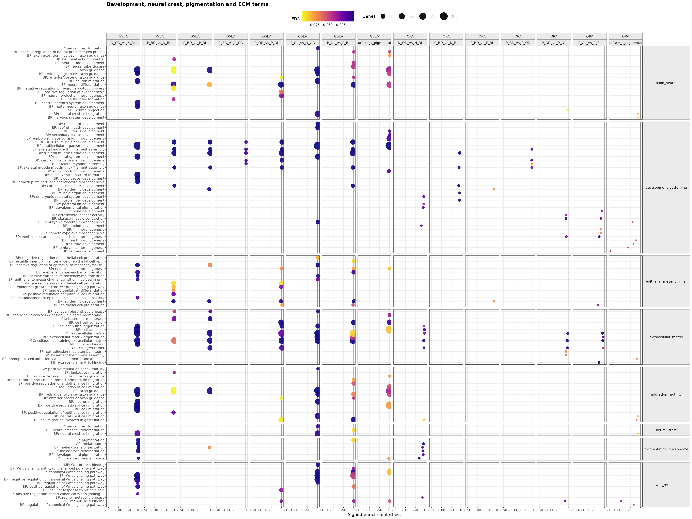
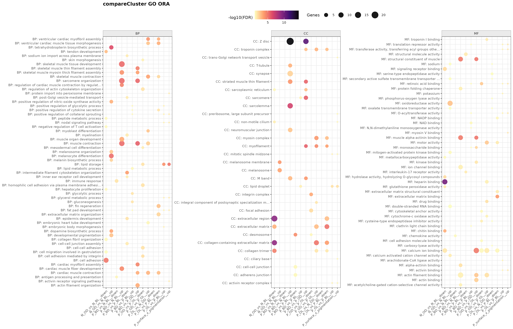

# Enriquecimiento funcional e interpretación biológica

## Objetivo del bloque

Este capítulo traduce los resultados de expresión diferencial a procesos biológicos. No busca inflar la lista de términos significativos, sino identificar qué programas funcionales explican mejor los contrastes: pigmentación normal, pérdida local de pigmentación en superficie ocular, pigmentación ectópica en la cara ciega e interacción entre superficie y color.

El análisis funcional se realizó con anotaciones Gene Ontology específicas del proyecto y herramientas de `clusterProfiler` [@Yu2012]. Se usaron dos enfoques complementarios:

- **GSEA**, que evalúa cambios coordinados a lo largo de toda la lista ordenada de genes;
- **ORA**, que resume términos sobrerrepresentados entre genes filtrados como diferencialmente expresados.

::: {.callout-note title="Criterio de lectura"}
GSEA es más útil para detectar programas distribuidos y cambios modestos pero coherentes. ORA es más directa para genes filtrados por FDR y magnitud de cambio. En este informe se interpretan como evidencias complementarias, no como resultados intercambiables.
:::

## Salidas funcionales

Las figuras principales resumen GO por contraste, mientras que las tablas descargables conservan todos los términos seleccionados y categorías dirigidas. La interpretación se apoya en `go_enrichment_combined_summary.tsv` y `development_neural_crest_summary.tsv`, ambos incluidos como recursos del libro.

::: {#fig-functional-go-summary layout-ncol="2"}

Resumen funcional de términos GO por contraste. GSEA captura cambios coordinados a lo largo de la lista ordenada; ORA resume términos sobrerrepresentados entre genes filtrados.
:::

{#fig-functional-development-neural-crest width="95%"}

{#fig-functional-comparecluster width="95%"}

::: {#tbl-functional-selected}
| Contraste | Categoría | Término principal | Efecto | FDR |
|:--|:--|:--|--:|--:|
| `N_OD_vs_N_BL` | Pigmentación/melanocito | `CC: melanosome` | 2.39 | 4.04e-06 |
| `N_OD_vs_N_BL` | Cresta neural | `BP: neural crest cell migration` | -1.53 | 3.22e-02 |
| `N_OD_vs_N_BL` | Wnt/retinoides | `BP: positive regulation of Wnt signaling pathway` | -2.22 | 4.98e-04 |
| `P_OD_vs_P_OL` | Desarrollo/patterning | `BP: skeletal muscle thin filament assembly` | 2.40 | 2.20e-05 |
| `P_OD_vs_P_OL` | Retinoides | `MF: retinoic acid binding` | -1.85 | 4.34e-02 |
| `P_BD_vs_P_BL` | Pigmentación/melanocito | `CC: melanosome` | -2.08 | 3.18e-03 |
| `P_BD_vs_N_BL` | Desarrollo/patterning | `BP: skeletal muscle tissue development` | 2.92 | 7.17e-18 |
| `P_OL_vs_N_OD` | Wnt/retinoides | `BP: Wnt signaling pathway` | 2.15 | 1.56e-06 |
| `P_OL_vs_N_OD` | Cresta neural | `BP: neural crest cell migration` | 1.83 | 2.77e-03 |
| `P_surface_x_pigmentation` | Desarrollo/patterning | `BP: multicellular organism development` | 1.74 | 6.27e-03 |

: Términos funcionales seleccionados de categorías dirigidas. El signo del efecto indica enriquecimiento hacia genes con log2FC positivo o negativo según el contraste.
:::

## Eje normal de pigmentación

El contraste `N_OD_vs_N_BL` funciona como referencia fisiológica. Los genes más altos en piel ocular oscura normal incluyen marcadores de pigmentación y melanocitos, como `tyrp1b`, `TYRP1`, `tyr`, `mlpha` y `sox10`. El enriquecimiento funcional confirma esa lectura: términos como **melanosome**, **melanocyte differentiation**, **melanosome organization** y **melanin biosynthetic process** aparecen asociados al lado ocular oscuro.

La dirección opuesta del contraste no es un simple "apagado" de pigmentación. También aparecen términos relacionados con matriz extracelular, angiogénesis, guía axonal, desarrollo y señalización. Esto sugiere que la diferencia entre cara ocular y cara ciega combina pigmentación con identidad tisular y organización de la piel.

::: {.callout-tip title="Lectura del eje normal"}
El eje normal valida el diseño: la comparación entre piel ocular oscura y piel ciega clara recupera el programa pigmentario esperado. Esta referencia es esencial para interpretar si las regiones pseudoalbinas conservan, pierden o reconfiguran ese programa.
:::

## Pseudoalbinismo ocular

El contraste `P_OD_vs_P_OL` compara dos regiones de la misma superficie en individuos pseudoalbinos: una zona ocular oscura y una zona ocular clara. La señal diferencial es clara, pero no reproduce de forma completa el eje normal. Los genes destacados incluyen colágenos y señales de matriz extracelular, como `col10a1a` y `col5a2b`, además de genes relacionados con metabolismo lipídico como `dgat2`.

Esta combinación sugiere que la pérdida local de pigmentación ocular no se explica únicamente por ausencia de genes terminales de melanogénesis. Puede implicar cambios en el microambiente cutáneo, composición celular, matriz o estado de diferenciación de la piel. En términos prácticos, el pseudoalbinismo ocular parece una alteración local del tejido, no solo una reducción de melanina.

El contraste `P_OL_vs_N_OD` refuerza esta idea. La región ocular clara pseudoalbina se diferencia del estado ocular oscuro normal con una lista más pequeña de genes, sesgada hacia genes más altos en `N_OD`, compatible con pérdida parcial del programa normal esperado.

## Pigmentación ectópica de la cara ciega

La pigmentación oscura en la cara ciega pseudoalbina es el componente más divergente del análisis. El contraste `P_BD_vs_N_BL` es el que produce más genes diferencialmente expresados y muestra una señal funcional amplia. Aparecen términos de desarrollo, estructura tisular, epidermis, músculo/contracción y metabolismo mitocondrial.

El contraste `P_BD_vs_P_BL`, que compara regiones oscuras y claras dentro de la superficie ciega pseudoalbina, no reproduce de forma limpia el eje melanogénico normal. De hecho, algunos términos de melanosoma aparecen con dirección opuesta a la esperada si `P_BD` fuese simplemente una copia de la piel ocular oscura.

::: {.callout-important title="Hipótesis de trabajo"}
La pigmentación ectópica de la cara ciega parece representar un estado tisular reprogramado. Puede incluir pigmentación, pero también señales de identidad de superficie, estructura, matriz, metabolismo y composición celular. Esta lectura es más coherente con los resultados que una explicación basada solo en activación terminal de melanogénesis.
:::

## Efecto de superficie con color constante

Los contrastes puente ayudan a separar color y superficie. `P_OL_vs_P_BL` compara regiones claras pseudoalbinas de superficie ocular y ciega; `P_BD_vs_P_OD` compara regiones oscuras pseudoalbinas de superficie ciega y ocular. Ambos contrastes indican que el mismo color macroscópico no implica equivalencia transcriptómica.

En `P_BD_vs_P_OD`, todos los genes filtrados significativos son positivos, con señales de componentes contráctiles y manejo de calcio, como `mybpc2a`, `casq1a` y `atp2a1l`. Esto refuerza que la región ciega oscura pseudoalbina no es una copia molecular de la región ocular oscura.

El modelo `P_surface_x_pigmentation` identifica una lista pequeña de genes con interacción superficie por pigmentación. La lista incluye `crabp1a`, relacionado con ácido retinoico, y `dgat2`, relacionado con metabolismo lipídico. Al ser un contraste más estricto, su señal es más reducida, pero biológicamente interesante porque apunta a genes cuyo efecto dark/light cambia según la superficie.

## Integración biológica

Los resultados apoyan una interpretación en capas:

- La pigmentación normal recupera el programa melanocítico esperado.
- El pseudoalbinismo ocular conserva parte de ese eje, pero incorpora señales de matriz y estado tisular.
- La pigmentación ectópica de la cara ciega es más divergente y probablemente combina pigmentación con reprogramación de superficie.
- Las rutas de desarrollo, cresta neural, Wnt/retinoides y matriz extracelular aparecen como ejes interpretativos clave para conectar el fenotipo macroscópico con biología de piel.

Esta lectura no excluye una contribución directa de melanóforos o melanogénesis. Más bien indica que la malpigmentación observada en HOLOFISHCOLOUR debe interpretarse como un fenómeno tisular, donde los genes de pigmento forman parte de un programa más amplio.

## Archivos derivados

Los archivos principales para revisar o reutilizar la interpretación funcional son:

- [Resumen combinado de enriquecimiento GO](../tables/05_de/go_enrichment_combined_summary.tsv)
- [Resumen de categorías desarrollo/cresta neural](../tables/05_de/development_neural_crest_summary.tsv)
- [Todos los DEGs significativos anotados](../tables/05_de/deg_significant_all_contrasts_annotated.tsv)
- [Top 50 genes anotados por contraste](../tables/05_de/deg_top50_by_contrast_annotated.tsv)

## Limitaciones

La interpretación funcional depende de la anotación disponible para rodaballo y de la calidad de los mapeos GO. Los genes sin símbolo funcional local no deben descartarse; pueden contener señales relevantes pendientes de curación. Además, los términos enriquecidos no identifican por sí solos el tipo celular responsable de la señal. Para validar mecanismos concretos será necesario integrar histología, marcadores celulares, anotación manual dirigida o experimentos funcionales.

## Conclusión del bloque

El pseudoalbinismo en este conjunto no se explica únicamente por apagado terminal de melanogénesis. La señal transcriptómica apunta a una combinación de programas pigmentarios, desarrollo/cresta neural, Wnt/retinoides, matriz extracelular, epidermis, metabolismo y estructura tisular. La pigmentación ectópica de la cara ciega es el patrón más divergente y constituye el candidato más fuerte para análisis integrativos posteriores.
