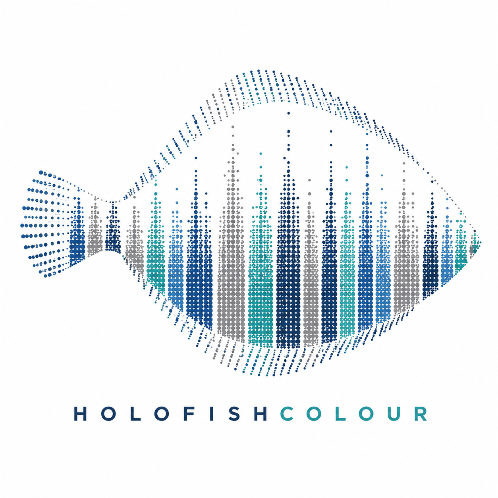

# HOLOFISHCOLOUR transcriptomics

::: {.project-brand}
{fig-alt="Logotipo oficial de HOLOFISHCOLOUR" .project-logo .nolightbox}
:::

Este libro documenta el análisis transcriptómico de piel de rodaballo (*Scophthalmus maximus*) desarrollado dentro del proyecto **HOLOFISHCOLOUR**. El objetivo es caracterizar los programas moleculares asociados a pigmentación normal, pseudoalbinismo y pigmentación ectópica, manteniendo una trazabilidad completa desde la muestra biológica hasta las tablas de expresión diferencial y enriquecimiento funcional.

La web funciona como informe bioinformático navegable. Integra el diseño experimental, el control de calidad de ARN, el procesamiento con **nf-core/rnaseq**, la auditoría técnica con **MultiQC**, la exploración de matrices de expresión, los modelos **DESeq2** y una interpretación biológica centrada en pigmentación, identidad de superficie, matriz extracelular, desarrollo y estado tisular.

::: {.callout-note title="Lectura rápida"}
El conjunto principal de inferencia está formado por **20 muestras de piel**. Las bibliotecas muestran calidad técnica alta: retención media tras `fastp` de **98.45%**, bases Q30 post-filtrado de **94.71%**, alineamiento STAR total de **97.52%** y alineamiento único de **90.09%**. La expresión diferencial se apoya en conteos **Salmon gene-level** y usa **ENSSMAG** como identificador primario de gen.
:::

## Pregunta del informe

La pregunta central no es simplemente si una región de piel contiene más o menos melanina. La pregunta biológicamente más informativa es si cada región conserva el programa transcriptómico esperado para su superficie y pigmentación, o si la malpigmentación refleja una combinación de señales de **cromatóforos**, **microambiente cutáneo**, **identidad anatómica**, **desarrollo**, **matriz extracelular**, **metabolismo** y **respuesta fisiológica**.

## Objetivos

- Documentar el diseño experimental y la procedencia de las muestras incluidas en el análisis RNA-seq.
- Evaluar la calidad del ARN y de las bibliotecas antes de la interpretación biológica.
- Resumir el procesamiento reproducible con `nf-core/rnaseq`, incluyendo referencia, software, parámetros y salidas.
- Integrar métricas de lectura, alineamiento, duplicación, cuantificación y PCA para decidir si las muestras son aptas para downstream.
- Interpretar los contrastes de expresión diferencial en relación con pigmentación normal, pseudoalbinismo ocular, pigmentación ectópica en la cara ciega e interacción superficie-pigmentación.
- Conectar genes y términos funcionales con hipótesis biológicas plausibles, sin sustituir la evidencia experimental por sobreinterpretación.

## Diseño y resultados principales

::: {#tbl-index-summary}
| Elemento | Resumen |
|:--|:--|
| Especie | Rodaballo, *Scophthalmus maximus* |
| Tejido inferencial | Piel |
| Fenotipos | Normal y pseudoalbino/malpigmentado |
| Regiones | Cara ocular y cara ciega; zonas oscuras y claras |
| Bibliotecas procesadas | 24 bibliotecas RNA-seq paired-end |
| Muestras en DE principal | 20 muestras de piel |
| Pipeline | `nf-core/rnaseq` con estrategia `star_salmon` |
| Referencia | Ensembl release 113, ensamblado ASM1334776v1 |
| Modelo principal | DESeq2 sobre conteos Salmon gene-level |
| Umbral de DEG interpretado | FDR < 0.05 y `|log2FC| >= 1` |

: Resumen operativo del informe transcriptómico.
:::

Los resultados apuntan a tres mensajes principales. Primero, el eje normal entre piel ocular oscura y piel ciega clara recupera un programa pigmentario coherente, con genes y términos de melanosoma, melanocito y melanogénesis. Segundo, el pseudoalbinismo ocular no se comporta como una simple pérdida terminal de pigmento: conserva parte del eje normal, pero aparece acompañado de señales de matriz extracelular y estructura tisular. Tercero, la pigmentación ectópica de la cara ciega es el fenómeno más divergente; no reproduce de forma limpia el programa ocular oscuro normal y muestra una contribución notable de desarrollo, estructura, epidermis, metabolismo y posible composición celular.

## Cómo navegar el libro

El informe está organizado como una cadena de evidencia. La introducción fija el marco biológico; el diseño experimental define qué comparaciones son interpretables; los capítulos de QC establecen la solvencia técnica; los capítulos de alineamiento y cuantificación justifican la matriz usada; la expresión diferencial enumera contrastes y resultados; la interpretación funcional sintetiza la biología; y los anexos conservan protocolo y decisiones reproducibles.

::: {.callout-important title="Criterio de lectura"}
Las figuras y tablas están pensadas para sostener revisión biológica, no para reemplazarla. En una especie no modelo, los identificadores `ENSSMAG` sin símbolo funcional local deben conservarse como candidatos trazables hasta completar curación por ortología, dominios, sintenia o anotaciones actualizadas.
:::
